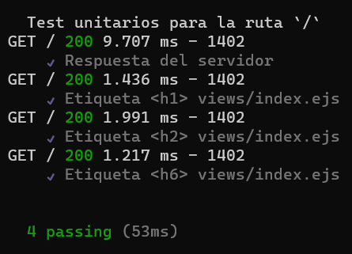
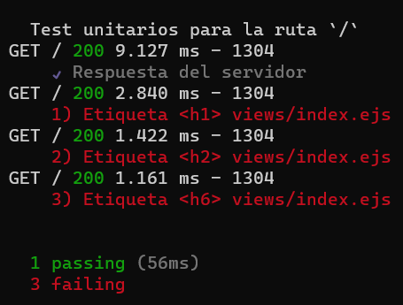

# Ejercicio 01

### Instrucciones

* Desde el navegador, revise cada una de las instrucciones que aparecen en los recuadros de color verde.
* Desde el editor de texto, modifica el archivo `views/index.ejs`, 
	+ Agrega las etiquetas solicitadas dentro de cada uno de los comentarios marcados, con:  
	`<!-- Inicio -->` y `<!-- Fin -->`
* Desde el navegador, actualice la página y verifique si los cambios cumplen con las instrucciones solicitadas.
* Pruebas unitarias

	+ Ejecutar: `npm test`
	- Los resultados posibles a las pruebas unitarias pueden ser: 
		* Todos fueron exitosas.
		
		
		
		* Existen pruebas unitarias fallidas.
		
		

* En caso de ser necesario, modifique el/los archivo(s) y vuelva a ejecutar las pruebas unitarias. 

## Referencias 

* Freeman, J. (2022). Chapter 3 HTML Fundamentals | Client-Side Web Development. Retrieved 19 April 2022, from https://info340.github.io/html-fundamentals.html