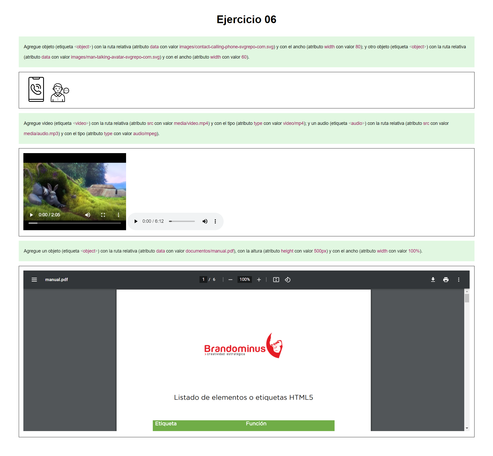

# Ejercicio 06

## Instrucciones

* Desde la línea de comandos
	+ Ingrese a la carpeta con el ejercicio
	+ Instale los paquetes necesarios, con: `npm install`
	+ Levante el servidor con cualquiera de las siguientes opciones:
		- En modo predeterminado, con: `npm start`
		- En modo de depuración 
			+ En Windows, con: `npm run debugw`
			+ En MacOs, con: `npm run debugm`
	+ Utilice su navegador preferido para abrir la vista inicial del ejercicio, con el URL: `http://localhost:3000/`

* Desde el navegador, revise cada una de las instrucciones que aparecen en los recuadros de color verde.
* Desde el editor de texto, modifica el archivo `views/index.ejs`, 
	+ Agrega las etiquetas solicitadas dentro de cada uno de los comentarios marcados, con:  
	`<!-- Inicio -->` y `<!-- Fin -->`
* Desde el navegador, actualice la página y verifique si los cambios cumplen con las instrucciones solicitadas.

## Pruebas unitarias

* Desde la línea de comandos ejecute: `npm test`
* Los resultados posibles a las pruebas unitarias pueden ser: 
	+ Todos fueron exitosas, o
	+ Existen pruebas unitarias fallidas.
* En caso de ser necesario, modifique el/los archivo(s) y vuelva a ejecutar las pruebas unitarias. 

## Referencias 

* Freeman, J. (2022). Chapter 3 HTML Fundamentals | Client-Side Web Development. Retrieved 19 April 2022, from https://info340.github.io/html-fundamentals.html
* HTML Multimedia. (2022). Retrieved 25 April 2022, from https://www.w3schools.com/html/html_media.asp
* How to Use SVG Images in CSS and HTML – A Tutorial for Beginners. (2020). Retrieved 25 April 2022, from https://www.freecodecamp.org/news/use-svg-images-in-css-html/#:~:text=SVG%20images%20can%20be%20written,element%20in%20your%20HTML%20document.&text=body%3E-,If%20you%20did%20everything%20correctly%2C%20your%20webpage%20should,exactly%20like%20the%20demo%20below.
* Contact Us Line Vectors SVG Vectors and Icons - SVG Repo. (2022). Retrieved 25 April 2022, from https://www.svgrepo.com/collection/contact-us-line-vectors/
* (2022). Retrieved 25 April 2022, from https://www.brandominus.com/manuales/manual_html5.pdf