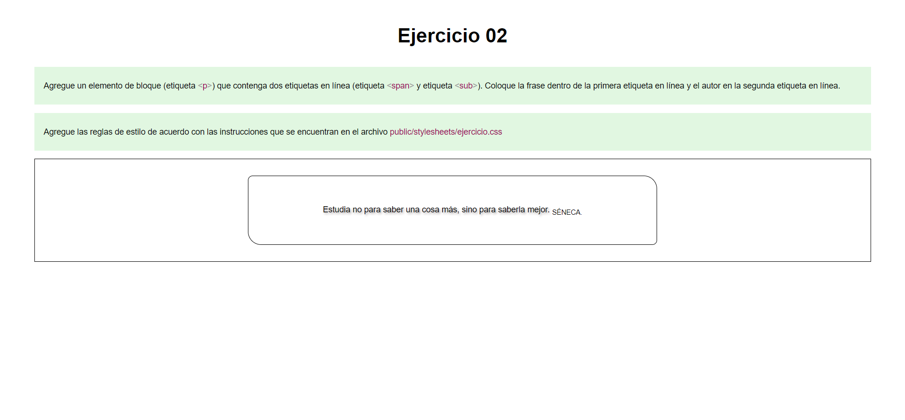

# Ejercicio 02

## Instrucciones

* Desde la línea de comandos
	+ Ingrese a la carpeta con el ejercicio
	+ Instale los paquetes necesarios, con: `npm install`
	+ Levante el servidor con cualquiera de las siguientes opciones:
		- En modo predeterminado, con: `npm start`
		- En modo de depuración 
			+ En Windows, con: `npm run debugw`
			+ En MacOs, con: `npm run debugm`
	+ Utilice su navegador preferido para abrir la vista inicial del ejercicio, con el URL: `http://localhost:3000/`
* Desde el navegador, revise cada una de las instrucciones que aparecen en los recuadros de color verde.
* Desde el editor de texto, modifica el archivo `views\index.ejs` y el archivo `public/stylesheets/ejercicio.css`, 
	+ Identifique las instrucciones a realizar que se encuentran en los bloques de comentarios.
	+ Agrega los cambiossolicitadas dentro de las secciones marcadas, con:  
	`<!-- Inicio -->` - `<!-- Fin -->`, y `/* Inicio */` - `/* Fin */`
* Desde el navegador, actualice la página y verifique si los cambios cumplen con las instrucciones solicitadas.

## Pruebas unitarias

* Desde la línea de comandos ejecute: `npm test`
* Los resultados posibles a las pruebas unitarias pueden ser: 
	+ Todos fueron exitosas, o
	+ Existen pruebas unitarias fallidas.
* En caso de ser necesario, modifique el/los archivo(s) y vuelva a ejecutar las pruebas unitarias. 

## Referencias 

* Freeman, J. (2022). Chapter 7 CSS Layouts | Client-Side Web Development. Retrieved 3 May 2022, from https://info340.github.io/css-layouts.html#display
* Introducción al Modelo de Caja de CSS - CSS | MDN. (2022). Retrieved 3 May 2022, from https://developer.mozilla.org/es/docs/Web/CSS/CSS_Box_Model/Introduction_to_the_CSS_box_model
* Box Model. (2022). Retrieved 3 May 2022, from https://web.dev/learn/css/box-model/

* CSS margin-left property. (2022). Retrieved 4 May 2022, from https://www.w3schools.com/cssref/pr_margin-left.asp
* CSS margin-right property. (2022). Retrieved 4 May 2022, from https://www.w3schools.com/cssref/pr_margin-right.asp
* CSS text-align property. (2022). Retrieved 4 May 2022, from https://www.w3schools.com/cssref/pr_text_text-align.ASP

* Diseño CSS - Aprende sobre desarrollo web | MDN. (2021). Retrieved 3 May 2022, from https://developer.mozilla.org/es/docs/Learn/CSS/CSS_layout
* Flexbox playground https://codepen.io/enxaneta/full/adLPwv a través de @CodePen 