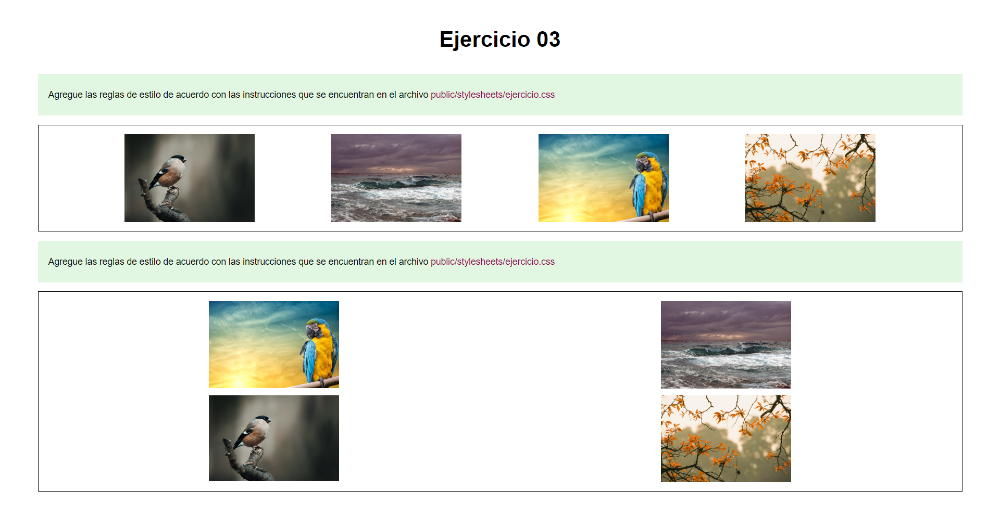

# Ejercicio 03

### Instrucciones

* Desde el editor de texto, modifica el archivo `public/stylesheets/ejercicio.css`, 
	+ Agrega las etiquetas solicitadas dentro de cada uno de los comentarios marcados, con:  
	`/* Inicio */` - `/* Fin */`
* Desde el navegador, actualice la página y verifique si los cambios cumplen con las instrucciones solicitadas.
* Pruebas unitarias

	+ Ejecutar: `npm test`
	+ En caso de ser necesario, modifique el/los archivo(s) y vuelva a ejecutar las pruebas unitarias.

## Referencias 

* Freeman, J. (2022). Chapter 3 HTML Fundamentals | Client-Side Web Development. Retrieved 19 April 2022, from https://info340.github.io/html-fundamentals.html