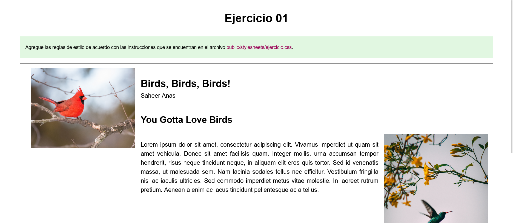

# Ejercicio 01

#### Dispositivo Fijo

#### Dispositivo Móvil

## Instrucciones

* Desde la línea de comandos
	+ Ingrese a la carpeta con el ejercicio
	+ Instale los paquetes necesarios, con: `npm install`
	+ Levante el servidor con cualquiera de las siguientes opciones:
		- En modo predeterminado, con: `npm start`
		- En modo de depuración 
			+ En Windows, con: `npm run debugw`
			+ En MacOs, con: `npm run debugm`
	+ Utilice su navegador preferido para abrir la vista inicial del ejercicio, con el URL: `http://localhost:3000/`
* Desde el navegador, revise cada una de las instrucciones que aparecen en los recuadros de color verde.
* Desde el editor de texto, modifica el archivo `public/stylesheets/ejercicio.css`, 
	+ Identifique las instrucciones a realizar que se encuentran en los bloques de comentarios.
	+ Agrega los cambiossolicitadas dentro de las secciones marcadas, con:  
	`/* Inicio */` y `/* Fin */`
* Desde el navegador, actualice la página y verifique si los cambios cumplen con las instrucciones solicitadas.

## Pruebas unitarias

* Desde la línea de comandos ejecute: `npm test`
* Los resultados posibles a las pruebas unitarias pueden ser: 
	+ Todos fueron exitosas, o
	+ Existen pruebas unitarias fallidas.
* En caso de ser necesario, modifique el/los archivo(s) y vuelva a ejecutar las pruebas unitarias. 

## Referencias 

* Freeman, J. (2022). Chapter 8 Responsive CSS | Client-Side Web Development. Retrieved 11 May 2022, from https://info340.github.io/responsive-css.html
* Learn Responsive Design. (2022). Retrieved 11 May 2022, from https://web.dev/learn/design/
* Diseño receptivo - Aprende sobre desarrollo web | MDN. (2021). Retrieved 11 May 2022, from https://developer.mozilla.org/es/docs/Learn/CSS/CSS_layout/Responsive_Design
* Article Details (2022). Retrieved 13 May 2022, from https://codepen.io/saheeranas/pen/LYQPQoj
* Juviler, J. (2022). How to Hide the Scrollbar in CSS. Retrieved 16 May 2022, from https://blog.hubspot.com/website/hide-scrollbar-css
* A Complete Guide to Flexbox | CSS-Tricks. (2013). Retrieved 16 May 2022, from https://css-tricks.com/snippets/css/a-guide-to-flexbox/
* A Complete Guide to Grid | CSS-Tricks. (2021). Retrieved 16 May 2022, from https://css-tricks.com/snippets/css/complete-guide-grid/