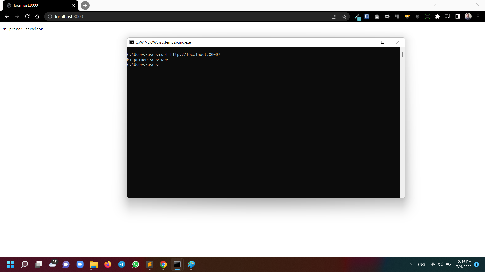

# Ejercicio 07



## Requisitos

* Instale Nodejs, dese el [sitio oficial](https://nodejs.org/es/download/).
	- Mediante la línea de comandos, verifique la versión de Nodejs, con: `node -v`

## Instrucciones

* Desde la línea de comandos
	+ Ingrese a la carpeta con el ejercicio
	+ Instale los paquetes necesarios, con: `npm install`

### Servidor HTTP

* Desde la línea de comandos, crea una carpeta, con: `mkdir servidorHTTP`.
* Acceda a la carpeta, con: `cd servidorHTTP`
* Cree el archivo `servidor.js`
* Agregue las instrucciones 

```
/* Módulo HTTP para crear el servidor */

const http = require("http");


/* Defina las constantes para vincular el servidor con el nombre y el puerto */

const host = 'localhost';
const puerto = 8000;


/* Función que responderá a la peticiones del servidor */

const manejadorPeticiones = (req, res) => {
    res.writeHead(200);
    res.end("Mi primer servidor");
};


/* Creación del objeto servidor a través de la función createServer() del módulo http. Este servidor acepta solicitudes HTTP y pasa a la función manejadorPeticiones() */

/* El servidor se vincula con la dirección de red */

const servidor = http.createServer(manejadorPeticiones);
servidor.listen(puerto, host, () => {
    console.log(`Servidor corriendo en http://${host}:${puerto}`);
});

```

* Desde la línea de comandos, levante el servidor con: `node servidor.js`
	- En la línea de comandos debe ver el mensaje `Servidor corriendo en http://localhost:8000`

* Cliente(s) 
	- Abra una pestaña en el navegador para el URL `http://localhost:8000`
	- Desde otra línea de comandos, haga una petición con `curl http://localhost:8000`
	- Verifique los resultados en ambos clientes.


## Pruebas unitarias

* Desde la línea de comandos ejecute: `npm test`
* Los resultados posibles a las pruebas unitarias pueden ser: 
	+ Todos fueron exitosas, o
	+ Existen pruebas unitarias fallidas.
* En caso de ser necesario, modifique el/los archivo(s) y vuelva a ejecutar las pruebas unitarias. 

## Referencias 

* Cómo crear un servidor web en Node.js con el módulo HTTP DigitalOcean. (2022). Retrieved 4 July 2022, from https://www.digitalocean.com/community/tutorials/how-to-create-a-web-server-in-node-js-with-the-http-module-es#paso-1-crear-un-servidor-http-basico