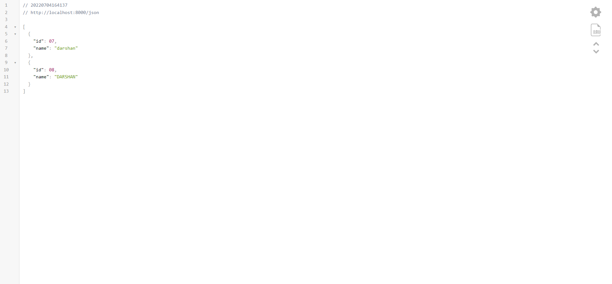

# Ejercicio 08

## Respuesta a la ruta "/texto"

## Respuesta a la ruta "/json"

## Respuesta a la ruta "/html"

## Requisitos

* Instale Nodejs, dese el [sitio oficial](https://nodejs.org/es/download/).
	- Mediante la línea de comandos, verifique la versión de Nodejs, con: `node -v`

## Instrucciones

* Desde la línea de comandos
	+ Ingrese a la carpeta con el ejercicio
	+ Instale los paquetes necesarios, con: `npm install`
* Desde el editor de texto, modifica el archivo el archivo `servidorHTTP/servidor.js`,
	+ Identifique las instrucciones a realizar que se encuentran en los bloques de comentarios.
	+ Agrega los cambios solicitadas dentro de las secciones marcadas, con:  
	`/* Inicio */` - `/* Fin */`
* Por cada bloque de instrucciones:
	+ Desde la línea de comandos desde la carpeta del proyecto `servidorHTTP`
	+ Reinicie el servidor con: `node servidor.js`
	+ Desde el navegador, abra una pestaña en el navegador para el URL `http://localhost:8000`.

## Pruebas unitarias

* Desde la línea de comandos ejecute: `npm test`
* Los resultados posibles a las pruebas unitarias pueden ser: 
	+ Todos fueron exitosas, o
	+ Existen pruebas unitarias fallidas.
* En caso de ser necesario, modifique el/los archivo(s) y vuelva a ejecutar las pruebas unitarias. 

## Referencias 

* Cómo crear un servidor web en Node.js con el módulo HTTP DigitalOcean. (2022). Retrieved 4 July 2022, from https://www.digitalocean.com/community/tutorials/how-to-create-a-web-server-in-node-js-with-the-http-module-es#paso-1-crear-un-servidor-http-basico
* HTTP headers - HTTP MDN. (2022). Retrieved 4 July 2022, from https://developer.mozilla.org/es/docs/Web/HTTP/Headers
* Tipos MIME - HTTP MDN. (2020). Retrieved 4 July 2022, from https://developer.mozilla.org/es/docs/Web/HTTP/Basics_of_HTTP/MIME_types
* Spring - REST JSON Response - GeeksforGeeks. (2022). Retrieved 4 July 2022, from https://www.geeksforgeeks.org/spring-rest-json-response/
* ¿Qué es una URL? - Aprende sobre desarrollo web MDN. (2021). Retrieved 4 July 2022, from https://developer.mozilla.org/es/docs/Learn/Common_questions/What_is_a_URL