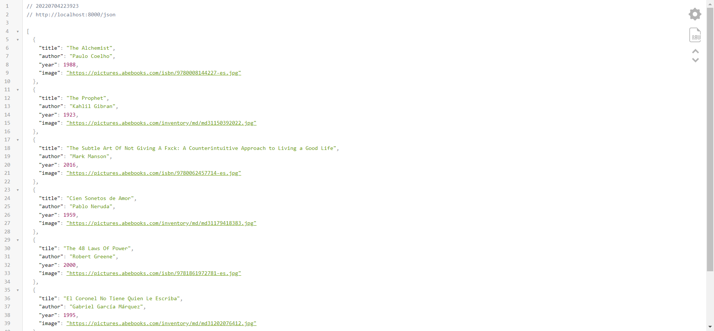

# Ejercicio 09

## Respuesta a la ruta "http://localhost:8000/json"

## Respuesta a la ruta "http://localhost:8001/"

## Requisitos

* Instale Nodejs, desde el [sitio oficial](https://nodejs.org/es/download/).
	- Mediante la línea de comandos, verifique la versión de Nodejs, con: `node -v`

## Instrucciones

* Desde la línea de comandos
	+ Ingrese a la carpeta con el ejercicio
	+ Instale los paquetes necesarios, con: `npm install`
* Servidor
	+ Desde la línea de comandos en la carpeta del proyecto `servidorHTTP`
	+ Inicie el servidor HTTP, con: `node servidor.js`
	+ Desde el navegador, abra una pestaña en el navegador para el URL `http://localhost:8000/json`
* Cliente
	+ Desde la línea de comandos en la carpeta del proyecto `clienteHTTP`
	+ Inicie el cliente HTTP, con: `python -m http.server 8001`
	+ Desde el navegador, abra una pestaña en el navegador para el URL `http://localhost:8001`
* Desde el editor de texto, modifica el archivo el archivo `servidorHTTP/servidor.js`,
	+ Identifique las instrucciones a realizar que se encuentran en los bloques de comentarios.
	+ Agrega los cambios solicitadas dentro de las secciones marcadas, con:  
	`/* Inicio */` - `/* Fin */`
	+ Desde la línea de comandos, reinicie el servidor HTTP con: `node servidor.js`
	+ Desde el navegador, actualice la pestaña en el navegador para el URL `http://localhost:8001`

## Pruebas unitarias

* Desde la línea de comandos ejecute: `npm test`
* Los resultados posibles a las pruebas unitarias pueden ser: 
	+ Todos fueron exitosas, o
	+ Existen pruebas unitarias fallidas.
* En caso de ser necesario, modifique el/los archivo(s) y vuelva a ejecutar las pruebas unitarias. 

## Referencias 

* Cómo crear un servidor web en Node.js con el módulo HTTP DigitalOcean. (2022). Retrieved 4 July 2022, from https://www.digitalocean.com/community/tutorials/how-to-create-a-web-server-in-node-js-with-the-http-module-es#paso-1-crear-un-servidor-http-basico
* HTTP headers - HTTP MDN. (2022). Retrieved 4 July 2022, from https://developer.mozilla.org/es/docs/Web/HTTP/Headers
* Control de acceso HTTP (CORS) - HTTP MDN. (2022). Retrieved 5 July 2022, from https://developer.mozilla.org/es/docs/Web/HTTP/CORS