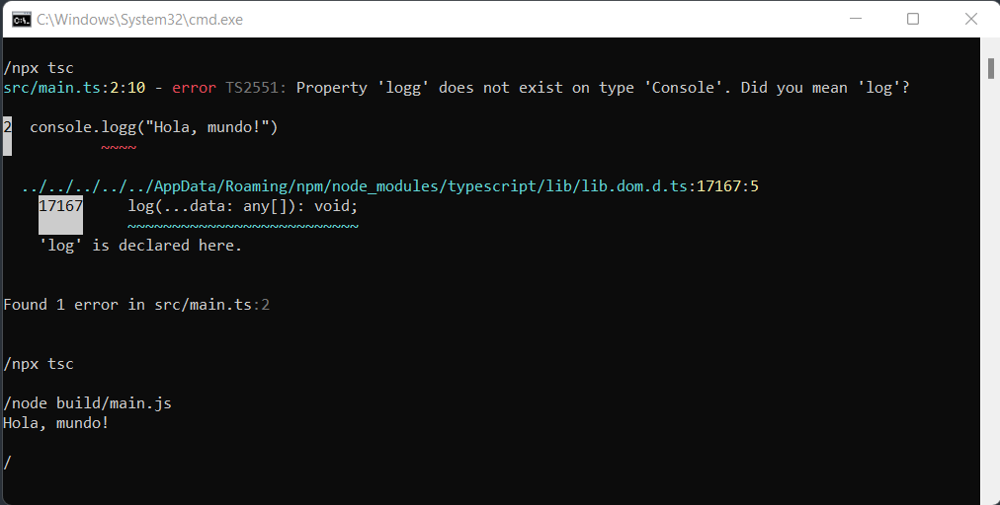

# Ejercicio 01




## Requisitos

* Instale Nodejs, desde el [sitio oficial](https://nodejs.org/es/download/).
	- Mediante la línea de comandos, verifique la versión de Nodejs, con: `node -v`
* Instale Typescript globalmente, con: `npm install -g typescript`

## Instrucciones

* Desde la línea de comandos
	+ Ingrese a la carpeta con el ejercicio
	+ Cree el archivo tsconfig.json, con `npx tsc --init`

* Desde su editor de texto
	+ Revise el archivo `src/main.ts` escrito en Typescript

* En el archivo **tsconfig.json**
	+ Agregue el punto de transpilación con la clave _include_ con valor `"src/**/*"`

	```
	{
		"include": ["src/**/*"],
		"compilerOptions": {
			...
		}
	}
	```

	+ Agregue el punto de salida con la clave _outDir_ con valor `"build"`

	```
	{
		"include": ["src/**/*"],
		"compilerOptions": {
			...
			"outDir": "build",
			...
		}
	}
	```

* Desde la línea de comandos
	+ Transpile los archivos Typescript a Javascript, con: `npx tsc`
	+ Revise los errores que aparecen en la consola.

* En el archivo **src/main.ts**
	+ Corrija el error que se muestra en la consola.

* Desde la línea de comandos
	+ Transpile los archivos Typescript a Javascript, con: `npx tsc`
	+ Se creará una carpeta `build` con el archivo en Javascript `main.js` 
	+ Ejecute el archivo transpilado, con: `node build/main.js`

## Referencias 

* TypeScript Compiling with Visual Studio Code. (2022). Retrieved 6 July 2022, from https://code.visualstudio.com/docs/typescript/typescript-compiling
