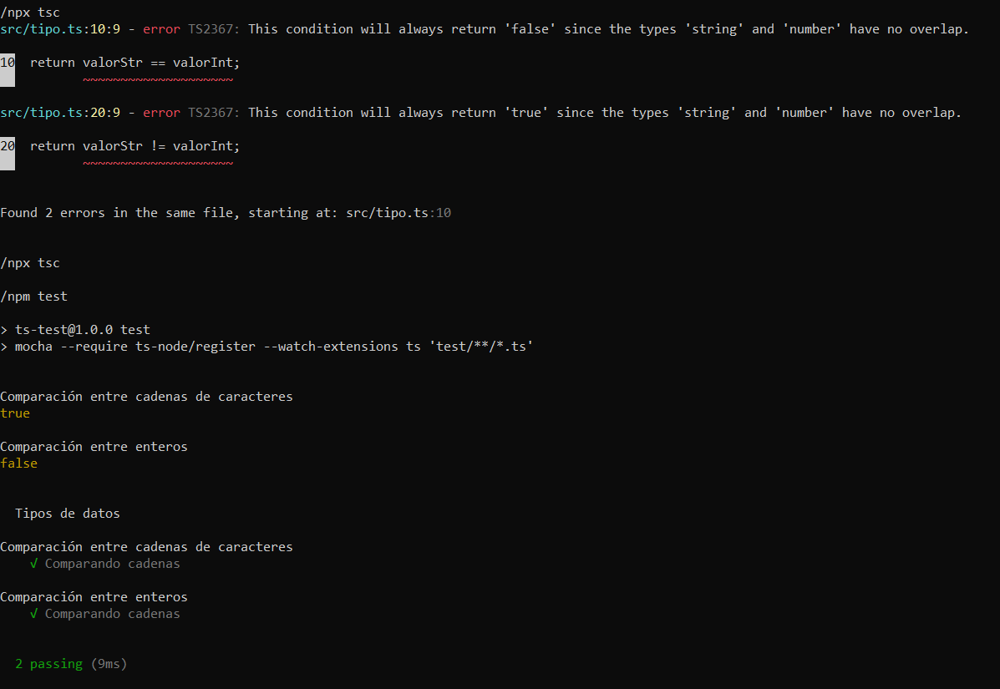

# Ejercicio 02




## Requisitos

* Instale Nodejs, desde el [sitio oficial](https://nodejs.org/es/download/).
	- Mediante la línea de comandos, verifique la versión de Nodejs, con: `node -v`
* Instale Typescript globalmente, con: `npm install -g typescript`

## Instrucciones

* Desde la línea de comandos
	+ Ingrese a la carpeta con el ejercicio
	+ Instale los paquetes necesarios, con: `npm install`
* Para transpilar de Typescript a Javascript:
	+  Un archivo, en modo estricto y especificando el directorio de salida:
	```
  	npx tsc src/tipo.ts --strict --outDir build 
  	```
	+ Todos los archivos, en modo estricto:
	```
  	npx tsc --strict
  	```
* Para ejecutar código de Javascript:
	+ Un archivo: 
  	```
  	node build/tipo.js
  	``` 


## Pruebas unitarias

* Desde la línea de comandos ejecute: `npm test`
* Los resultados posibles a las pruebas unitarias pueden ser: 
	+ Todos fueron exitosas, o
	+ Existen pruebas unitarias fallidas.
* En caso de ser necesario, modifique el/los archivo(s) y vuelva a ejecutar las pruebas unitarias. 

## Referencias 

* TypeScript Types. (2022). Retrieved 6 July 2022, from https://www.typescripttutorial.net/typescript-tutorial/typescript-types/
* An Essential Guide To Type Annotations in TypeScript. (2022). Retrieved 8 July 2022, from https://www.typescripttutorial.net/typescript-tutorial/typescript-type-annotations/
* TypeScript Number. (2022). Retrieved 8 July 2022, from https://www.typescripttutorial.net/typescript-tutorial/typescript-number/
* TypeScript String. (2022). Retrieved 8 July 2022, from https://www.typescripttutorial.net/typescript-tutorial/typescript-string/
* TypeScript Array Type. (2022). Retrieved 8 July 2022, from https://www.typescripttutorial.net/typescript-tutorial/typescript-array-type/
* An Essential Guide To Type Annotations in TypeScript. (2022). Retrieved 7 July 2022, from https://www.typescripttutorial.net/typescript-tutorial/typescript-type-annotations/
* Number.prototype.toString() - JavaScript MDN. (2021). Retrieved 6 July 2022, from https://developer.mozilla.org/es/docs/Web/JavaScript/Reference/Global_Objects/Number/toString
* parseInt() - JavaScript MDN. (2021). Retrieved 6 July 2022, from https://developer.mozilla.org/es/docs/Web/JavaScript/Reference/Global_Objects/parseInt
* expected, c., Mehta, M., & Grinko, D. (2013). chai test array equality doesn't work as expected. Retrieved 8 July 2022, from https://stackoverflow.com/questions/17526805/chai-test-array-equality-doesnt-work-as-expected