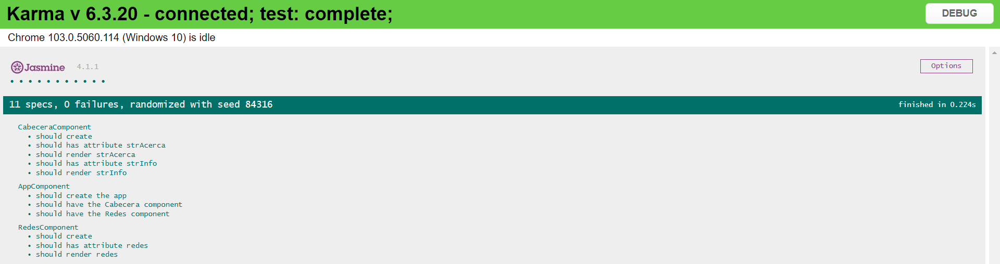

# Ejercicio 05


## Requisitos

* Completar las actividades de [Angular - Local](https://dawfiec.github.io/DAWM-2022/tutoriales/angular_local.html) y [Angular - Bootstrap](https://dawfiec.github.io/DAWM-2022/tutoriales/angular_bootstrap.html)
* Tome como referencia las instrucciones en [Angular - Componentes, Comunicación y Directivas](https://dawfiec.github.io/DAWM-2022/tutoriales/angular_bases.html)

## Instrucciones

* Desde la línea de comandos, en la raíz de la carpeta del proyecto 
* Cree los componentes: **cabecera** y **redes**.
* Para el componente **cabecera**:
	+ En **cabecera.component.ts**:
		- Agregue los atributos _strAcerca_ y _strInfo_
		```
		strAcerca:string = "Album fotográfico"
        strInfo:string = "A través de mis ojos"
		```
	+ En **cabecera.component.html**
		- Utilice la siguiente plantilla y renderice los atributos del componente
		```
		<h1 class="fw-light"><!-- Renderice el atributo strAcerca --></h1>
        <p class="lead text-muted"><!-- Renderice el atributo strInfo --></p>
		```
* Para el componente **redes**:
	+ En **redes.component.ts**:
		- Agregue el atributo _redes_
		```
		redes:any[] = [
		  {
	        'href': 'https://twitter.com/home',
	        'alt': 'Sígueme en Twitter',
	        'src': 'https://cdn-icons-png.flaticon.com/512/733/733579.png'
	      },
	      {
	        'href': 'https://www.facebook.com/',
	        'alt': 'Likes en Facebook',
	        'src': 'https://cdn-icons-png.flaticon.com/512/174/174848.png'
	      },
	      {
	        'href': 'mailto:correo@gmail.com',
	        'alt': 'Envíame un correo',
	        'src': 'https://cdn-icons-png.flaticon.com/512/2111/2111463.png'
	      }
		]
		```
	+ En **redes.component.html**
		- Utilice la siguiente plantilla y renderice el atributo del componente
		```html
		<ul class="list-group list-group-horizontal justify-content-center mb-5">
			
			<!-- Utilice la directiva *ngFor para iterar el arreglo redes -->
			<li class="list-group-item border-0" >
				<a href=" <!-- Renderice el href del elemento --> " class="text-primary">
					 " alt=" <!-- Renderice el alt del elemento --> ">
				</a>
			</li>

		</ul>
		```
* En **app.component.html**
	+ Reemplace las etiquetas html `h1.fw-light` y `p.lead.text-muted`:

	```html
	<main>
	  <section class="py-5 text-center container">
	    <div class="row py-lg-5">
	      <div class="col-lg-6 col-md-8 mx-auto">
	        <h1 class="fw-light">Album example</h1>
	        <p class="lead text-muted">Something short and leading about the collection below—its contents, the creator, etc. Make it short and sweet, but not too short so folks don’t simply skip over it entirely.</p>
	        ...
	      </div>
	    </div>
	  </section>
	</main>
	```
	por el selector del componente **Cabecera**

	```html
    <main>
	  <section class="py-5 text-center container">
	    <div class="row py-lg-5">
	      <div class="col-lg-6 col-md-8 mx-auto">
	        <app-cabecera></app-cabecera>
	        ...
	      </div>
	    </div>
	  </section>
	</main>
	```

	y agregue el selector del componente **Redes**

	```html
    <main>
	  <section class="py-5 text-center container">
	    <div class="row py-lg-5">
	      <div class="col-lg-6 col-md-8 mx-auto">
	        <app-cabecera></app-cabecera>
	        <app-redes></app-redes>
	        ...
	      </div>
	    </div>
	  </section>
	</main>
	```


## Pruebas unitarias

* En su proyecto de Angular, reemplace los archivos **.spec.ts** con los archivos **.spec.ts** (que se encuentran en la carpeta `specs`) de este repositorio.
	+ `specs/app.component.spec.ts` por `src/app/app.component.spec.ts`
	+ `specs/cabecera.component.spec.ts` por `src/app/cabecera/cabecera.component.spec.ts`
	+ `specs/redes.component.spec.ts` por `src/app/redes/redes.component.spec.ts`
* En la ruta de su proyecto en Angular, desde la línea de comandos ejecute: `npm test`
* Los resultados posibles a las pruebas unitarias pueden ser: 
	
	+ Todos fueron exitosas, o
	+ Existen pruebas unitarias fallidas.
* En caso de ser necesario, modifique el/los archivo(s) y vuelva a ejecutar las pruebas unitarias. 

## Referencias 

* DAWM-2022. (2022). Retrieved 15 July 2022, from https://dawfiec.github.io/DAWM-2022/tutoriales/angular_bases.html
