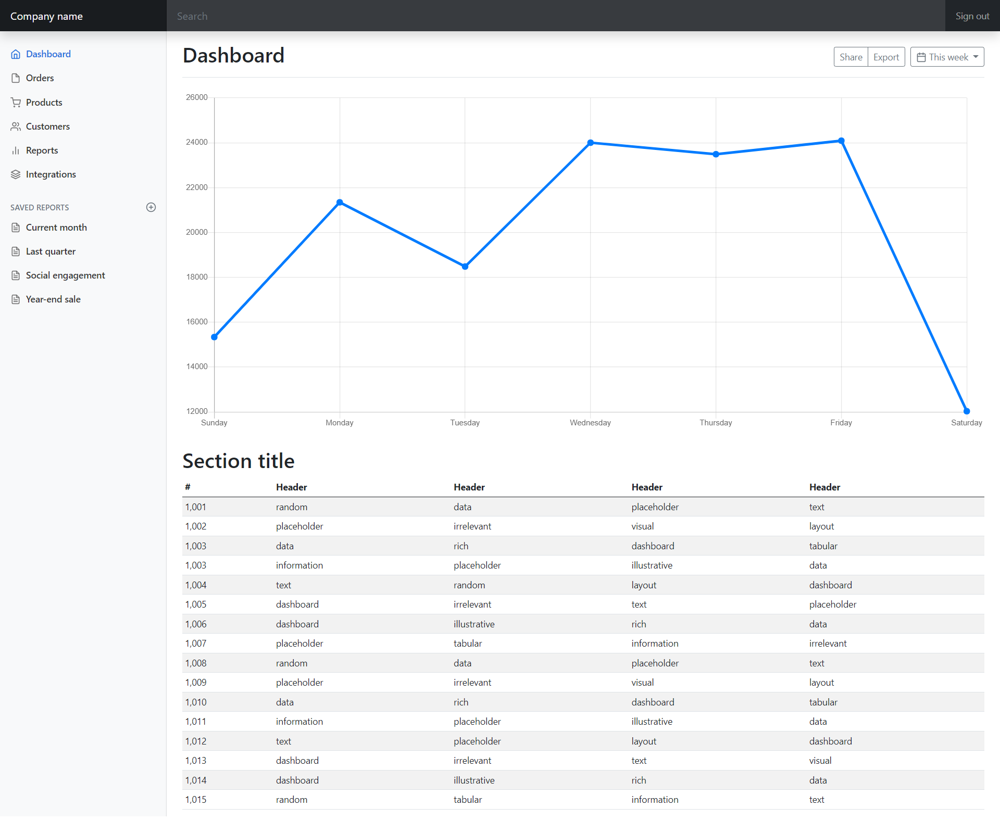

# Ejercicio 01

  

## Requisitos

* Tome como referencia las instrucciones en [Express - Bases](https://dawfiec.github.io/DAWM-2022/tutoriales/express_bases.html) y [Express - Bootstrap](https://dawfiec.github.io/DAWM-2022/tutoriales/express_bootstrap.html).

## Pruebas unitarias

* En su proyecto de Express 
  + Instale las dependencias **Jest**, **SuperTest** y **cross-env**, desde la línea de comandos ejecute:: `npm install --save-dev jest supertest cross-env`
  + Copie la carpeta **tests** a la carpeta del proyecto de Express

* En **package.json**
  + Agregue el par clave-valor

  <pre><code>
  "jest": {
    "testEnvironment": "node",
    "coveragePathIgnorePatterns": [
      "/node_modules/"
    ]
  }
  </code></pre> 

* En la ruta de su proyecto en Express, desde la línea de comandos ejecute: `npm test`
* Los resultados posibles a las pruebas unitarias pueden ser: jest
  + Todos fueron exitosas, o
  + Existen pruebas unitarias fallidas.
* En caso de ser necesario, modifique el/los archivo(s) y vuelva a ejecutar las pruebas unitarias.

## Referencias 

* DAWM-2022. (2022). Retrieved 27 July 2022, from https://dawfiec.github.io/DAWM-2022/tutoriales/express_bases.html
* DAWM-2022. (2022). Retrieved 27 July 2022, from https://dawfiec.github.io/DAWM-2022/tutoriales/express_bootstrap.html
* Testing your Express.js Backend Server. (2021). Retrieved 27 July 2022, from https://dev.to/lukekyl/testing-your-express-js-backend-server-3ae6
* Expect · Jest. (2022). Retrieved 27 July 2022, from https://jestjs.io/docs/expect
