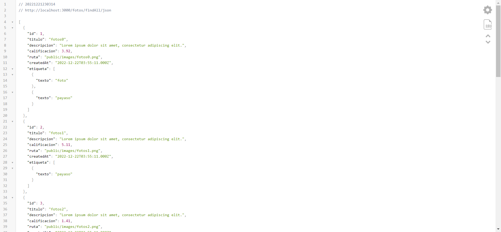

# Ejercicio 02

## Requisitos

* Completar las actividades de [Express - Bases](https://dawfiec.github.io/DAWM-2022/tutoriales/express_bases.html), [Express - Bootstrap](https://dawfiec.github.io/DAWM-2022/tutoriales/express_bootstrap.html) y [Express - Forms](https://dawfiec.github.io/DAWM-2022/tutoriales/express_forms.html).

## Pruebas unitarias

* En su proyecto de Express 
  + Instale las dependencias **Jest**, **SuperTest** y **cross-env**
    - Desde la línea de comandos ejecute: `npm install --save-dev jest supertest cross-env`
  + Agregue la carpeta **tests** de este repositorio a su proyecto 
  + Modifique el archivo **package.json**
    - Agregue los pares clave-valor

    <pre><code>
    ...
      "scripts":{
        ...
        <b style="color:red">
        ,
        "test": "jest"
        </b>
      }
    ...
        "nodemon": "^2.0.19",
        "supertest": "^6.2.4"
      }
      <b style="color:red">
      ,
      "jest": {
        "testEnvironment": "node",
        "coveragePathIgnorePatterns": [
          "/node_modules/"
        ]
      }
      </b>
    }
    </code></pre> 

* En la ruta de su proyecto en Express, desde la línea de comandos ejecute: `npm test`
* Los resultados posibles a las pruebas unitarias pueden ser: jest
  
  

    
  

  + Todos fueron exitosas, o
  + Existen pruebas unitarias fallidas.
* En caso de ser necesario, modifique el/los archivo(s) y vuelva a ejecutar las pruebas unitarias.

## Referencias 

* DAWM-2022. (2022). Retrieved 27 July 2022, from https://dawfiec.github.io/DAWM-2022/tutoriales/express_bases.html
* DAWM-2022. (2022). Retrieved 27 July 2022, from https://dawfiec.github.io/DAWM-2022/tutoriales/express_bootstrap.html
* Testing your Express.js Backend Server. (2021). Retrieved 27 July 2022, from https://dev.to/lukekyl/testing-your-express-js-backend-server-3ae6
* Expect · Jest. (2022). Retrieved 27 July 2022, from https://jestjs.io/docs/expect
