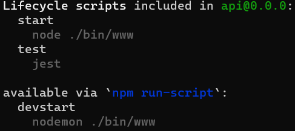

# Ejercicio 03


## Instrucciones

* Complete las actividades para que proyecto contenga:
  + De acuerdo con las instrucciones de [Express - Parámetros de consulta y Parámetros de ruta](https://dawfiec.github.io/DAWM/tutoriales/express_pcpr.html).

## Configuración

* Modifique el archivo `config/config.json` para el ambiente "test" para los datos de conexión: username, password y database

## Instrucciones

* Tome como referencia las instrucciones que se encuentran en el tutorial [Express - Parámetros de consulta y Parámetros de ruta](https://dawfiec.github.io/DAWM/tutoriales/express_pcpr.html) para desarrollar:

  + Para `'/etiquetas'` con la ruta `'/findAllById/:idmin/:idmax/json'` 
    - Extraiga los parámetro de ruta **idmin** y **idmax**
    - Con el ORM, consulte por todas las etiquetas cuyos ids se encuentren entre los valores de **idmin** y **idmax**. Ambos incluidos.
    - Devuelva los resultados en formato json
  + Para `'/etiquetas'` con la ruta `'/findByTexto/json'` 
    - Extraiga el parámetro de consulta **texto**
    - Con el ORM, consulte por la etiqueta cuyo texto sea igual a **texto**.
    - Devuelva el resultado en formato json

## Pruebas unitarias

* En su proyecto de Express 
  + Instale las dependencias **Jest**, **SuperTest** y **cross-env**
    - Desde la línea de comandos ejecute: `npm install --save-dev jest supertest cross-env`
  + Agregue la carpeta **tests** de este repositorio a su proyecto 
  + Modifique el archivo **package.json**
    - Agregue los pares clave-valor

    <pre><code>
    ...
      "scripts":{
        ...
        <b style="color:red">
        ,
        "test": "jest --detectOpenHandles"
        </b>
      }
    ...
        "nodemon": "^2.0.19",
        "supertest": "^6.2.4"
      }
      <b style="color:red">
      ,
      "jest": {
        "testEnvironment": "node",
        "coveragePathIgnorePatterns": [
          "/node_modules/"
        ]
      }
      </b>
    }
    </code></pre> 

* Desde la línea de comandos:
  + Liste los comando disponibles, con: `npm run`

  <p align="center">
    
  </p>
  
  + Ejecute las pruebas unitarias, con: `npm test`

* Los resultados posibles a las pruebas unitarias:
  
  ```
  Test Suites: X passed, X total
  Tests:       y passed, y total
  Snapshots:   0 total
  Time:        x.yx s, estimated w s
  ```

  + Todos fueron exitosas, o
  + Existen pruebas unitarias fallidas.
* En caso de ser necesario, modifique el/los archivo(s) y vuelva a ejecutar las pruebas unitarias.

## Referencias 

* DAWM-2022. (2022). Retrieved 4 August 2022, from https://dawfiec.github.io/DAWM-2022/tutoriales/express_bases.html
* DAWM-2022. (2022). Retrieved 4 August 2022, from https://dawfiec.github.io/DAWM-2022/tutoriales/express_ormbasico.html
* Testing your Express.js Backend Server. (2021). Retrieved 27 July 2022, from https://dev.to/lukekyl/testing-your-express-js-backend-server-3ae6
* Expect · Jest. (2022). Retrieved 27 July 2022, from https://jestjs.io/docs/expect
* Concepts, C., & Finders, M. (2022). Model Querying - Finders Sequelize. Retrieved 4 August 2022, from https://sequelize.org/docs/v6/core-concepts/model-querying-finders/