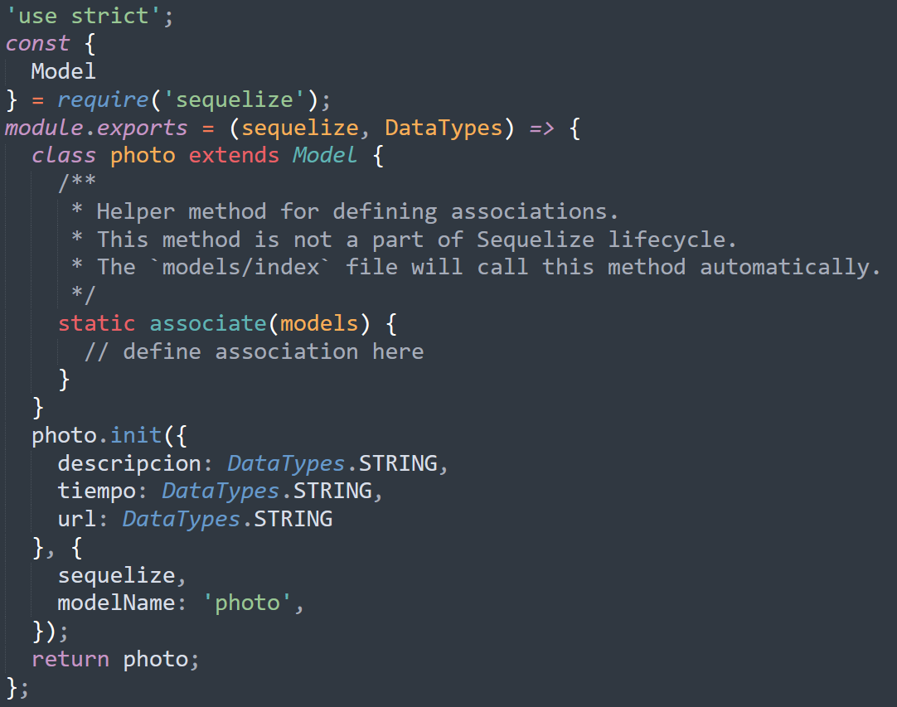
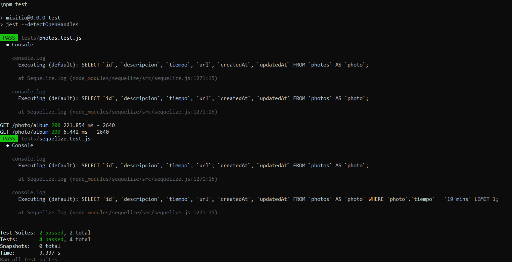

# Ejercicio 03




## Instrucciones

* Tome como referencia las instrucciones de:

  + [Express - Bases](https://dawfiec.github.io/DAWM-2022/tutoriales/express_bases.html),
  + [Express - ORM (Básico)](https://dawfiec.github.io/DAWM-2022/tutoriales/express_ormbasico.html),
  + [Express - Parámetros de consulta y Parámetros de ruta](https://dawfiec.github.io/DAWM-2022/tutoriales/express_pcpr.html)

* Cree un proyecto nuevo llamado **album**

* Base de datos: **album**

* Modifique el archivo `config/config.json` para los ambientes "development" y "test" para los datos de conexión: **database**, **username** y **password**

* Cree el modelo **`photo`**, con atributos de tipo _string_: **`descripcion`**, **`tiempo`** y **`url`**
  
* Modifique el seeder de **`photo`**:
  + En la función **up**:
  ```
  let arreglo = [
      {
        "descripcion": "Lorem ipsum dolor sit amet, consectetur adipiscing elit. In gravida sapien at gravida semper. Aenean a lacinia diam. Nulla facilisi. Suspendisse ut turpis at tellus porttitor hendrerit.",
        "tiempo": "3 mins",
        "url": "https://randomwordgenerator.com/img/picture-generator/53e4d2464252ae14f1dc8460962e33791c3ad6e04e507440722d72d59448c5_640.jpg"
      },
      {
        "descripcion": "Lorem ipsum dolor sit amet, consectetur adipiscing elit. In gravida sapien at gravida semper. Aenean a lacinia diam. Nulla facilisi. Suspendisse ut turpis at tellus porttitor hendrerit.",
        "tiempo": "9 mins",
        "url": "https://randomwordgenerator.com/img/picture-generator/57e3d2474255a814f1dc8460962e33791c3ad6e04e507440762a7cd49348cc_640.jpg"
      },
      {
        "descripcion": "Lorem ipsum dolor sit amet, consectetur adipiscing elit. In gravida sapien at gravida semper. Aenean a lacinia diam. Nulla facilisi. Suspendisse ut turpis at tellus porttitor hendrerit.",
        "tiempo": "5 mins",
        "url": "https://randomwordgenerator.com/img/picture-generator/57e4dd404d51a914f1dc8460962e33791c3ad6e04e5074417c2e7dd29744c7_640.jpg"
      },
      {
        "descripcion": "Lorem ipsum dolor sit amet, consectetur adipiscing elit. In gravida sapien at gravida semper. Aenean a lacinia diam. Nulla facilisi. Suspendisse ut turpis at tellus porttitor hendrerit.",
        "tiempo": "3 mins",
        "url": "https://randomwordgenerator.com/img/picture-generator/52e1d2454e55b10ff3d8992cc12c30771037dbf852577148762c7ad2904e_640.jpg"
      },
      {
        "descripcion": "Lorem ipsum dolor sit amet, consectetur adipiscing elit. In gravida sapien at gravida semper. Aenean a lacinia diam. Nulla facilisi. Suspendisse ut turpis at tellus porttitor hendrerit.",
        "tiempo": "3 mins",
        "url": "https://randomwordgenerator.com/img/picture-generator/52e8d2474851ad14f1dc8460962e33791c3ad6e04e5074417c2f7dd59f4ac1_640.jpg"
      },
      {
        "descripcion": "Lorem ipsum dolor sit amet, consectetur adipiscing elit. In gravida sapien at gravida semper. Aenean a lacinia diam. Nulla facilisi. Suspendisse ut turpis at tellus porttitor hendrerit.",
        "tiempo": "19 mins",
        "url": "https://randomwordgenerator.com/img/picture-generator/52e3d4404852ac14f1dc8460962e33791c3ad6e04e507440772d7cdd9f4bcc_640.jpg"
      }
    ]

    for (var i = arreglo.length - 1; i >= 0; i--) {
      let foto = arreglo[i]
      await queryInterface.bulkInsert('Photos', [{  
            descripcion: foto['descripcion'],
            tiempo: foto['tiempo'],
            url: foto['url'],
            createdAt: new Date(),  
            updatedAt: new Date()  
        }], {});  
    }
  ```

  + En la función **down**:

  ```
  await queryInterface.bulkDelete('Photos', null, {});
  ```

* Ejecute los seeders

<p align="center">
  
</p>

* En el app.js
  + Registre la ruta "/photo" para que enrute las peticiones a "routes/photo.js" 

* En el router "routes/photo.js" agregue la referencia a los módulos **Sequelize** y **Op**. Además, al modelo **Photo**.

```
...
const { Sequelize, Op } = require('sequelize');
const Photo = require('../models').photo;  
...
```

* Agregue el controlador para el método `GET` con la subruta `/album`. Además, agregue un _query_ para traer todos los datos de la entidad **photo**.

```
...
Photo.findAll()  
  .then(photos => {  
      res.json(photos)
  })  
  .catch(error => res.status(400).send(error))
...
```

* Agregue el controlador para el método `GET` con la subruta `/album/:id`. Además, agregue un _query_ para traer la **photo** con _id_ enviado como parámetro.

```
...
Photo.findOne({ where: { id: req.params.id } })  
  .then(photos => {  
      res.json(photos)
  })  
  .catch(error => res.status(400).send(error))
...
```

## Pruebas unitarias

* En su proyecto de Express 
  + Instale las dependencias **Jest**, **SuperTest** y **cross-env**
    - Desde la línea de comandos ejecute: `npm install --save-dev jest supertest cross-env`
  + Agregue la carpeta **tests** de este repositorio a su proyecto 
  + Modifique el archivo **package.json**
    - Agregue los pares clave-valor

    <pre><code>
    ...
      "scripts":{
        ...
        <b style="color:red">
        ,
        "test": "jest --detectOpenHandles"
        </b>
      }
    ...
        "nodemon": "^2.0.19",
        "supertest": "^6.2.4"
      }
      <b style="color:red">
      ,
      "jest": {
        "testEnvironment": "node",
        "coveragePathIgnorePatterns": [
          "/node_modules/"
        ]
      }
      </b>
    }
    </code></pre> 

* En la ruta de su proyecto en Express, desde la línea de comandos ejecute: `npm test`
* Los resultados posibles a las pruebas unitarias pueden ser:
  
  <p align="center">
    
  </p>

  + Todos fueron exitosas, o
  + Existen pruebas unitarias fallidas.
* En caso de ser necesario, modifique el/los archivo(s) y vuelva a ejecutar las pruebas unitarias.

## Referencias 

* DAWM-2022. (2022). Retrieved 4 August 2022, from https://dawfiec.github.io/DAWM-2022/tutoriales/express_bases.html
* DAWM-2022. (2022). Retrieved 4 August 2022, from https://dawfiec.github.io/DAWM-2022/tutoriales/express_ormbasico.html
* Testing your Express.js Backend Server. (2021). Retrieved 27 July 2022, from https://dev.to/lukekyl/testing-your-express-js-backend-server-3ae6
* Expect · Jest. (2022). Retrieved 27 July 2022, from https://jestjs.io/docs/expect
* Concepts, C., & Finders, M. (2022). Model Querying - Finders Sequelize. Retrieved 4 August 2022, from https://sequelize.org/docs/v6/core-concepts/model-querying-finders/