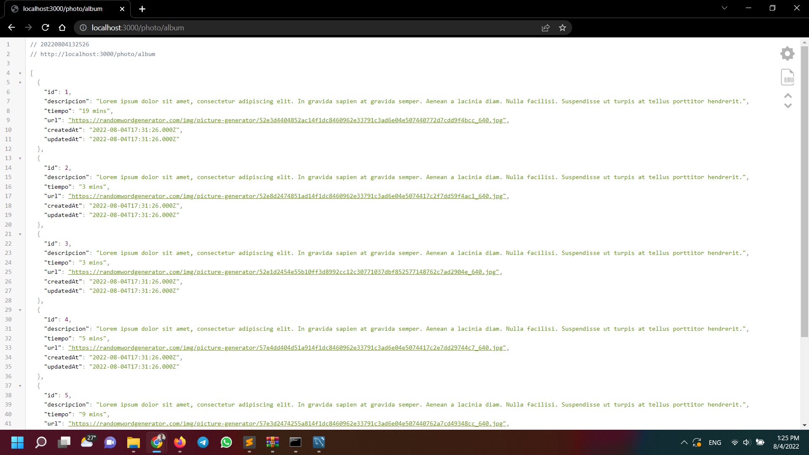

# Ejercicio 04

## Instrucciones

* Tome como referencia las instrucciones de:

  + [Firebase - Realtime database](https://dawfiec.github.io/DAWM-2022/tutoriales/firebase_realtime_database.html)

*

## Pruebas unitarias

* 

## Referencias 

* Building requests Postman Learning Center. (2022). Retrieved 16 August 2022, from https://learning.postman.com/docs/sending-requests/requests/
* Receiving responses Postman Learning Center. (2022). Retrieved 16 August 2022, from https://learning.postman.com/docs/sending-requests/responses/
* Grouping requests in collections Postman Learning Center. (2022). Retrieved 16 August 2022, from https://learning.postman.com/docs/sending-requests/intro-to-collections/
* Using variables Postman Learning Center. (2022). Retrieved 16 August 2022, from https://learning.postman.com/docs/sending-requests/variables/