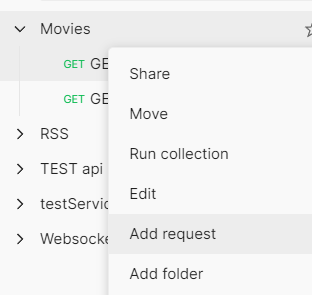
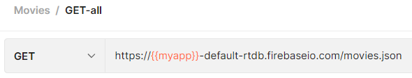

# Ejercicio 04

## Instrucciones

* Tome como referencia las instrucciones de:

  + [Firebase - Realtime database](https://dawfiec.github.io/DAWM-2022/tutoriales/firebase_realtime_database.html)

* Descargue el _dataset_ de [Kaggle - Disney Movies](https://www.kaggle.com/datasets/prateekmaj21/disney-movies).
* Instale globalmente el módulo [csv2json](https://www.npmjs.com/package/csv2json).
  + Convierta el dataset de **.csv** a **.json**, con: `csv2json disney_movies.csv disney_movies.json`
* Cree un proyecto en **Firebase** de acuerdo con el tutorial [Firebase - Realtime database](https://dawfiec.github.io/DAWM-2022/tutoriales/firebase_realtime_database.html).
  + Cree la colección: `movies`
  + Cargue el archivo **disney_movies.json** dentro de la colección **movies**
  + Edite las reglas de acceso a los datos para permitir acceso completo.
* Instale [Postman](https://learning.postman.com/docs/getting-started/installation-and-updates/) en su máquina.
  + Obtenga una cuenta
  + Cree una nueva colección, por ejemplo **Movies**, y agregue los requerimientos.

  
  

 
  

  + Requerimientos:
    - De tipo **GET** para obtener todos (_GET all_) la colección.

  
  

    - De tipo **GET** para obtener un (_GET one_) elemento la colección.

  
  

    

## Pruebas unitarias

* 

## Referencias 

* Building requests Postman Learning Center. (2022). Retrieved 16 August 2022, from https://learning.postman.com/docs/sending-requests/requests/
* Receiving responses Postman Learning Center. (2022). Retrieved 16 August 2022, from https://learning.postman.com/docs/sending-requests/responses/
* Grouping requests in collections Postman Learning Center. (2022). Retrieved 16 August 2022, from https://learning.postman.com/docs/sending-requests/intro-to-collections/
* Using variables Postman Learning Center. (2022). Retrieved 16 August 2022, from https://learning.postman.com/docs/sending-requests/variables/