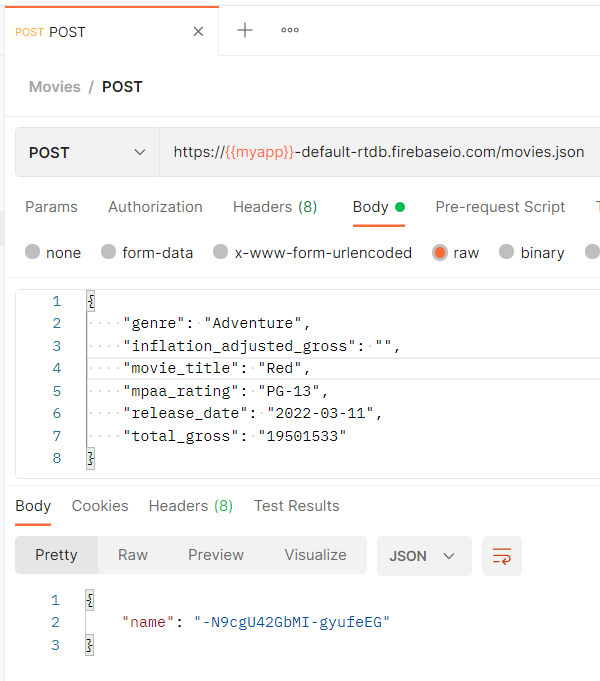
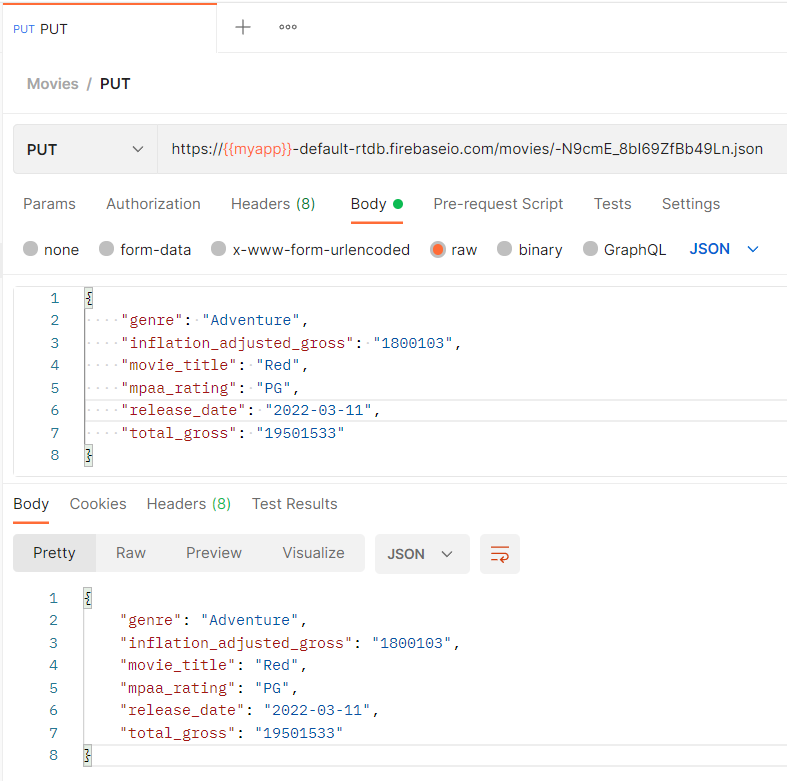
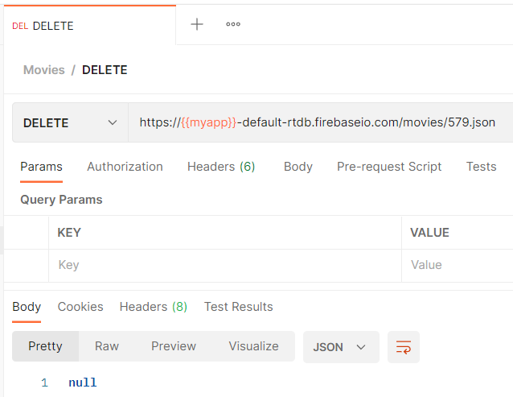
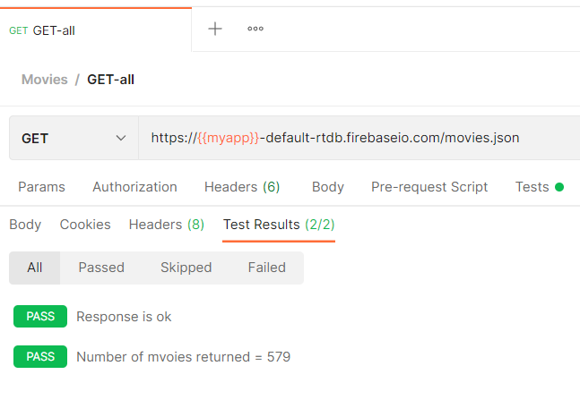

# Ejercicio 04


## Instrucciones

* Tome como referencia las instrucciones de:

  + [Firebase - Realtime database](https://dawfiec.github.io/DAWM-2022/tutoriales/firebase_realtime_database.html)

* Descargue el _dataset_ de [Kaggle - Disney Movies](https://www.kaggle.com/datasets/prateekmaj21/disney-movies).
* Instale globalmente el módulo [csv2json](https://www.npmjs.com/package/csv2json).
  + Convierta el dataset de **.csv** a **.json**, con: `csv2json disney_movies.csv disney_movies.json`
* Cree un proyecto en **Firebase** de acuerdo con el tutorial [Firebase - Realtime database](https://dawfiec.github.io/DAWM-2022/tutoriales/firebase_realtime_database.html).
  + Cree la colección: `movies`
  + Cargue el archivo **disney_movies.json** dentro de la colección **movies**
  + Edite las reglas de acceso a los datos para permitir acceso completo.
* Instale [Postman](https://learning.postman.com/docs/getting-started/installation-and-updates/) en su máquina.
  + Obtenga una cuenta
  + Cree una nueva colección, por ejemplo **Movies**,
    <p align="center">  
      
    </p>


  + Y agregue los requerimientos:
    <p align="center"> 
      
    </p>

    - _**GET-all**_: De tipo **GET** para obtener todos la colección, al URL: `https://{{myapp}}-default-rtdb.firebaseio.com/movies.json`. Haga clic en el botón **Send** para enviar el requerimiento.
      <p align="center">  
        
      </p>

    - _**GET-one**_: De tipo **GET** para del elemento **150** de la colección, al URL: `https://{{myapp}}-default-rtdb.firebaseio.com/movies/150.json`. Haga clic en el botón **Send** para enviar el requerimiento.
      <p align="center">  
        
      </p>

    - _**POST**_: De tipo **POST** para enviar datos a la colección, al URL `https://{{myapp}}-default-rtdb.firebaseio.com/movies/579.json`. Modifique el **Body** del requerimiento de tipo **raw**. 
      ```
      {
          "genre": "Adventure",
          "inflation_adjusted_gross": "",
          "movie_title": "Red",
          "mpaa_rating": "PG-13",
          "release_date": "",
          "total_gross": ""
      }
      ```

      Haga clic en el botón **Send** para enviar el requerimiento.
      <p align="center">  
        
      </p>

      La colección en firebase después del POST
      <p align="center">  
        
      </p>

    - _**PUT**_: De tipo **PUT** para enviar datos a la colección, al URL `https://{{myapp}}-default-rtdb.firebaseio.com/movies/579.json`.  Modifique el **Body** del requerimiento de tipo **raw**. 
      ```
      {
          "genre": "Adventure",
          "inflation_adjusted_gross": "1800103",
          "movie_title": "Red",
          "mpaa_rating": "PG",
          "release_date": "2022-03-11",
          "total_gross": "19501533"
      }
      ```

      Haga clic en el botón **Send** para enviar el requerimiento.
      <p align="center">  
        
      </p>

      La colección en firebase después del PUT
      <p align="center">  
        
      </p>

    - _**DELETE**_: De tipo **DELETE** para enviar datos a la colección, al URL `https://{{myapp}}-default-rtdb.firebaseio.com/movies/579.json`. 

      Haga clic en el botón **Send** para enviar el requerimiento.
      <p align="center">  
        
      </p>

      La colección en firebase después del DELETE
      <p align="center">  
        
      </p>


## Pruebas unitarias

* En cada requerimiento, en la sección **Tests**
  + Para _**GET-all**_ 
```
pm.test("Response is ok", ()=>{
    pm.response.to.have.status(200)
})

var data = pm.response.json();

pm.test('Number of mvoies returned = ' + data.length, ()=>{
    pm.expect(data.length).to.equal(579);
})
```

  + Para _**GET-one**_ 
```
pm.test("Response is ok", ()=>{
    pm.response.to.have.status(200)
})

const jsonData = pm.response.json();

pm.test('Has data: mpaa_rating', function() {
  pm.expect(jsonData).to.have.property('mpaa_rating');
});

pm.test('Has total_gross value: "12349549"', function() {
  pm.expect(jsonData["total_gross"]).to.equal("12349549");
});
```

  + Para _**POST**_ 
```
pm.test("Response is ok", ()=>{
    pm.response.to.have.status(200)
})

const jsonData = pm.response.json();

pm.test('Has data: name', function() {
  pm.expect(jsonData).to.have.property('name');
});
```

  + Para _**PUT**_ 
```
pm.test("Response is ok", ()=>{
    pm.response.to.have.status(200)
})

const jsonData = pm.response.json();

pm.test('Has data: total_gross', function() {
  pm.expect(jsonData).to.have.property('total_gross');
});

pm.test('Has data: inflation_adjusted_gross', function() {
  pm.expect(jsonData).to.have.property('inflation_adjusted_gross');
});
```

  + Para _**DELETE**_ 
```
pm.test("Response is ok", ()=>{
    pm.response.to.have.status(200)
})

const jsonData = pm.response.json();

pm.test('Response is null', function() {
  pm.expect(jsonData).to.eql(null)
});
```


* Los resultados posibles a las pruebas unitarias pueden ser:
  <p align="center">  
    
  </p>


## Referencias 

* Building requests Postman Learning Center. (2022). Retrieved 16 August 2022, from https://learning.postman.com/docs/sending-requests/requests/
* Receiving responses Postman Learning Center. (2022). Retrieved 16 August 2022, from https://learning.postman.com/docs/sending-requests/responses/
* Grouping requests in collections Postman Learning Center. (2022). Retrieved 16 August 2022, from https://learning.postman.com/docs/sending-requests/intro-to-collections/
* Using variables Postman Learning Center. (2022). Retrieved 16 August 2022, from https://learning.postman.com/docs/sending-requests/variables/
* Firebase Database REST API. (2022). Retrieved 16 August 2022, from https://firebase.google.com/docs/reference/rest/database