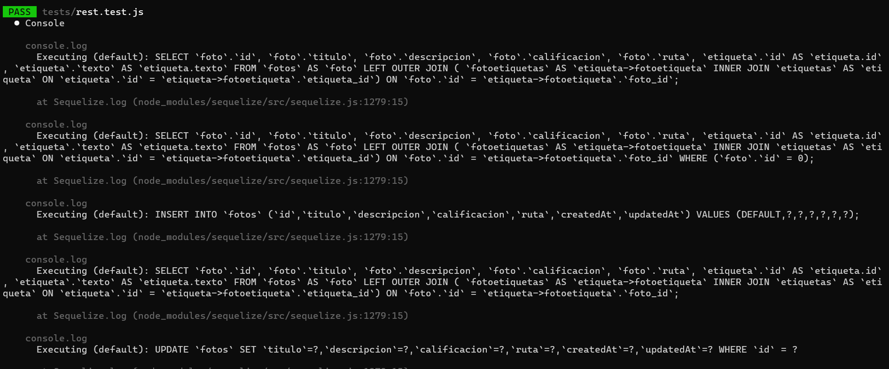
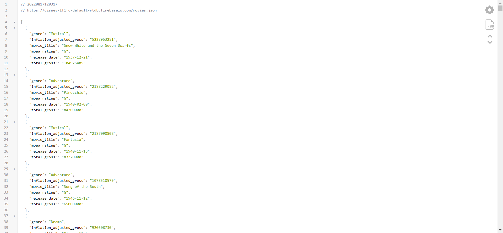
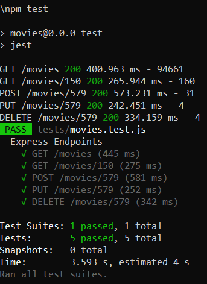

# Ejercicio 01

<p align="center">  
  
</p>


## Instrucciones

* Tome como referencia las instrucciones de:

  + [Express - Bases](https://dawfiec.github.io/DAWM-2022/tutoriales/express_bases.html),
  + [Express - Formularios](https://dawfiec.github.io/DAWM-2022/tutoriales/express_forms.html),
  + [Express - Parámetros de consulta y Parámetros de ruta](https://dawfiec.github.io/DAWM-2022/tutoriales/express_pcpr.html)
  + [Firebase - Realtime database](https://dawfiec.github.io/DAWM-2022/tutoriales/firebase_realtime_database.html)

* Cree un proyecto nuevo llamado **movies**
* Instale el módulo **axios**, con: `npm i axios`
* En el app.js
  + Registre la ruta "/movies" para que enrute las peticiones a "routes/movies.js"

* En el ruteador "routes/movies.js" 

  + Agregue las referencias a los módulos **express** y **axios**. Además, agregue el nombre de su aplicación en **myapp**. 

  ```
  var express = require('express');
  const axios = require('axios')
  var router = express.Router();

  const myapp = ''
  ```  
  
  + Agregue controlador con la subruta `/` para la funcionalidad para _GET all_ mediante un requerimiento http con **axios**. 

  ```
  /* GET all. */
  router.get('/', (req, res, next) => {

    axios.get(`https://${myapp}-default-rtdb.firebaseio.com/movies.json`)
    .then( resAxios => {
        res.json(resAxios.data)
    })
    .catch(err => console.log(err))

  });
  ```

  Levante el servidor, con: `npm run devstart`. Consulte el resultado en el navegador a la URL: `http://localhost:3000/movies`

  <p align="center">  
    
  </p>

  + Agregue la funcionalidad para **GET one**, **POST**, **PUT** y **DELETE**. De acuerdo con [Axios Tutorial: Get/Post/Put/Delete request example](https://www.bezkoder.com/axios-request/)

  ```
  /* GET one. */
  router.get('/:id', (req, res, next) => {


  });

  /* POST. */
  router.post('/:id', (req, res, next) => {

    let obj = {
      "genre": req.body.genre,
      "inflation_adjusted_gross": req.body.inflation_adjusted_gross,
      "movie_title": req.body.movie_title,
      "mpaa_rating": req.body.mpaa_rating,
      "release_date": req.body.release_date,
      "total_gross": req.body.total_gross
    }


  });

  /* PUT. */
  router.put('/:id', (req, res, next) => {

    let obj = {
      "genre": req.body.genre,
      "inflation_adjusted_gross": req.body.inflation_adjusted_gross,
      "movie_title": req.body.movie_title,
      "mpaa_rating": req.body.mpaa_rating,
      "release_date": req.body.release_date,
      "total_gross": req.body.total_gross
    }


  });

  /* DELETE. */
  router.delete('/:id', (req, res, next) => {


  });
  module.exports = router;
  ``` 

## Pruebas unitarias

* En su proyecto de Express 
  + Instale las dependencias **Jest**, **SuperTest** y **cross-env**
    - Desde la línea de comandos ejecute: `npm install --save-dev jest supertest cross-env`
  + Agregue la carpeta **tests** de este repositorio a su proyecto 
  + Modifique el archivo **package.json**
    - Agregue los pares clave-valor

    <pre><code>
    ...
      "scripts":{
        ...
        <b style="color:red">
        ,
        "test": "jest"
        </b>
      }
    ...
        "nodemon": "^2.0.19",
        "supertest": "^6.2.4"
      }
      <b style="color:red">
      ,
      "jest": {
        "testEnvironment": "node",
        "coveragePathIgnorePatterns": [
          "/node_modules/"
        ]
      }
      </b>
    }
    </code></pre> 

* En la ruta de su proyecto en Express, desde la línea de comandos ejecute: `npm test`
* Los resultados posibles a las pruebas unitarias pueden ser: jest
  
  <p align="center">
    
  </p>

  + Todos fueron exitosas, o
  + Existen pruebas unitarias fallidas.
* En caso de ser necesario, modifique el/los archivo(s) y vuelva a ejecutar las pruebas unitarias.

## Referencias 

* DAWM-2022. (2022). Retrieved 17 August 2022, from https://dawfiec.github.io/DAWM-2022/tutoriales/express_bases.html
* DAWM-2022. (2022). Retrieved 17 August 2022, from https://dawfiec.github.io/DAWM-2022/tutoriales/express_forms.html
* DAWM-2022. (2022). Retrieved 17 August 2022, from https://dawfiec.github.io/DAWM-2022/tutoriales/express_pcpr.html
* DAWM-2022. (2022). Retrieved 17 August 2022, from https://dawfiec.github.io/DAWM-2022/tutoriales/firebase_realtime_database.html
* Axios API Axios Docs. (2022). Retrieved 17 August 2022, from https://axios-http.com/docs/api_intro
* HAxios Tutorial: Get/Post/Put/Delete request example - BezKoder. (2021). Retrieved 17 August 2022, from https://www.bezkoder.com/axios-request/