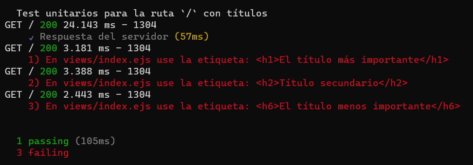
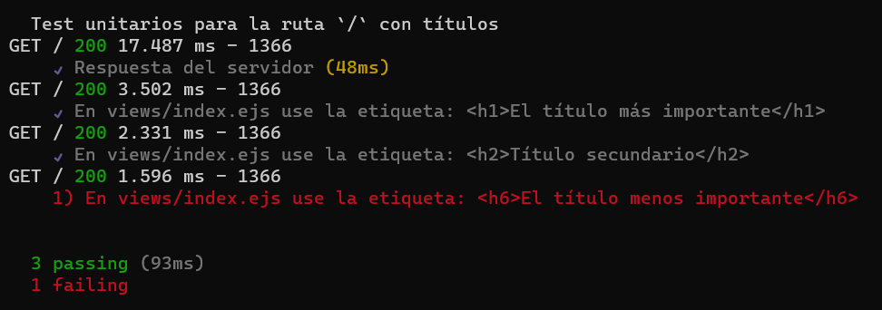

# Ejercicio 01

## Instrucciones

* Descargue y descomprima [ejercicio01.zip](ejercicio01.zip)
* Desde la línea de comandos
	+ Ingrese a la carpeta con el ejercicio
	+ Instale los paquetes necesarios, con: `npm install`
	+ Levante el servidor con cualquiera de las siguientes opciones:
		- En modo predeterminado, con: `npm start`
		- En modo de depuración 
			+ En Windows, con: `npm run debugw`
			+ En MacOs, con: `npm run debugm`
	+ Utilice su navegador preferido para abrir la vista inicial del ejercicio, con el URL: `http://localhost:3000/`

* Desde el navegador, revise cada una de las instrucciones que aparecen en los recuadros de color verde.
* Desde el editor de texto, modifica el archivo `views/index.ejs`, 
	+ Agrega su respuesta dentro de cada uno de los comentarios marcados, con:  
	`<!-- Inicio -->` y `<!-- Fin -->`
* Desde el navegador, actualice la página y verifique si los cambios cumplen con las instrucciones solicitadas.

## Pruebas unitarias

* Desde otra instancia de la línea de comandos, ejecute: `npm test`
* Los resultados posibles a las pruebas unitarias pueden ser: 

	+ Todas las pruebas unitarias fueron exitosas, o

	

	  
	

	+ Existen pruebas unitarias fallidas.

	

	  
	

* En caso de aparecer pruebas unitarias fallidas:
	+ Revise los valores esperados, 
	+ Modifique el/los archivo(s), y 
	+ Vuelva a ejecutar las pruebas unitarias. 

	

	  
	

## Referencias 

* Freeman, J. (2022). Chapter 3 HTML Fundamentals | Client-Side Web Development. Retrieved 19 April 2022, from https://info340.github.io/html-fundamentals.html
* Elementos títulos - HTML: Lenguaje de etiquetas de hipertexto | MDN. (2022). Retrieved 16 May 2022, from https://developer.mozilla.org/es/docs/Web/HTML/Element/Heading_Elements
* Tutorial HTML - Títulos y encabezados. (2022). Retrieved 16 May 2022, from https://tutorialehtml.com/es/tutoriales-html-titulos/
