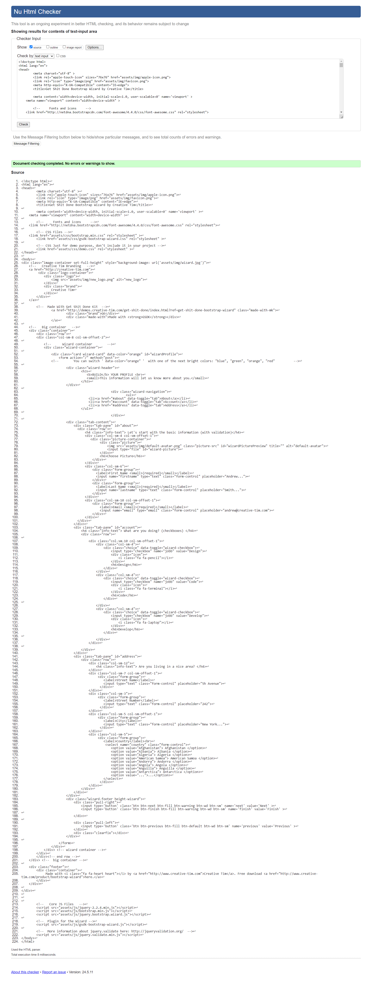

# Ejercicio 05

## Instrucciones

* Descargue y descomprima [C02E05.zip](../../zips/C02E05.zip)
* Desde la línea de comandos
	+ Ingrese a la carpeta con el ejercicio
	+ Instale los paquetes necesarios, con: `npm install`
	+ Levante el servidor con cualquiera de las siguientes opciones:
		- En modo predeterminado, con: `npm start`
		- En modo de depuración 
			+ En Windows, con: `npm run debugw`
			+ En MacOs, con: `npm run debugm`
	+ Utilice su navegador preferido para abrir la vista inicial del ejercicio, con el URL: `http://localhost:3000/`

* Copie todo el contenido del archivo `views/index.ejs` y valide la estructura html con el [W3C Validator By Input](https://validator.w3.org/#validate_by_input).
* Desde el editor de texto, modifica el archivo `views/index.ejs`
	+ Realiza todas las notificaciones **INFO**, **WARNING** y **ERROR**.
	+ En caso de necesitar ayuda, revisa las recomendaciones en [Rocket Validator](https://rocketvalidator.com/html-validation)
* Desde el navegador, actualice la página y verifique si los cambios cumplen con las instrucciones solicitadas.

## Pruebas unitarias

* Desde otra instancia de la línea de comandos, ejecute: `npm test`
* Los resultados posibles a las pruebas unitarias pueden ser: 
	+ Todos fueron exitosas, o
	+ Existen pruebas unitarias fallidas.
* En caso de ser necesario, modifique el/los archivo(s) y vuelva a ejecutar las pruebas unitarias. 

## Referencias 

* Markup Validation Service. (n.d.). Retrieved from https://validator.w3.org/#validate_by_input
* HTML Guide · Rocket Validator. (n.d.). Retrieved from https://rocketvalidator.com/html-validation