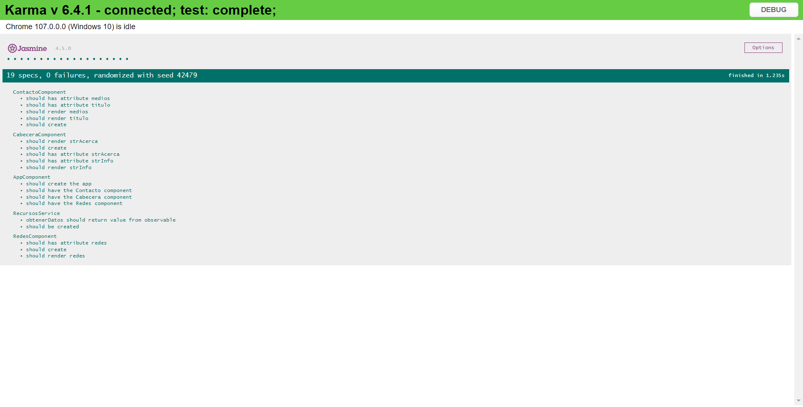

# Ejercicio 11

## Requisitos

* Complete las actividades de [Angular - Local](https://dawmfiec.github.io/DAWM/tutoriales/angular_local.html), [Angular - Bootstrap](https://dawmfiec.github.io/DAWM/tutoriales/angular_bootstrap.html), [Angular - Componentes, Comunicación y Directivas](https://dawmfiec.github.io/DAWM/tutoriales/angular_bases.html) y [Angular - Servicios](https://dawmfiec.github.io/DAWM/tutoriales/angular_servicios.html).

## Instrucciones

* Desde la línea de comandos, en la raíz de la carpeta del proyecto 
* Ejecute su aplicación, con: `ng serve`

## Pruebas unitarias

* Descargue y descomprima [C04E06.zip](../../zips/C04E11.zip)
* Copie cada archivo **.spec.ts** y reemplace con el archivo **.spec.ts** a cada componente del proyecto.
	+ `specs/app.component.spec.ts` -> `src/app/app.component.spec.ts`
	+ `specs/recursos.component.spec.ts` -> `src/app/servicios/recursos.component.spec.ts`
* En la ruta de su proyecto en Angular, desde la línea de comandos ejecute: `npm test`
* Los resultados posibles a las pruebas unitarias pueden ser: 
	
	+ Todos fueron exitosas, o
	+ Existen pruebas unitarias fallidas.
* En caso de ser necesario, modifique el/los archivo(s) y vuelva a ejecutar las pruebas unitarias. 

## Referencias 

* DAWM. (2022). Retrieved 29 November 2022, from https://dawmfiec.github.io/DAWM/tutoriales/angular_local.html
* DAWM. (2022). Retrieved 29 November 2022, from https://dawmfiec.github.io/DAWM/tutoriales/angular_bootstrap.html
* DAWM. (2022). Retrieved 29 November 2022, from https://dawmfiec.github.io/DAWM/tutoriales/angular_bases.html
* DAWM. (2022). Retrieved 29 November 2022, from https://dawmfiec.github.io/DAWM/tutoriales/angular_pwa.html
* DAWM. (2022). Retrieved 29 November 2022, from https://dawmfiec.github.io/DAWM/tutoriales/angular_servicios.html
