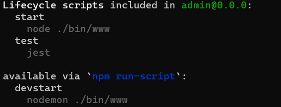

# Ejercicio 01

## Instrucciones

* Complete las actividades de [Express - Bases](https://dawmfiec.github.io/DAWM/tutoriales/express_bases.html) y [Express - Bootstrap](https://dawmfiec.github.io/DAWM/tutoriales/express_bootstrap.html).

## Pruebas unitarias

* En su proyecto de Express 
  + Instale las dependencias a **Jest**, **SuperTest** y **cross-env**
    - Desde otra instancia de la línea de comandos, ejecute: `npm install --save-dev jest supertest cross-env`
  + Copie la carpeta **tests** de este repositorio a su proyecto.
  + Modifique el archivo **package.json**
    - Agregue los pares/valores: **test** y **jest**

    <pre><code>
    ...
      "scripts": {
        "devstart": "nodemon ./bin/www",
        "start": "node ./bin/www",
        <b style="color:red">
        "test": "jest"
        </b>
      },
      <b style="color:red">
      "jest": {
        "testEnvironment": "node",
        "coveragePathIgnorePatterns": [
          "/node_modules/"
        ]
      },
      </b>
      "dependencies": {
      ...
      },
      "devDependencies": {
      ...
      }
    }
    </code></pre> 

* Desde la línea de comandos:
  + Liste los comando disponibles, con: `npm run`

  

    
  

  
  + Ejecute las pruebas unitarias, con: `npm test`

* Los resultados posibles a las pruebas unitarias:
  
  

    
  

  + Todos fueron exitosas, o
  + Existen pruebas unitarias fallidas.
* En caso de ser necesario, modifique el/los archivo(s) y vuelva a ejecutar las pruebas unitarias.

## Referencias 

* DAWM-2022. (2022). Retrieved 27 July 2022, from https://dawfiec.github.io/DAWM-2022/tutoriales/express_bases.html
* DAWM-2022. (2022). Retrieved 27 July 2022, from https://dawfiec.github.io/DAWM-2022/tutoriales/express_bootstrap.html
* Testing your Express.js Backend Server. (2021). Retrieved 27 July 2022, from https://dev.to/lukekyl/testing-your-express-js-backend-server-3ae6
* Expect · Jest. (2022). Retrieved 27 July 2022, from https://jestjs.io/docs/expect
