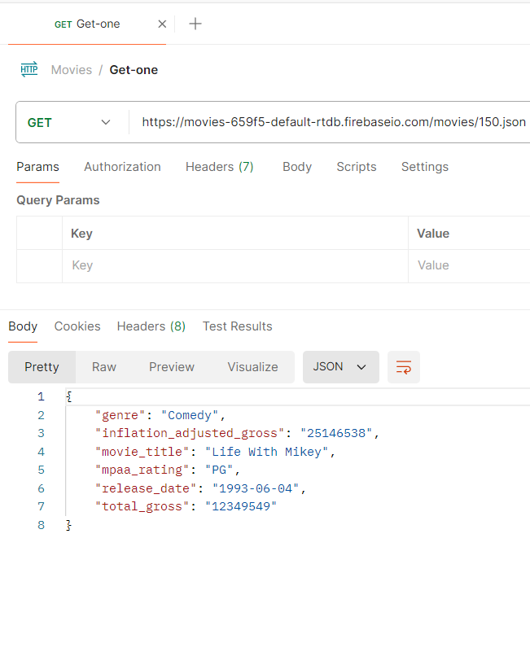
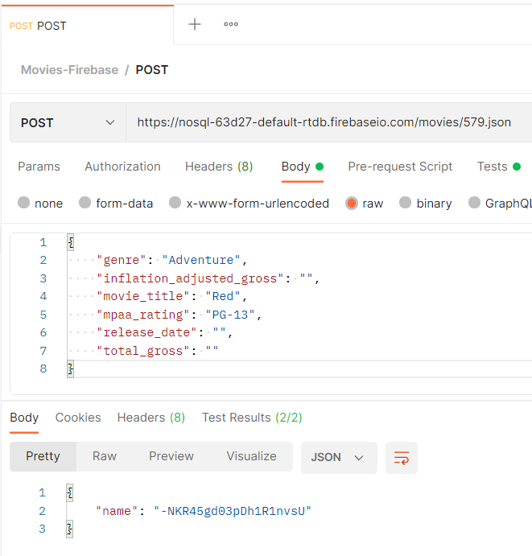
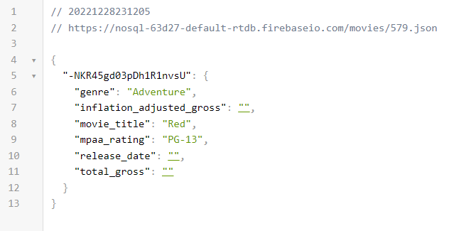
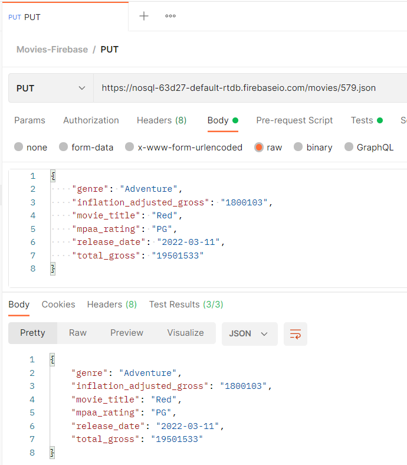
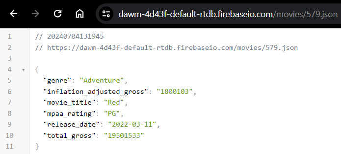
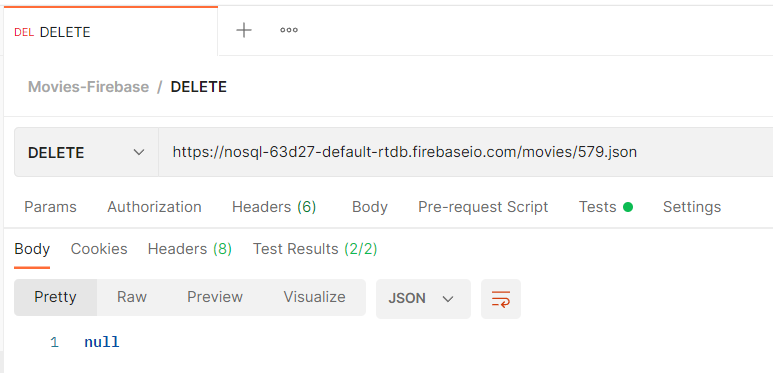
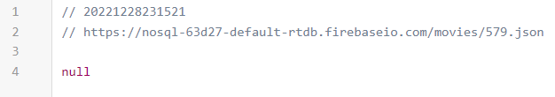

# Ejercicio 04

<p align="center">  
  
</p>

## Instrucciones

* Descargue el _dataset_ de **disney_movies.csv** en [Kaggle - Disney Movies](https://www.kaggle.com/datasets/prateekmaj21/disney-movies).
* Desde la línea de comandos, instale globalmente el módulo [csv2json](https://www.npmjs.com/package/csv2json).
  + Convierta el dataset de **.csv** a **.json**, con: `csv2json disney_movies.csv disney_movies.json`
* Cree un proyecto en **Firebase** de acuerdo con el tutorial [Firebase - Realtime database](https://dawmfiec.github.io/DAWM/tutoriales/firebase_realtime_database.html).
  + Cree la colección: `movies`
  + Cargue el archivo **disney_movies.json** dentro de la colección movies.
  + Edite las reglas de acceso a los datos para permitir acceso completo.
  + Obtenga el URL de acceso a la colección. Suele ser similar al siguiente patrón:
      
      ```
      https://<NOMBRE_BASE_DATOS>-default-rtdb.firebaseio.com/movies.json
      ```

* Descargue e instale [Postman](https://learning.postman.com/docs/getting-started/installation-and-updates/).
  + Obtenga una [cuenta gratuita](https://identity.getpostman.com/signup).
  + Cree la colección **Movies**,
    <p align="center">  
      
    </p>

  + Y agregue los requerimientos:
    <p align="center"> 
      
    </p>

    - _**GET-all**_: Con el método **GET** para obtener todos los elementos de la colección, al URL: `https://nosql-63d27-default-rtdb.firebaseio.com/movies.json`. Así luce respuesta del requerimiento en _Postman_.

      <p align="center">  
        
      </p>

    - _**GET-one**_: Con el método **GET** para del elemento **150** de la colección, al URL: `https://nosql-63d27-default-rtdb.firebaseio.com/movies/150.json`. Así luce respuesta del requerimiento en _Postman_.

      <p align="center">  
        
      </p>

    - _**POST**_: Con el método **POST** para enviar datos a la colección, al URL `https://nosql-63d27-default-rtdb.firebaseio.com/movies/579.json`. Modifique el **Body** del requerimiento de tipo **raw**. 
      ```
      {
          "genre": "Adventure",
          "inflation_adjusted_gross": "",
          "movie_title": "Red",
          "mpaa_rating": "PG-13",
          "release_date": "",
          "total_gross": ""
      }
      ```

      Así luce respuesta del requerimiento en _Postman_ y la colección en firebase después del POST.

      <p align="center">  
        
        
      </p>

    - _**PUT**_: Con el método **PUT** para enviar datos a la colección, al URL `https://nosql-63d27-default-rtdb.firebaseio.com/movies/579.json`.  Modifique el **Body** del requerimiento de tipo **raw**. 
      ```
      {
          "genre": "Adventure",
          "inflation_adjusted_gross": "1800103",
          "movie_title": "Red",
          "mpaa_rating": "PG",
          "release_date": "2022-03-11",
          "total_gross": "19501533"
      }
      ```

      Así luce respuesta del requerimiento en _Postman_ y la colección en firebase después del PUT.

      <p align="center">  
        
        
      </p>

    - _**DELETE**_: Con el método **DELETE** para enviar datos a la colección, al URL `https://nosql-63d27-default-rtdb.firebaseio.com/movies/579.json`. Envíe la petición. Así luce respuesta del requerimiento en _Postman_ y la colección en firebase después del DELETE.

      <p align="center">  
        
        
      </p>


## Pruebas unitarias

* Para cada requerimiento, en la sección **Tests**
  + Agregue los test _**GET-all**_ 
  ```
  pm.test("Response is ok", ()=>{
      pm.response.to.have.status(200)
  })

  var data = pm.response.json();

  pm.test('Number of mvoies returned = ' + data.length, ()=>{
      pm.expect(data.length).to.equal(579);
  })
  ```

  + Agregue los test _**GET-one**_ 
  ```
  pm.test("Response is ok", ()=>{
      pm.response.to.have.status(200)
  })

  const jsonData = pm.response.json();

  pm.test('Has data: mpaa_rating', function() {
    pm.expect(jsonData).to.have.property('mpaa_rating');
  });

  pm.test('Has total_gross value: "12349549"', function() {
    pm.expect(jsonData["total_gross"]).to.equal("12349549");
  });
  ```

  + Agregue los test _**POST**_ 
  ```
  pm.test("Response is ok", ()=>{
      pm.response.to.have.status(200)
  })

  const jsonData = pm.response.json();

  pm.test('Has data: name', function() {
    pm.expect(jsonData).to.have.property('name');
  });
  ```

  + Agregue los test _**PUT**_ 
  ```
  pm.test("Response is ok", ()=>{
      pm.response.to.have.status(200)
  })

  const jsonData = pm.response.json();

  pm.test('Has data: total_gross', function() {
    pm.expect(jsonData).to.have.property('total_gross');
  });

  pm.test('Has data: inflation_adjusted_gross', function() {
    pm.expect(jsonData).to.have.property('inflation_adjusted_gross');
  });
  ```

  + Agregue los test _**DELETE**_ 
  ```
  pm.test("Response is ok", ()=>{
      pm.response.to.have.status(200)
  })

  const jsonData = pm.response.json();

  pm.test('Response is null', function() {
    pm.expect(jsonData).to.eql(null)
  });
  ```

* Programe la ejecución de la colección, con:

  <p align="center">  
    
    
  </p>

* Los resultados posibles a las pruebas unitarias pueden ser:
  <p align="center">  
    
  </p>


## Referencias 

* Building requests Postman Learning Center. (2022). Retrieved 16 August 2022, from https://learning.postman.com/docs/sending-requests/requests/
* Receiving responses Postman Learning Center. (2022). Retrieved 16 August 2022, from https://learning.postman.com/docs/sending-requests/responses/
* Grouping requests in collections Postman Learning Center. (2022). Retrieved 16 August 2022, from https://learning.postman.com/docs/sending-requests/intro-to-collections/
* Using variables Postman Learning Center. (2022). Retrieved 16 August 2022, from https://learning.postman.com/docs/sending-requests/variables/
* Firebase Database REST API. (2022). Retrieved 16 August 2022, from https://firebase.google.com/docs/reference/rest/database