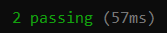

# Desarrollo de Aplicaciones Web y Móviles - SOFG1006

Cada capítulo contiene un conjunto de ejercicios donde podrás experimentar los conceptos revisados durante la clase. Cada ejercicio contiene un conjunto de pruebas para validar tu respuesta.

## Sitio web

Enlace al [sitio web](https://dawmfiec.github.io/DAWM/).

## Recursos

*  [Programming-Notes-for-Professionals-books](https://github.com/bao-vn/Programming-Notes-for-Professionals-books/tree/master/GoalKicker)
*  [Sobrecodigo](https://www.instagram.com/sobrecodigo/)

## Prerequisitos

* Editor de texto 
	- [Sublime](https://www.sublimetext.com/3),
	- [Visual Studio Code](https://code.visualstudio.com/download), o cualquier otro editor de texto.
* Git
	- Descargue e instale desde el [sitio oficial](https://git-scm.com/downloads).
* node
	- Instale node, dese el [sitio oficial](https://nodejs.org/es/download/).
* npm
	- Descargue el [paquete](https://www.npmjs.com/package/download) de manera global, con: `npm install -g npm` 

## ¿Dónde comienzo?

* Accede a la página de cada ejercicio
	+ Descarga y descomprime el archivo `.zip` del ejercicio.
	+ Realiza las instrucciones en el `README.md`.
	+ Ejecuta las pruebas unitarias.

## Pruebas Unitarias

Cada ejercicio contiene un conjunto de pruebas unitarias. Dichas pruebas permiten comprobar si la respuesta a los ejercicios cumplen con los requisitos solicitados. Los resultados posibles a las pruebas unitarias pueden ser: 

* Todos fueron exitosas.

* Existen pruebas unitarias fallidas.

 

## Ejercicios

| Capítulo      | Ejercicios                                     | Temas    |
| :-----------: | :--------------------------------------------: | :------- |
| Capítulo 01   | [Ejercicio 01](Capítulo01/ejercicio01)         | HTML: Títulos  |
| 			    | [Ejercicio 02](Capítulo01/ejercicio02)         | Listas (no) numeradas, tablas, atributos   |
| 			    | [Ejercicio 03](Capítulo01/ejercicio03)         | Imágenes, enlaces, etiquetas contenedores (p-span), atributo (clase) |
| 			    | [Ejercicio 04](Capítulo01/ejercicio04)         | Formularios, atributo (identificador) |
| 			    | [Ejercicio 05](Capítulo01/ejercicio05)         | Semántico |
| 			    | [Ejercicio 06](Capítulo01/ejercicio06)         | Media |
| 			    | [Ejercicio 07](Capítulo01/ejercicio07)         | CSS: Reglas y Selectores |
| 			    | [Ejercicio 08](Capítulo01/ejercicio08)         | Modelo de cajas |
| 			    | [Ejercicio 09](Capítulo01/ejercicio09)         | Colocación |
| 			    | [Ejercicio 10](Capítulo01/ejercicio10)         | Posicionamiento |
| Capítulo 02   | [Ejercicio 01](Capítulo02/ejercicio01)         | Diseño responsivo: Grid  |
| 			    | [Ejercicio 02](Capítulo02/ejercicio02)         | Diseño responsivo: Flexbox  |
| 			    | [Ejercicio 03](Capítulo02/ejercicio03)         | RWD  |
| 			    | [Ejercicio 04](Capítulo02/ejercicio04)         | Bootstrap  |
| 			    | [Ejercicio 05](Capítulo02/ejercicio05)         | Validación  |
| Capítulo 03   | [Ejercicio 01](Capítulo03/ejercicio01)         | Etiqueta script  |
| 				| [Ejercicio 02](Capítulo03/ejercicio02)         | Fundamentos  |
|               | [Ejercicio 03](Capítulo03/ejercicio03)         | Control de flujo y Funciones  |
| 				| [Ejercicio 04](Capítulo03/ejercicio04)         | DOM  |
| 				| [Ejercicio 05](Capítulo03/ejercicio05)         | Eventos |
| 				| [Ejercicio 06](Capítulo03/ejercicio06)         | Promesas y Async/Await  |
| 				| [Ejercicio 07](Capítulo03/ejercicio07)         | Servidor HTTP - Básico  |
| Capítulo 04   | [Ejercicio 01](Capítulo04/ejercicio01)         | Typescript - Transpilar TypeScript en JavaScript |
| 				| [Ejercicio 02](Capítulo04/ejercicio02)         | Typescript - Anotación de tipos básicos, arreglos y objetos |
| 				| [Ejercicio 03](Capítulo04/ejercicio03)         | Typescript - Interfaces y clases |
| 				| [Ejercicio 04](Capítulo04/ejercicio04)         | Typescript - Funciones |
| 				| [Ejercicio 05](Capítulo04/ejercicio05)         | Angular - Bases, Bootstrap y Componentes/Comunicación/Directivas |
| 				| [Ejercicio 06](Capítulo04/ejercicio06)         | Angular - Servicios |
| Capítulo 05   | [Ejercicio 01](Capítulo05/ejercicio01)         | Express - Bases y Bootstrap |
|               | [Ejercicio 02](Capítulo05/ejercicio02)         | Express - ORM (Básico e Intermedio) |
|               | [Ejercicio 03](Capítulo05/ejercicio03)         | Express - Parámetros de consulta y de ruta |
| Capítulo 06   | [Ejercicio 01](Capítulo06/ejercicio01)         | Express - Rest - Local|
|               | [Ejercicio 02](Capítulo06/ejercicio02)         | Express - Rest - Firebase |

## Referencias 

* Guía completa markdown y su integración con R. (2022). Retrieved 19 April 2022, from https://rstudio-pubs-static.s3.amazonaws.com/330387_5a40ca72c3b14824acedceb7d34618d1.html
* Unit Testing Express : Unit Test Express Route. (2018). Retrieved 19 April 2022, from https://codehandbook.org/unit-test-express-route/
* Freeman, J. (2022). Client-Side Web Development. Retrieved 9 May 2022, from https://info340.github.io/
* Learn. (2022). Retrieved 9 May 2022, from https://web.dev/learn/
* Tecnología para desarrolladores web | MDN. (2021). Retrieved 9 May 2022, from https://developer.mozilla.org/es/docs/Web
* Hello, World! - Learn HTML - Free Interactive HTML Tutorial. (2022). Retrieved 11 May 2022, from https://www.learn-html.org/en/Hello%2C_World%21
* HTML Tutorial. (2022). Retrieved 11 May 2022, from https://www.w3schools.com/html/default.asp
* CSS Tutorial. (2022). Retrieved 11 May 2022, from https://www.w3schools.com/css/default.asp
* Introduction to Chai Assertions. (2022). Retrieved 11 May 2022, from https://testautomationu.applitools.com/chai-test-assertions/
* message, M., d, t., & 0, G. (2020). Mocha/Chai: testing thrown Errors with error message. Retrieved 9 June 2022, from https://stackoverflow.com/questions/62717058/mocha-chai-testing-thrown-errors-with-error-message
