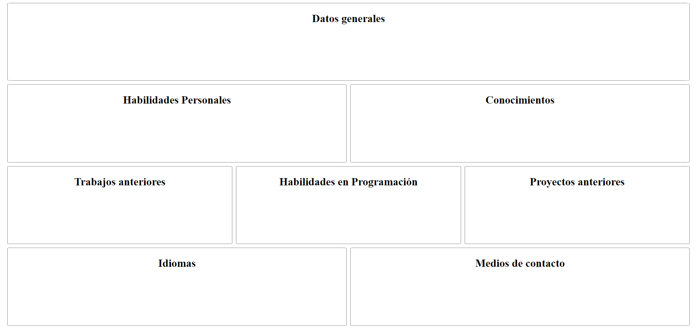

# Colocación de elementos

## Actividades previas

* Descargue y descomprima el ejercicio de [colocación](/DAWM/ejercicios/colocacion.zip). 
* Habilite el [Live Server de Visual Studio Code](https://www.geeksforgeeks.org/how-to-enable-live-server-on-visual-studio-code/).
* Habilite el inspector en el navegador para visualizar los cambios en vivo.

## Grid vs Flexbox

* Considere el siguiente diseño para la `colocación de elementos` mediante `flexbox` y `grid` .



### Grid por columnas 

* Modifique la hoja de estilos _css/grid_columnas.css_.
* Utilice el selector CSS para acceder a la etiqueta &lt;main&gt;. Aplique cada una de las siguientes propiedades y valores. Verifique los cambios en el navegador.

	```

		/* Modo de colocar los elementos internos en una rejilla */
		display: grid; 

		/* Separación entre filas */
		row-gap: 0.5rem; 

		/* Separación entre columnas */
		column-gap: 0.5rem; 

		/* Número de columnas: 6 * 1fr */
		grid-template-columns: repeat(6, 1fr); 

	```

* Para cada elemento	**&lt;section&gt;** que se encuentran dentro de la etiqueta **&lt;main&gt;**
	+ Acceda con el selector CSS de su preferencia. 
	+ Para las propiedades **grid-column** y **grid-row**, coloque los valores para **cinicio**, **cfinal**, **finicio** y **ffinal**.
	
		```

			grid-column: cinicio / cfinal;
			grid-row: finicio / ffinal;

		```
    + Verifique los cambios en el navegador

### Grid por area

* Modifique la hoja de estilos _css/grid_areas.css_.
* Utilice el selector CSS para acceder a la etiqueta &lt;main&gt;. Aplique cada una de las siguientes propiedades y valores. Verifique los cambios en el navegador.

	```

		/* Modo de colocar los elementos internos en una rejilla */
		display: grid; 

		/* Separación entre filas */
		row-gap: 0.5rem; 

		/* Separación entre columnas */
		column-gap: 0.5rem; 

		/* Nombres de las áreas*/
		grid-template-areas: "A A A A A A"
	                         "B B B Q Q Q"
	                         "D D E E F F"
	                         "M M M T T T"

	```

* Para cada elemento	**&lt;section&gt;** que se encuentran dentro de la etiqueta **&lt;main&gt;**
	+ Acceda con el selector CSS de su preferencia. 
	+ Para la propiedad **grid-area**, coloque los valores para **idarea**.
	
		```

			grid-area: idarea;

		```
	+ Verifique los cambios en el navegador


### Flexbox

* Modifique la hoja de estilos _css/flexbox.css_.
* Utilice el selector CSS para acceder a la etiqueta &lt;main&gt;. Aplique cada una de las siguientes propiedades y valores. Verifique los cambios en el navegador.

	```

		/* Modo de colocar los elementos internos de manera flexible */
	  display: flex; 

	  /* Eje primario con la dirección de los elementos */
	  flex-direction: row;

	  /* Separación entre filas */
	  row-gap: 0.5rem; 

	  /* Separación entre columnas */
	  column-gap: 0.5rem; 

	  /* Los elementos ocupan el espacio de acuerdo a su tamaño */
	  flex-wrap: wrap;

	  /* Los elementos están distribuidos uniformemente en el eje primario  */
	  justify-content: space-between;

	  /* Los elementos se estiran para llenar el eje transversal */
	  align-items: stretch;

	```

* Para cada elemento **&lt;section&gt;** que se encuentran dentro de la etiqueta **&lt;main&gt;**
	+ Acceda con el selector CSS de su preferencia. 
	+ Para la propiedad **flex-basis**, coloque los valores para **porcentaje**. 
	
		```
			flex-basis: porcentaje%;

			/* El espacio restante en el contenedor se distribuirá 
			equitativamente entre todos los elementos internos */
			
			flex-grow: 1;
		```

    + Verifique los cambios en el navegador

### Respuesta

* Comprima los archivos en formato .zip o .rar y responda a la actividad en el aulavirtual.

### Referencias

* Pseudoclases y pseudoelementos - Aprende sobre desarrollo web MDN. (2021). Retrieved 31 May 2022, from https://developer.mozilla.org/es/docs/Learn/CSS/Building__blocks/Selectors/Pseudo-classes__and__pseudo-elements
* Pseudo-classes - CSS MDN. (2022). Retrieved 31 May 2022, from https://developer.mozilla.org/es/docs/Web/CSS/Pseudo-classes
* Pseudoelementos - CSS MDN. (2022). Retrieved 31 May 2022, from https://developer.mozilla.org/es/docs/Web/CSS/Pseudo-elements
* 3.4. Pseudo-clases (CSS avanzado). (2022). Retrieved 31 May 2022, from https://uniwebsidad.com/libros/css-avanzado/capitulo-3/pseudo-clases
* 3.5. Pseudo-elementos (CSS avanzado). (2022). Retrieved 31 May 2022, from https://uniwebsidad.com/libros/css-avanzado/capitulo-3/pseudo-elementos
* Relación de Grid Layout con otros métodos de diseño y posicionamiento - CSS - CSS MDN. (2021). Retrieved 31 May 2022, from https://developer.mozilla.org/es/docs/Web/CSS/CSS__Grid__Layout/Relationship__of__Grid__Layout
* Don't Overthink It (Flexbox) Grids  CSS-Tricks. (2016). Retrieved 31 May 2022, from https://css-tricks.com/dont-overthink-flexbox-grids/
* flexbox-playground. (2022). Retrieved 31 May 2022, from https://flexbox.netlify.app/
* A Complete Guide to Flexbox  CSS-Tricks. (2013). Retrieved 31 May 2022, from https://css-tricks.com/snippets/css/a-guide-to-flexbox/
* A Complete Guide to Grid CSS-Tricks. (2021). Retrieved 31 May 2022, from https://css-tricks.com/snippets/css/complete-guide-grid/
* Layoutit Grid: Learning CSS Grid Visually With a Generator CSS-Tricks. (2020). Retrieved 1 June 2022, from https://css-tricks.com/layoutit-grid-learning-css-grid-visually-with-a-generator/
* Simple HTTP server in Python - Anurag Kumar. (2022). Retrieved 1 June 2022, from https://www.hackerearth.com/practice/notes/simple-http-server-in-python/