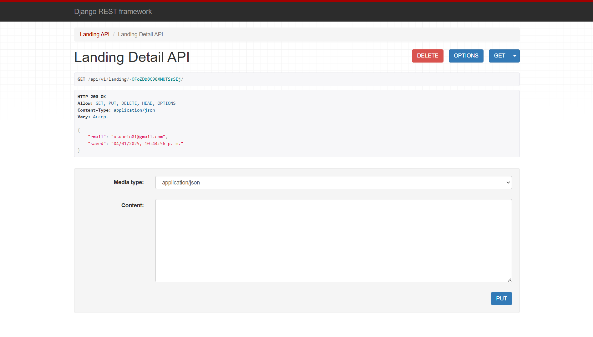

## Django Rest Framework (DRF)

[DAWM](/DAWM/)

### Actividades previas

* Complete la guía con el Django Rest Framework (DRF) en el proyecto.

### Actividades en clases

#### URL

1. Modifique el archivo _api/urls.py_, con:
	
	+ Asocie la ruta **'v1/landing/&lt;str:pk&gt;/'** con la vista LandingAPIDetail

	```python
	from django.urls import path
	from . import views

	urlpatterns = [
	    ...
	    path('v1/landing/<str:pk>/', views.LandingAPIDetail.as_view()),
	]
	```


#### LandingAPIDetail

1. Edite el archivo _api/views.py_, con:
	
	+ Agregue la clase `LandingAPIDetail`, con los métodos **get**, **put**, y **delete**.

	```python 
	...

	class LandingAPI(APIView):
		...

	class LandingAPIDetail(APIView):

		name = 'Landing Detail API'

		collection_name = 'coleccion'

		def get(self, request, pk):
			return Response(None, status=status.HTTP_200_OK)

		def put(self, request, pk):
			return Response(None, status=status.HTTP_200_OK)

		def delete(self, request, pk):
			return Response(None, status=status.HTTP_200_OK)
	```

2. Desde la línea de comandos
	
	+ Levante el servidor, con:

	```command
	python manage.py runserver
	```

3. (STOP 2) Revise los cambios en el navegador para las URLs: 

	+ En la ruta por clave `pk`, por ejemplo: [http://127.0.0.1:8000/api/v1/landing/-OFoZDb8C98XMUTSsSEj/](http://127.0.0.1:8000/api/v1/landing/-OFoZDb8C98XMUTSsSEj/)

	<div align="center">
	    
	</div>

#### GET, PUT y DELETE por PK

1. Implemente el método **GET** para recuperar un documento específico de la colección identificado por el parámetro `pk`.
	+ En caso de éxito, retornar el documento con el código de estado `200 OK`.
	+ Si no se encuentra el documento, retornar un mensaje de error con el código `404 Not Found`.

2. Implementar el método **PUT** para actualizar un documento en la colección identificado por `pk`.
	+ Validar que el cuerpo de la solicitud (`request.data`) contenga los campos necesarios para la actualización.
	+ En caso de éxito, retornar un mensaje confirmando la actualización con el código de estado `200 OK`.
	+ Si el documento no se encuentra, retornar un mensaje de error con el código `404 Not Found`.

3. Implementar el método **DELETE** para eliminar un documento específico de la colección identificado por `pk`.
	+ En caso de éxito, retornar un mensaje confirmando la eliminación con el código de estado `204 No Content`.
	+ Si no se encuentra el documento, retornar un mensaje de error con el código `404 Not Found`.


#### Validación y Verificación

1. Probar los métodos utilizando la interfaz de DRF y cURL.
2. Verificar que las respuestas cumplan con los códigos de estado y formatos esperados.
3. Asegurarse de que las operaciones no afecten otros documentos de la colección.

### Entregable

* Responda a la actividad en el aulavirtual con las capturas de pantalla del resultado y del código.

### Referencias

* Christie, T. (n.d.). Requests. Retrieved from https://www.django-rest-framework.org/api-guide/requests/
* Christie, T. (n.d.). Tutorial 3: Class-based Views. Retrieved from https://www.django-rest-framework.org/tutorial/3-class-based-views/
* firebase_admin.db module  Firebase. (n.d.). Retrieved from https://firebase.google.com/static/docs/reference/admin/python/firebase_admin.db
* Introducción a la API de Admin Database  Firebase Realtime Database. (n.d.). Retrieved from https://firebase.google.com/docs/database/admin/start?hl=es-419
* Khan, A. (2025). DELETE Method of APIView In Django REST Framework. Retrieved from https://medium.com/@altafkhan_24475/delete-method-of-apiview-in-django-rest-framework-c227942776d2