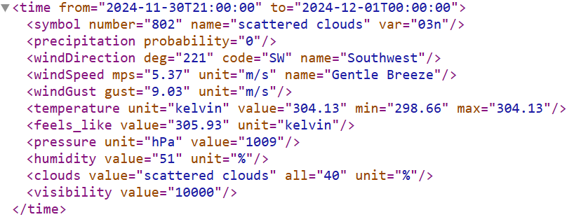
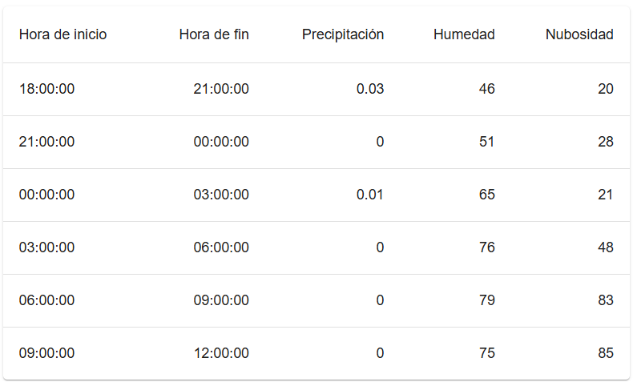

## React

[DAWM](/DAWM/)

### Actividades previas

* Complete las guías con el uso de hooks (useState, useRef y useEfffect) en el proyecto.

### Actividades en clases

#### Interfaz de datos

1. Cree la interfaz _src/interface/Item.tsx_:
	
	+ Con las claves **dateStart**, **dateEnd**, **precipitation**, **humidity** y **clouds**. 
	+ Todas las claves son de tipo _String_.

	```jsx
	export default interface Item {
		dateStart: String;
		...
	}
	```

#### _App.tsx_

1. Importe la interfaz **Item**
2. Cree una variable de estado y función de actualización para un arreglo del tipo _Item_, p.e.: **items** y **setItems**.
3. En el callback del hook _useEffect_:

	+ Cree un arreglo temporal del tipo **Item** para almacenar los valores del XML, p.e.: dataToItems.

	+ Analice el XML y utilice el DOM API obtener la referencia:
		- A la etiqueta `time` y extraiga los atributos **@from**, **@to**
		- A la etiqueta `time > precipitacion` y extraiga el atributo **probability**
		- A la etiqueta `time > humidity` y extraiga el atributo **value**
		- A la etiqueta `time > clouds` y extraiga el atributo **all** 	

	<div align="center">
	    
	</div>

	+ Por el ajuste visual, solo almacene los 6 primeros objetos (de tipo _Item_) en el arreglo temporal.
	+ Use la función de actualización para asignar el arreglo temporal.

4. En el _JSX_:

	+ Pase la variable de estado al prop del componente _TableWeather_, p.e.: **itemsIn** 

	```jsx
	<TableWeather itemsIn={ items } />
	```

#### _TableWeather.tsx_

1. Importe la interfaz **Item**
2. Cree la interfaz _MyProp_: 
	
	+ Con la clave igual que el identificador del prop: _itemsIn_.
	+ El tipo de datos es un arreglo del tipo _Item_.

	```typescript
	interface MyProp {
	  itemsIn: Item[];
	}
	```

3. Defina el prop **props** del tipo _MyProp_

	```typescript
	export default function BasicTable(props: MyProp) { ... }
	```

4. Cree una variable de estado y función de actualización para un arreglo del tipo _Item_, p.e.: **rows** y **setRows**
5. Use un useEffect, que: 
	
	+ En el callback llame a la función de actualización, con el valor del prop en la clave: **props.itemsIn**.
	+ Dependiente de los cambios del prop: **props**.

	```tsx
	useEffect( ()=> {
		setRows(props.itemsIn)
	}, [props])
	```

6. En el _JSX_:

	- Dentro de la etiqueta `<TableBody>`, itere en la variable de estado (arreglo del tipo **Item**)

	```jsx
	<TableBody>
      {rows.map((row, idx) => (
        <TableRow
          key={idx}
          sx={{ '&:last-child td, &:last-child th': { border: 0 } }}
        >
          <TableCell component="th" scope="row">
            {row.dateStart}
          </TableCell>
          ...
        </TableRow>
      ))}
    </TableBody>
	```

	- Muestre las otras claves de los elementos

7. Cambie los nombres de las cabeceras de la tabla

	```jsx
	<TableRow>
		<TableCell>Hora de inicio</TableCell>
		<TableCell align="right">Hora de fin</TableCell>
		<TableCell align="right">Precipitación</TableCell>
		<TableCell align="right">Humedad</TableCell>
		<TableCell align="right">Nubosidad</TableCell>
	</TableRow>
	```

8. Verifique la salida en el navegador


	<div align="center">
	    
	</div>

### Entregable

* Responda a la actividad en el aulavirtual con el URL del repositorio remoto en GitHub.

### Referencias

* Renard, G. (2023). Under the Hood of React useEffect Dependencies. Retrieved from https://blog.bitsrc.io/understanding-dependencies-in-useeffect-7afd4df37c96
