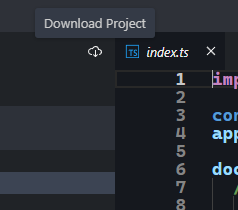

## Introducción a Typescript

[DAWM](/DAWM/)

### Actividades previas

* Obtenga una cuenta en [Stackblitz](https://stackblitz.com/) con su cuenta de GitHub.
* Acceda a la colección pública [Typescript](https://stackblitz.com/@aavendan/collections/typescript).

### Actividades en clases

Para cada proyecto:

1. Cree una bifurcación (**fork**)
2. Acceda a todos los archivos con extensión **.ts** (`index.ts`, `clase.ts`, `funciones.ts`, etc) y complete las instrucciones que se encuentran en los comentarios.
3. Verifique la validez de su respuesta: 
	+ Errores en tiempo de transpilación: No debe tener líneas marcadas en rojo.
	+ Errores en tiempo de compilación: La vista previa debe ejecutarse sin problemas y la consola de la vista previa no debe contener errores.

### Entregable

* Descargue cada proyecto mediante el botón **Download Project** 

    

* Comprima todos los archivos en formato .zip, o .rar, y responda a la actividad en el aulavirtual.

### Referencias

* (2023). Retrieved 21 June 2023, from https://thenewstack.io/what-is-typescript/
* (2022). Retrieved 27 November 2022, from https://www.typescriptlang.org/
* StackBlitz Instant Dev Environments Click. Code. Done. - StackBlitz. (2023). Retrieved 21 June 2023, from https://stackblitz.com/
* TypeScript Tutorial. (2023). Retrieved 21 June 2023, from https://www.typescripttutorial.net/
* Explore Challenges. (n.d.). Retrieved from https://typehero.dev/explore/beginner