## Guía 09

[Regresar](/DAWM/)

### Contenidos

* Revisión de ejercicios previos: dudas y comentarios.
* Troubleshooting
	+ [CORS](https://javascript.info/fetch-crossorigin)
	+ Manejo de respuesta y de errores del API
	+ [Slow internet connection](https://www.rd.com/list/hidden-reasons-your-internet-is-so-slow/)
	+ [Rate limiting - Github](https://docs.github.com/es/rest/overview/resources-in-the-rest-api#rate-limiting)

### Actividades

* Descargue y descomprima el archivo [fetch](../ejercicios/fetch.zip)
* Servidor HTTP
	+ Abra la línea de comando en la carpeta **fetch**
	+ Levante un servidor HTTP
	```
	python -m http.server 8056
	``` 
* Abra en su navegador el URL `http://localhost:8056/`


#### CORS

* En el navegador, acceda al URL `http://localhost:8056/cors/`
* Verifique el resultado de la petición
	+ En el navegador, abra otra pestaña al URL del <a href="https://random-d.uk/api/random" title="API" target="_blank">API</a> del <a href="https://random-d.uk/" title="Abrir el sitio original" target="_blank">Random-d.uk</a>. Con la salida:

	<p align="center">
	  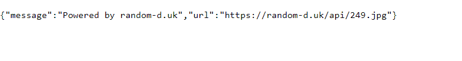
	</p>
	
  + En la página web, haga clic en el botón **Petición a Random-d.uk/api/random**.  Revise que la salida en la consola del navegador sea: `Solicitud desde otro origen bloqueada: la política de mismo origen impide leer el recurso remoto en https://random-d.uk/api/random (razón: falta la cabecera CORS 'Access-Control-Allow-Origin'). Código de estado: 200.`.
  	- El resultado en Mozilla:


	<p align="center">
	  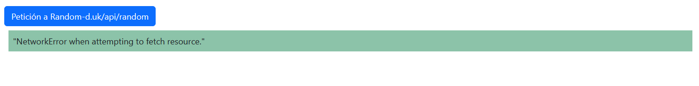
	</p>
		

##### Problema

La solicitud fue bloqueada debido a la violación de las reglas de seguridad de <a href="https://developer.mozilla.org/es/docs/Web/HTTP/CORS/Errors" title="CORS" target="_blank">CORS</a> (solo peticiones desde el mismo dominio). La restricción de peticiones desde un servicio externo significa que un usuario de un sitio A no acceda fácilmente a los recursos del sitio B. 

##### Solución

* Cambios en la aplicación del servidor 
* Cambios en el código del backend.
* Uso de un [reverse proxy](https://httptoolkit.tech/blog/cors-proxies/) en la petición desde el frontend (en el código de javascript).
	- Abra el archivo `scripts/application.js`
	- Cambie el URL anterior por **`https://damp-beach-17296.herokuapp.com/https://random-d.uk/api/random`** para realizar la petición asincrónica. 
	- Recargue la página en el navegador, realice la petición desde el botón y verifique el resultado.


#### Manejo de respuesta y de errores del API

* En el navegador, acceda al URL `http://localhost:8056/status/`
* Verifique el resultado de la petición
	+ En la página web, deje el número `2` que aparece en **ID anime** y haga clic en el botón **Petición a https://api.jikan.moe/v4/anime/{id}/full**.

		- El resultado en Mozilla y en la consola del inspector.
		
	<p align="center">
	  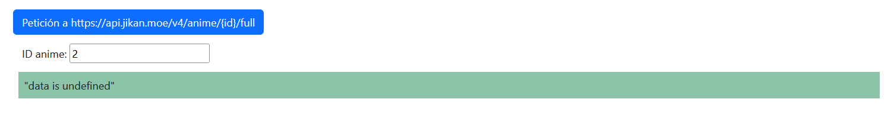
	  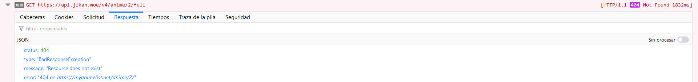
	</p>

	+ En la página web, modifique el valor que aparece en **ID anime** por `1` y haga clic en el botón **Petición a https://api.jikan.moe/v4/anime/{id}/full**.

	<p align="center">
	  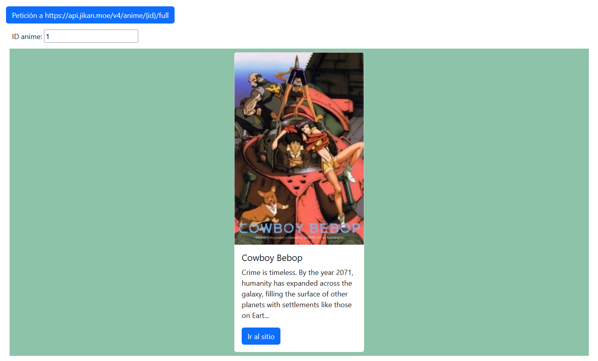
	</p>


##### Problema

En el archivo `scripts/application.js`, el resultado de la petición es directamente asignado a la variable `data` sin analizar si la petición fue exitosa o no.

##### Solución

Revisar la [documentación](https://docs.api.jikan.moe/) del [Jikan API](https://jikan.moe/), específicamente para el endpoint [`getAnimeFullById`](https://docs.api.jikan.moe/#tag/anime/operation/getAnimeFullById)

En caso de no existir un anime con el ID, el API devuelve un JSON como el que aparece a continuación:

<p align="center">
  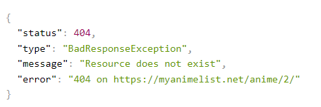
</p>

* Abra el archivo `scripts/application.js`
* Agregue la verificación del estado de la respuesta
	+ En caso que el **obj** tenga la propiedad **`status`** y que su valor sea **404**
		- Mostrará un mensaje de error
		- Borrará el contenido de la caja de texto y llevará el foco a la caja de texto
	+ Caso contrario, reubique la sección de procesamiento.
	+ Recargue la página en el navegador, realice la petición desde el botón y verifique el resultado.

	```
		if(obj.hasOwnProperty('status') && obj["status"] == 404) {

          document.getElementById('respuesta').innerHTML = `No existe un anime con el ID ${id}`
          document.getElementById("id_anime").value = ''
          document.getElementById("id_anime").focus()
        
        } else {
          // Inicio del procesamiento
					... 
          // Fin del procesamiento
        }
	```

#### Slow internet connection

* En el navegador, acceda al URL `http://localhost:8056/slow/`
* Verifique el resultado de la petición
	+ **Petición bajo condiciones normales**
	  - En la pestaña **RED** del inspector, verifique de los siguientes valores
		- En la página web, haga clic en el botón **Petición a news?category=science**.
		- En la consola del inspector, verifique el `Tiempo de ejecución del fetch`
		<p align="center">
		  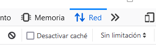
			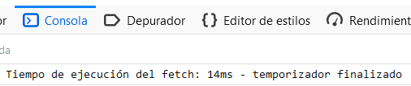
		</p>

	+ **Petición sin caché del navegador**
		- En la pestaña **RED** del inspector, verifique de los siguientes valores
		- En la página web, haga clic en el botón **Petición a news?category=science**.
		- En la consola del inspector, verifique el `Tiempo de ejecución del fetch`
		<p align="center">
		  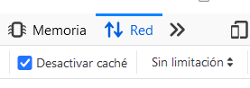
		  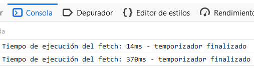
		</p>


	+ **Petición sin caché del navegador + limitación GPRS**
		- En la pestaña **RED** del inspector, verifique de los siguientes valores
		- En la página web, haga clic en el botón **Petición a news?category=science**.
		- En la consola del inspector, verifique el `Tiempo de ejecución del fetch`	
		<p align="center">
		  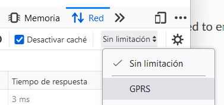
		  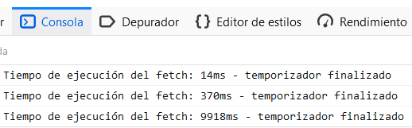
		</p>
	
##### Problema

Las condiciones de la red pueden generar la sensación de _carga infinita_ al usuario. Los navegadores modernos permiten emular diferentes escenarios para monitorear el comportamiento de las aplicaciones. La opción [Throttling](https://firefox-source-docs.mozilla.org/devtools-user/network_monitor/throttling/index.html) ofrece diferente varios tipos de redes con condiciones para descarga, subida y latencia en la transmisión de datos.

##### Solución

Provea de un mecanismo visual para el [monitoreo del progreso de un requerimiento asincrónico](https://dev.to/tqbit/how-to-monitor-the-progress-of-a-javascript-fetch-request-and-cancel-it-on-demand-107f). 

* Abra el archivo `scripts/application.js`
* Comente el contenido del **Bloque de petición**
* Coloque el contenido de `scripts/guiavisual.txt` en el **Bloque de petición**
* Recargue la página en el navegador, realice la petición desde el botón y verifique el resultado.


#### Restricciones en el servidor

* En el navegador, acceda al URL `http://localhost:8056/restrictions/cliente/`
* Verifique el resultado de la petición
	+ En la página web, luego de varios clics en el botón **Petición a commits?per_page=100 (500 veces)**.

	<p align="center">
	  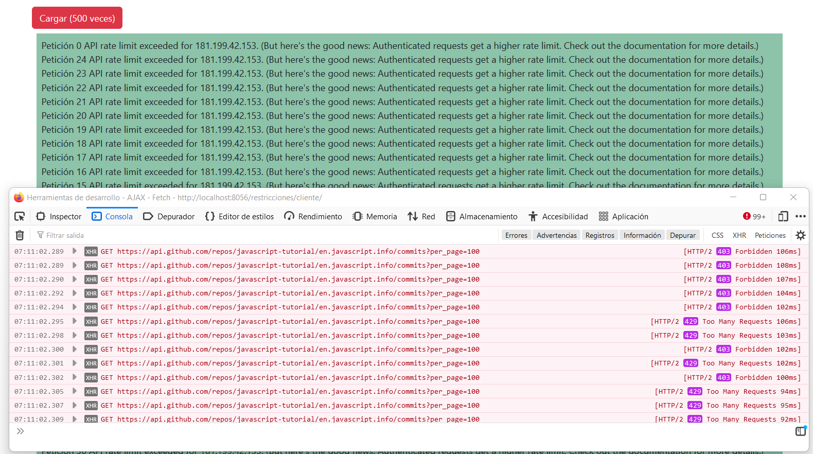
	</p>

##### Problema

Los diferentes tipos de solicitudes de API a GitHub.com están sujetos a diferentes [límite de velocidad](https://docs.github.com/es/rest/overview/resources-in-the-rest-api#rate-limiting) para controlar el tráfico de la red. Las respuestas del servidor son:

* [403 Forbidden](https://developer.mozilla.org/es/docs/Web/HTTP/Status/403): el servidor ha recibido y ha entendido la petición, pero rechaza enviar una respuesta, y
* [429 Too Many Requests](https://developer.mozilla.org/en-US/docs/Web/HTTP/Status/429): el usuario ha enviado demasiadas solicitudes en un período de tiempo determinado ("límite de velocidad").


##### Solución

* Espere hasta que levanten el bloqueo de las peticiones.
* Cree un ambiente de pruebas al guarde una versión local del archivo. Para este ejercicio, puede encontrar el archivo en `fetch/restrictions/servidor/commits_ilya.json`
	
	+ Abra el archivo `fetch/cliente/scripts/application.js`
		- Cambie el URL anterior por `http://localhost:8056/restrictions/servidor/commits_ilya.json`
	+ Recargue la página en el navegador, realice la petición desde el botón y verifique el resultado.


### Términos

dominio, `CORS`, proxy, reverse proxy, `API`

### Referencias

* Random-d.uk. (2022). Retrieved 8 November 2022, from https://random-d.uk/
* Jikan - Unofficial MyAnimeList API. (2022). Retrieved 9 November 2022, from https://jikan.moe/
* Throttling — Firefox Source Docs documentation. (2022). Retrieved 9 November 2022, from https://firefox-source-docs.mozilla.org/devtools-user/network_monitor/throttling/index.html
* console.time() - Web APIs MDN. (2022). Retrieved 9 November 2022, from https://developer.mozilla.org/en-US/docs/Web/API/console/time
* How to monitor the progress of a Javascript fetch - request and cancel it on demand. (2021). Retrieved 9 November 2022, from https://dev.to/tqbit/how-to-monitor-the-progress-of-a-javascript-fetch-request-and-cancel-it-on-demand-107f