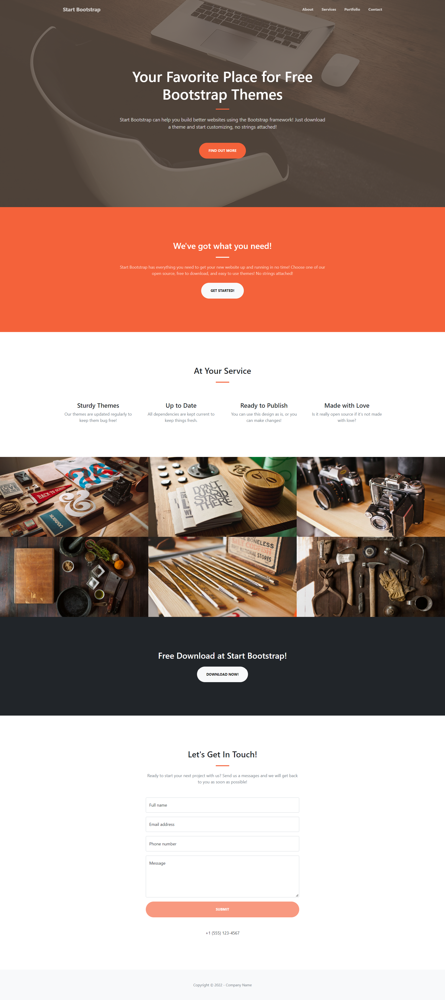

## Guía 13

[Regresar](/DAWM/)

### Contenidos

* Revisión de ejercicios previos: dudas y comentarios.
* [Angular](https://angular.io/) es un framework para aplicaciones web desarrollado en TypeScript, de código abierto, mantenido por Google, que se utiliza para crear y mantener aplicaciones web de una sola página. Su objetivo es aumentar las aplicaciones basadas en navegador con capacidad de Modelo Vista Controlador (MVC), en un esfuerzo para hacer que el desarrollo y las pruebas sean más fáciles.
* [**SPA**](https://davidjguru.medium.com/single-page-application-un-viaje-a-las-spa-a-trav%C3%A9s-de-angular-y-javascript-337a2d18532) son las siglas de Single Page Application, donde todas las pantallas las muestra en la misma página, sin recargar el navegador.

### Actividades

* Genere una aplicación en Angular, siguiendo las instrucciones pertinentes de los tutoriales:

  + Cree la carpeta **spa**.
  + Dentro de **spa**, cree la aplicación **clienteAngular** de acuerdo con las instrucciones en [Angular - Local](https://dawfiec.github.io/DAWM/tutoriales/angular_local.html). 
  + Incluya bootstrap y sus dependencias de acuerdo con las instrucciones en [Angular - Bootstrap](https://dawfiec.github.io/DAWM/tutoriales/angular_bootstrap.html)

* Incorpore la plantilla [Creative](https://startbootstrap.com/theme/creative) a la aplicación en Angular.

	+ HTML
		- **Plantilla Original:** Del archivo `index.html`, copie el **contenido** de la etiqueta `<body>` . No copie las etiquetas `<script>`. 
		- **Proyecto de Angular:** En el `src/app/app.component.html`, pegue las etiquetas html. 
	+ ASSETS
		- **Plantilla Original:** De la carpeta `assets`, copie el **contenido**. 
		- **Proyecto de Angular:** En la ruta `src/assets`, coloque los archivos.
	+ CSS:
		- **Plantilla Original:** Del archivo `css/styles.css`, copie el **contenido**.
		- **Proyecto de Angular:** En el `src/styles.css`, pegue las reglas css.

* Actualice el navegador o (re)inicie el servidor
* Revise la página de [errores](https://dawfiec.github.io/DAWM/paginas/errores.html) de ser necesario.

* Componentes
	+ Cree los componentes: **`common/navbar`** y **`common/footer`** de acuerdo con las instrucciones en [Angular - Componentes, Comunicación y Directivas](https://dawfiec.github.io/DAWM/tutoriales/angular_bases.html).
	+ De `src/app/app.component.html` mueva:
		- La etiqueta _\<nav\>_ a la vista del componente **common/navbar**
		- La etiqueta _\<footer\>_ a la vista del componente **common/footer**
	+ Agregue las etiquetas _\<app-navbar\>_ y _\<app-footer\>_ en el lugar correspondiente en `src/app/app.component.html`.

* Actualice el navegador o (re)inicie el servidor
* Revise la página de [errores](https://dawfiec.github.io/DAWM/paginas/errores.html) de ser necesario.

### Términos

Librería, marco de trabajo, bootstrapping, spa

### Referencias

* Angular. (2021). Retrieved 1 December 2021, from [https://angular.io/](https://angular.io/)
* Introduction to Angular Components and How to Implement It? (20202) https://www.simplilearn.com/tutorials/angular-tutorial/angular-components
* Guía de iniciación al data binding en Angular Qué es y cómo se utiliza. (2019). Retrieved 13 July 2022, from https://www.acontracorrientech.com/guia-practica-del-databinding-en-angular/