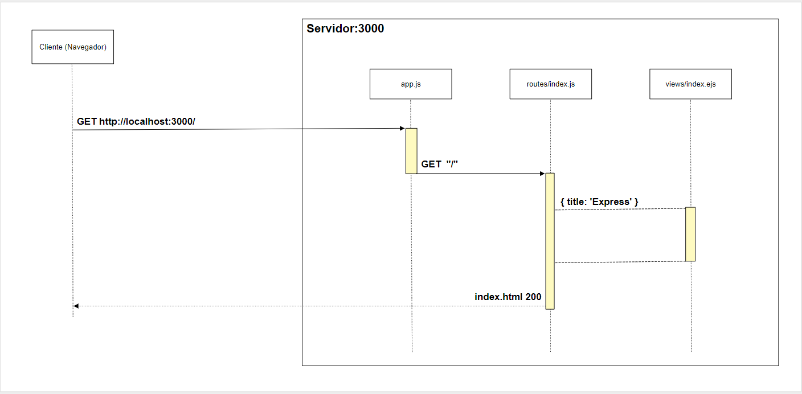

## Guía 16

[Regresar](/DAWM/)

### Contenidos

* Revisión de ejercicios previos: dudas y comentarios.
* [Nodejs](https://nodejs.org/en/) es un _JavaScript runtime_ basado en el motor de JavaScript V8 de Chrome.
* [Express](https://expressjs.com/es/) es una infraestructura de aplicaciones web Node.js mínima y flexible que proporciona un conjunto sólido de características para las aplicaciones web y móviles
* [Backend](https://descubrecomunicacion.com/que-es-backend-y-frontend/) es el interior de las aplicaciones que viven en el servidor y al que a menudo se le denomina "el lado del servidor". El backend consiste en un servidor, una aplicación y una base de datos. Se toman los datos, se procesa la información y se envía al usuario. Un desarrollador Backend debe tener amplios conocimientos de los siguientes lenguajes: frameworks y los tipos de base de datos. No siendo necesario conocer todos los lenguajes pero sí entender y saber trabajar con algunos de ellos.
* [HTTP](https://developer.mozilla.org/es/docs/Web/HTTP). Este protocolo de la capa de aplicación nos comunicar navegadores y servidors mediante documentos HTML.
* El [comportamiento por defecto](https://javascript.info/default-browser-action#:~:text=There%20are%20many%20default%20browser,submits%20the%20form%20after%20it.) de un navegador web presenta reacciones predeterminados a eventos del usuario. El comportamiento [predeterminado para el envío del formulario](https://www.freecodecamp.org/news/manage-default-behavior-in-browser/) considera el valor de los atributos `action` y `method`.

### Prerrequisito

Utiliza el proyecto que desarrollaste con los tutoriales de [Express - Bases](https://dawfiec.github.io/DAWM/tutoriales/express_bases.html) y [Express - Boostrap](https://dawfiec.github.io/DAWM/tutoriales/express_bootstrap.html)
  
* Desde tu repositorio personal
* Clone el proyecto con las [aplicaciones del curso](https://github.com/DAWFIEC/DAWM-apps) para la aplicación **album/admin**
    - Para el hito: **`hito2-admin`**

### Actividades

* Realice las actividades de la guía [Express - Partials/Layout](https://dawfiec.github.io/DAWM/tutoriales/express_partials.html).

* De la interacción entre el cliente y el servidor, la respuesta es completamente renderizada en lado del servidor (SSR server-side rendering) y enviada al cliente,  como se muestra en la imagen a continuación. 

  

### Términos

`Backend`, `Frontend`, servidor, HTTP, verbos HTTP

### Referencias

* Node.js. (2022). Retrieved 1 August 2022, from https://nodejs.org/en/
* Express - Infraestructura de aplicaciones web Node.js. (2022). Retrieved 1 August 2022, from https://expressjs.com/es/
* How to Manage Browser Defaults with event.preventDefault() and event.stopPropagation(). (2022). Retrieved 1 August 2022, from https://www.freecodecamp.org/news/manage-default-behavior-in-browser/