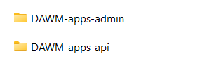

## Guía 22

[Regresar](/DAWM/)

### Contenidos

* Revisión de ejercicios previos: dudas y comentarios.
* Las [cookies](https://policies.google.com/technologies/cookies?hl=es) son pequeños fragmentos de texto que los sitios web que visitas envían al navegador. Permiten que los sitios web recuerden información sobre tu visita, lo que puede hacer que sea más fácil volver a visitar los sitios y hacer que estos te resulten más útiles. 
  + Una [sesión](https://support.google.com/analytics/answer/2731565?hl=es-419#zippy=%2Csecciones-de-este-art%C3%ADculo) es un conjunto de interacciones de los usuarios con su sitio web en un periodo determinado. Por ejemplo, una única sesión puede contener varias vistas de página, eventos, interacciones sociales y transacciones de comercio electrónico. Más información acerca de los diferentes tipos de solicitudes en Analytics

  Se puede decir que una sesión es el elemento que engloba las acciones del usuario en su sitio web.


### Aplicación

**Nota:** Aquí optaremos por clonar el proyecto en diferentes carpetas, una por cada rama (aplicaciones). 

* De [las aplicaciones del curso](https://github.com/DAWFIEC/DAWM-apps)
  
  + Línea de comandos (1) para la aplicación **album/api** en el _hito9-api_, con: 
```
git clone --branch hito9-api https://github.com/DAWFIEC/DAWM-apps.git DAWM-apps-api
```
  
  + Línea de comandos (2) para la aplicación **album/admin** en el _hito6-admin_, con: 
```
git clone --branch hito6-admin https://github.com/DAWFIEC/DAWM-apps.git DAWM-apps-admin
```


* Verifique que aparezcan los dos proyectos: `DAWM-apps-api/album/api` y `DAWM-apps-admin/album/admin`

<p align="center">
  
</p>


### Actividades

* Realice completamente el tutorial [Express - Manejo de estados I: Sesión](https://dawfiec.github.io/DAWM/tutoriales/express_estados1.html) y [Express - Manejo de estados II: Cookies](https://dawfiec.github.io/DAWM/tutoriales/express_estados2.html)


### Términos

`middleware`, cookies, sesión, `autenticación`, `autorización`

### Referencias

* Manejo de Cookies en Express.js · GitBook. (2021). Retrieved 23 August 2021, from https://ull-esit-pl-1617.github.io/estudiar-cookies-y-sessions-en-expressjs-victor-pamela-jesus/cookies/chapter5.html 
* Sessions en ExpressJS · GitBook. (2021). Retrieved 23 August 2021, from https://ull-esit-dsi-1617.github.io/estudiar-cookies-y-sessions-en-expressjs-alejandro-raul-35l2-p4/sessionsexpress.html
