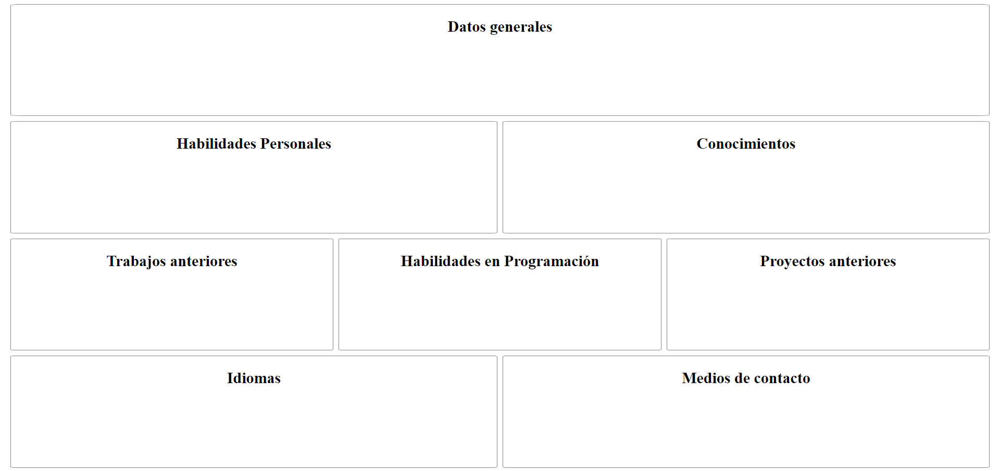

## Guía 05

[DAWM](/DAWM/) / [Proyecto02](/DAWM/proyectos/2023/proyecto02)

### Actividades previas

#### Diseño

* Elija una estructura para el sitio de [Frontend Practice](https://www.frontendpractice.com/projects)

#### Ejercicio de colocación de elementos

* Descargue el ejercicio de [colocación](ejercicios/colocacion.zip). 
* Utilice **Visual Studio Code** para abrir el ejercicio de colocación.
* Instale el [Live Server de Visual Studio Code](https://www.geeksforgeeks.org/how-to-enable-live-server-on-visual-studio-code/).

### Actividades

#### Grid vs Flexbox

* Considere el siguiente diseño para practicar el uso de flexbox y grid con el ejercicio de colocación de elementos:

#### `Grid por columnas` 

* Modifique el archivo `css/grid_columnas.css`
* Utilice el selector CSS para la etiqueta `<main>` y aplique las siguientes propiedades:
	> __display: grid;__ <mark># Modo de colocar los elementos internos a grid</mark> 
	> __row-gap: 0.5rem;__ <mark># Separación entre filas</mark> 
	> __column-gap: 0.5rem;__ <mark># y/o columnas</mark> 
	> __grid-template-columns: repeat(6, 1fr);__ <mark># Número de columnas donde acomodar los elementos</mark> 

* Utilice los selectores CSS para cada elemento `<section>` dentro de la etiqueta `<main>` y aplique las siguientes propiedades:
	> __grid-column: <mark>Número de columna de inicio</mark> / <mark>Número de columna de fin</mark>;__ <mark>Columnas que ocupará en la rejilla</mark>, y 
	> __grid-row: <mark>Número de fila de inicio</mark> / <mark>Número de fila de fin</mark>;__ <mark>Filas que ocupará en la rejilla</mark>

#### `Grid por areas` 

* Modifique el archivo `css/grid_areas.css`
* Utilice el selector CSS para la etiqueta `<main>` y aplique las siguientes propiedades:
	> __display: grid;__ <mark># Modo de colocar los elementos internos a grid</mark> 
	> __row-gap: 0.5rem;__ <mark># Separación entre filas</mark> 
	> __column-gap: 0.5rem;__ <mark># y/o columnas</mark> 
	> __grid-template-areas: "fila1 fila1 fila1 fila1 fila1 fila1"   "fila21 fila21 fila21 fila22 fila22 fila22"   "fila31 fila31 fila32 fila32 fila33 fila33";   "fila41 fila41 fila41 fila42 fila42 fila42"__ <mark># Nombres de las áreas</mark> 
	
* Utilice los selectores CSS para cada elemento `<section>` dentro de la etiqueta `<main>` y aplique las siguientes propiedades:
	> __grid-area: <mark>Nombre del área</mark>;__ <mark>Nombre que ocupará en el área</mark> 
 

#### `Flexbox`

* Modifique el archivo `css/flexbox.css`
* Utilice el selector CSS para la etiqueta `<main>` y aplique las siguientes propiedades:
	> __display: flex;__ <mark>Cambia el modo de colocar los elementos internos a flex</mark> 
	> __row-gap: 0.5rem;__ <mark>Separación entre filas</mark> 
	> __column-gap: 0.5rem;__ <mark>y/o columnas</mark> 
	> __flex-wrap: wrap;__ <mark>Los ítems ocupan el espacio de acuerdo a su tamaño</mark> 
	> __justify-content: space-between;__ <mark>Los elementos internos se distribuyen por igual</mark> 

* Utilice los selectores CSS para cada elemento `<section>` dentro de la etiqueta `<main>` y aplique las siguientes propiedades:
	> __width: <mark>Porcentaje</mark>%;__ <mark>Cantidad</mark> 

### Documentación

* [A Complete Guide to Grid](https://css-tricks.com/snippets/css/complete-guide-grid/) y [Layoutit Grid: Learning CSS Grid Visually With a Generator](https://css-tricks.com/layoutit-grid-learning-css-grid-visually-with-a-generator/)
* [A Complete Guide to Flexbox](https://css-tricks.com/snippets/css/a-guide-to-flexbox/) y [Don’t Overthink It (Flexbox) Grids](https://css-tricks.com/dont-overthink-flexbox-grids/)
* En [flexbox.netlify](https://flexbox.netlify.app/) encuentras en un espacio para practicar la acomodación mediante Flexbox, mientras que  
* En [grid.layoutit](https://grid.layoutit.com/) se ofrece un buen espacio para comprender grid.

### Términos

Colocación de cajas, `flexbox`, `grid`, servidor http, localhost, puerto, IP

### Referencias

* Pseudoclases y pseudoelementos - Aprende sobre desarrollo web MDN. (2021). Retrieved 31 May 2022, from https://developer.mozilla.org/es/docs/Learn/CSS/Building__blocks/Selectors/Pseudo-classes__and__pseudo-elements
* Pseudo-classes - CSS MDN. (2022). Retrieved 31 May 2022, from https://developer.mozilla.org/es/docs/Web/CSS/Pseudo-classes
* Pseudoelementos - CSS MDN. (2022). Retrieved 31 May 2022, from https://developer.mozilla.org/es/docs/Web/CSS/Pseudo-elements
* 3.4. Pseudo-clases (CSS avanzado). (2022). Retrieved 31 May 2022, from https://uniwebsidad.com/libros/css-avanzado/capitulo-3/pseudo-clases
* 3.5. Pseudo-elementos (CSS avanzado). (2022). Retrieved 31 May 2022, from https://uniwebsidad.com/libros/css-avanzado/capitulo-3/pseudo-elementos
* Relación de Grid Layout con otros métodos de diseño y posicionamiento - CSS - CSS MDN. (2021). Retrieved 31 May 2022, from https://developer.mozilla.org/es/docs/Web/CSS/CSS__Grid__Layout/Relationship__of__Grid__Layout
* Don't Overthink It (Flexbox) Grids  CSS-Tricks. (2016). Retrieved 31 May 2022, from https://css-tricks.com/dont-overthink-flexbox-grids/
* flexbox-playground. (2022). Retrieved 31 May 2022, from https://flexbox.netlify.app/
* A Complete Guide to Flexbox  CSS-Tricks. (2013). Retrieved 31 May 2022, from https://css-tricks.com/snippets/css/a-guide-to-flexbox/
* A Complete Guide to Grid CSS-Tricks. (2021). Retrieved 31 May 2022, from https://css-tricks.com/snippets/css/complete-guide-grid/
* Layoutit Grid: Learning CSS Grid Visually With a Generator CSS-Tricks. (2020). Retrieved 1 June 2022, from https://css-tricks.com/layoutit-grid-learning-css-grid-visually-with-a-generator/
* Simple HTTP server in Python - Anurag Kumar. (2022). Retrieved 1 June 2022, from https://www.hackerearth.com/practice/notes/simple-http-server-in-python/