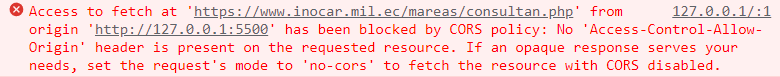

## Guía 11

[DAWM](/DAWM/) / [Proyecto05](/DAWM/proyectos/2023/proyecto05)

### Actividades previas

* Revise la información de las [Tabla de mareas puertos del Ecuador del INOCAR](https://www.inocar.mil.ec/web/index.php/productos/tabla-mareas).

	- Use el inspector del navegador (en la pestaña **Network** y filtre con la opción **Doc**) para identificar los requerimientos de cada uno de los documentos PHP externos. 
  	

  - Identifique la estructura de la respuesta al recurso **consultan.php**:

  	

* Analice el código para realizar requerimientos asincrónicos cuya respuesta se encuentra en formato [XML](https://codetogo.io/how-to-fetch-xml-in-javascript/).
	- Identifique los diferentes tipos de MimeType para el método [parseFromString](https://developer.mozilla.org/en-US/docs/Web/API/DOMParser/parseFromString) de acuerdo con el tipo de respuesta.

* Examine la utilidad de la implementación de [CORS](https://developer.mozilla.org/es/docs/Web/HTTP/CORS) en los navegadores web.

* Analice el uso de un [CORS - Proxy](https://httptoolkit.com/blog/cors-proxies/) para resolver la implementación de las política de CORS. En particular, revise la implementación de un CORS - Proxy que se encuentra en [CORS-anywhere](https://github.com/Rob--W/cors-anywhere).

 
### Actividades

#### Dashboard

##### HTML

* Levante el proyecto _dashboard_.
* En el `index.html`, agregue una etiqueta HTML vacía. Dicho etiqueta contendrá la _Tabla de mareas puertos del Ecuador_. Asegúrese de colocar las clases de Bootstrap adecuadas y un identificador único, por ejemplo: `table-container`. 

##### JavaScript

Dentro del archivo javascript creado en las guías anteriores.

* Agregue la función flecha **loadInocar**, antes con la función autoejecutable. Y llame a la función loadInocar dentro de la función anónima.

  ```
  let plot = (data) => { ... }

  let load = (data) => { ... }
  
  let loadInocar = () => { ... }

  (
    function () { 
    	... 

    	loadInocar();
    }

  )();
  ```

* Dentro de la función **loadInocar**, agregue:

  - Una petición asíncrona al _endpoint_ de `'https://www.inocar.mil.ec/mareas/consultan.php'`. Utilice la documentación del método [fetch](https://www.javascripttutorial.net/javascript-fetch-api/) para el procesamiento de una respuesta [XML](https://codetogo.io/how-to-fetch-xml-in-javascript/)

	  ```
	  let URL = 'https://www.inocar.mil.ec/mareas/consultan.php';

	  fetch(URL)
		 	.then(response => response.text())
			.then(data => {
			   const parser = new DOMParser();
			   const xml = parser.parseFromString(data, "application/xml");
			   console.log(xml);
			})
			.catch(console.error);
	  ```

	**Nota:** En el método **parseFromString**, cambie el MimeType de `"application/xml"` a `"text/html"`.


#### CORS

Use el inspector del navegador (en la pestaña **Console**) para reconocer el error en el requerimiento a un dominio cruzado. 



#### CORS - Proxy

* **OPCIÓN 1:** Proxy local

	+ Clone el repositorio [Rob--W/cors-anywhere](https://github.com/Rob--W/cors-anywhere) 
	+ Instale los paquetes, con: `npm install`
	+ Levante el servidor, con: `npm start`
	+ La `URL_proxy` es `'http://localhost:8080/'`

* **OPCIÓN 2:** Proxy remoto
	
	+ En el repositorio [Rob--W/cors-anywhere](https://github.com/Rob--W/cors-anywhere)
	+ Solicite acceso al [proxy demo](https://cors-anywhere.herokuapp.com/corsdemo)
	+ La `URL_proxy` es `'https://cors-anywhere.herokuapp.com/'`

##### JavaScript

Dentro del archivo javascript creado en las guías anteriores.

* Dentro de la función **loadInocar**:

	- Modifique el _endpoint_ para que pase por el CORS - Proxy

		```
		let URL_proxy = ' ' // Coloque el URL de acuerdo con la opción de proxy
	  let URL = URL_proxy + 'https://www.inocar.mil.ec/mareas/consultan.php';
	  ```

		**Nota:** Consulte la nueva respuesta al requerimiento asincrónico.

		


* Dentro de la función **loadInocar**, en el callback con el procesamiento de la respuesta:

	- Utilice el API del objeto **xml** ([getElementsByClassName](https://developer.mozilla.org/es/docs/Web/API/Document/getElementsByClassName) o [getElementsByTagName](https://developer.mozilla.org/es/docs/Web/API/Document/getElementsByTagName)) para obtener la referencia al elemento `div.container-fluid`.

  	Por ejemplo:

	  ```
	  let contenedorMareas = xml.getElementsByClassName('container-fluid')[0];
	  ```

	  o 

	  ```
	  let contenedorMareas = xml.getElementsByTagName('div')[0];
	  ```

  - Utilice el API del objeto **xml** para obtener la referencia al elemento HTML mediante el documento API, por ejemplo:
  	  
	  ```
	  let contenedorHTML = document.getElementById('table-container');
	  ```

  - Coloque el contenido de la respuesta asincrónica como contenido del elemento HTML, por ejemplo:

	  ```
	  contenedorHTML.innerHTML = contenedorMareas.innerHTML;
	  ```

* Realice los cambios necesarios en el estilo y revise los resultados en el navegador.

### Documentación

* Requerimientos asincrónicos de archivos en formato [XML](https://codetogo.io/how-to-fetch-xml-in-javascript/).
* El significado, uso y consideraciones de los [CORS - Proxies](https://httptoolkit.com/blog/cors-proxies/).
* Mecanismo de [CORS](https://developer.mozilla.org/es/docs/Web/HTTP/CORS) implementado por el navegador.

### Términos

XML, CORS, proxy

### Referencias

* Joubran, J., & Joubran, J. (2023). How to fetch XML in JavaScript  Code to go. Retrieved 18 June 2023, from https://codetogo.io/how-to-fetch-xml-in-javascript/
* Intercambio de recursos de origen cruzado (CORS) - HTTP MDN. (2023). Retrieved 18 June 2023, from https://developer.mozilla.org/es/docs/Web/HTTP/CORS
* What are CORS proxies, and when are they safe?. (2023). Retrieved 18 June 2023, from https://httptoolkit.com/blog/cors-proxies/