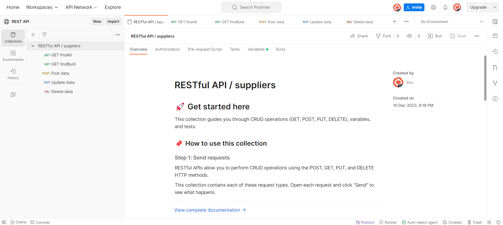

## Guía 17

[DAWM](/DAWM/) / [Proyecto06](/DAWM/proyectos/2023/proyecto06)

### Actividades previas

#### Base de datos Relacional

* Copie el script (DDL y DML) SQL de [Northwind](https://en.wikiversity.org/wiki/Database_Examples/Northwind/MySQL).
* Acceda al motor [MySQL Community Server](https://dev.mysql.com/downloads/mysql/) mediante la interfaz [MySQL Workbench](https://dev.mysql.com/downloads/workbench/).
  + Identifique las credenciales de acceso: usuario y contraseña.
  + Ejecute el script y acceda a schema **northwind**

#### Dependencias Globales

* Instale los módulos Sequelize CLI, Sequelize Auto y Express Generator de forma global, con: 

  ```command
  npm install -g sequelize-cli sequelize-auto express-generator
  ```

### Actividades

#### Github

* Crea un repositorio en GitHub con el nombre **rest_api**.

#### Express - Proyecto Base

* Cree un proyecto en Express:
  + Desde la línea de comandos, utilice el comando **express** con: 

    ```command
    express --view=ejs rest_api
    ```

  + Acceda a la carpeta del proyecto, instale las dependencias y levante el servidor, con:

	```command
	cd rest_api   
	npm install   
	SET DEBUG=rest_api:\* & npm start
	```
  
  + En el navegador, acceda al URL `http://localhost:3000` y compruebe la respuesta predeterminada. 

#### Dependencias Locales

* Desde la línea de comandos en la carpeta del proyecto, instale Sequelize y el conector para MySQL para el proyecto, con: 

  ```
  npm install --save sequelize mysql2
  ```

#### Sequelize

* Desde la línea de comandos en la carpeta del proyecto, genere los archivos de configuración de Sequelize, con: 

  ```
  sequelize init
  ```

#### Modelos

* Desde la línea de comandos en la carpeta del proyecto, reconstruya los modelos con las credenciales de acceso y el esquema de la base de datos, con: 

  ```
  sequelize-auto -h 127.0.0.1 -d northwind -u root -x root -p 3306
  ```

#### Credenciales de conexión

* Modifique el archivo `config/config.json`, en el ambiente **development**, con los datos de conexión con el motor de bases de datos.

  ```typescript
  {
    "development": {
      "username": "root",
      "password": "root",
      "database": "northwind",
      "host": "127.0.0.1",
      "dialect": "mysql"
    },
    ...
  ```

#### Manejador de ruta

* Cree el archivo manejador de rutas `routes/suppliers.js` con los controladores para los métodos `GET`, `POST`, `PUT` y `DELETE`.

  ```typescript
  var express = require('express');
  var router = express.Router();

  const { Sequelize, Op } = require('sequelize');
  const Suppliers = require('../models').suppliers;

  router.get('/findAll', function(req, res, next) {
      res.send("GET All")
  });
  router.get('/findById/:id', function(req, res, next) {
      res.send("GET By Id")
  });
  router.post('/save', function(req, res, next) { 
      res.send("POST")
  });
  router.put('/update/:id', function(req, res, next) { 
      res.send("PUT")
  });  
  router.delete('/delete/:id', function(req, res, next) { 
      res.send("DELETE")
  });

  module.exports = router;
  ```

#### Registro del manejador de rutas

* Modifique el archivo `app.js` con el registro del archivo manejador de rutas `routes/suppliers.js` a la ruta `/suppliers`

  ```typescript
  ...
  var suppliersRouter = require('./routes/suppliers');
  
  var app = express();

  app.use('/users', ... );
  app.use('/suppliers', suppliersRouter);
  ...
  ```

* Levante el servidor, con:

  ```command
  SET DEBUG=rest_api:\* & npm start
  ```

* Utilice el workspace público de [Postman](https://elements.getpostman.com/redirect?entityId=1898620-df625a84-2a04-44ef-9492-d31713c26330&entityType=collection) como plantilla para comprobar la respuesta para cada tipo de petición.

<p align="center">
  
</p>

* Versiona local y remotamente el repositorio **rest_api**.

### Fundamental

* What is REST API? en [X](https://twitter.com/Terrasoft_ltd/status/1732354546528067738)

<blockquote class="twitter-tweet" data-media-max-width="560"><p lang="en" dir="ltr"><a href="https://twitter.com/hashtag/REST?src=hash&amp;ref_src=twsrc%5Etfw">#REST</a> <a href="https://twitter.com/hashtag/API?src=hash&amp;ref_src=twsrc%5Etfw">#API</a> what is it?<br>Representational State Transfer<br>This means that when a <a href="https://twitter.com/hashtag/client?src=hash&amp;ref_src=twsrc%5Etfw">#client</a> requests a resource using a REST API, the <a href="https://twitter.com/hashtag/server?src=hash&amp;ref_src=twsrc%5Etfw">#server</a> transfers back the current state of the resource in a standardized representation <a href="https://t.co/xCFXw9cQFZ">pic.twitter.com/xCFXw9cQFZ</a></p>&mdash; Terrasoft Ltd (@Terrasoft_ltd) <a href="https://twitter.com/Terrasoft_ltd/status/1732354546528067738?ref_src=twsrc%5Etfw">December 6, 2023</a></blockquote> <script async src="https://platform.twitter.com/widgets.js" charset="utf-8"></script>

### Documentación

En [ExpressJS](https://expressjs.com/) se encuentra la referencia del API, guías y tutoriales.

### Términos

rest api, crud, verbos HTTP, estados HTTP

### Referencias

* Terminal, F. (2011). Formatting cURL Output in the Windows Terminal. Retrieved 11 August 2022, from https://superuser.com/questions/275229/formatting-curl-output-in-the-windows-terminal
* Wieruch, R. (2020). How to create a REST API with Express.js in Node.js. Retrieved 10 August 2022, from https://www.robinwieruch.de/node-express-server-rest-api/
* Node.js Rest APIs example with Express, Sequelize & MySQL - BezKoder. (2020). Retrieved 14 August 2022, from https://www.bezkoder.com/node-js-express-sequelize-mysql/
* -->QueryInterface, H. (2022). sequelize.QueryInterface.removeColumn JavaScript and Node.js code examples Tabnine. Retrieved 24 December 2022, from https://www.tabnine.com/code/javascript/functions/sequelize/QueryInterface/removeColumn
* -->QueryInterface, H. (2022). sequelize.QueryInterface.addColumn JavaScript and Node.js code examples Tabnine. Retrieved 24 December 2022, from https://www.tabnine.com/code/javascript/functions/sequelize/QueryInterface/addColumn
* orm, b., bagade, a., Panneerselvam, S., Grin, O., & OurBigBook.com, C. (2019). bulkUpdate in sequelize orm. Retrieved 24 December 2022, from https://stackoverflow.com/questions/54898994/bulkupdate-in-sequelize-orm
* S., McConnell, H., & McConnell, H. (2020). Sequelize many-to-many M:N relationship not functioning. Error: 'SequelizeEagerLoadingError:${model1} is not associated to ${model2}'. Retrieved 24 December 2022, from https://stackoverflow.com/questions/64790882/sequelize-many-to-many-mn-relationship-not-functioning-error-sequelizeeagerl
* expected, O., & Vidal, L. (2021). One To Many relationship using Sequelize creates more foreign keys than expected. Retrieved 24 December 2022, from https://stackoverflow.com/questions/66696143/one-to-many-relationship-using-sequelize-creates-more-foreign-keys-than-expected