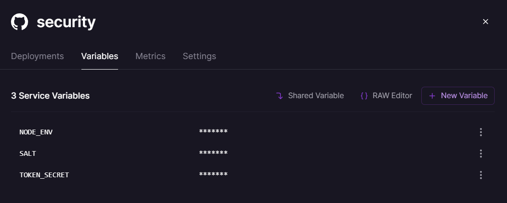

## Guía 23

[DAWM](/DAWM/) / [Proyecto06](/DAWM/proyectos/2023/proyecto06)

### Actividades previas

* Obtenga una cuenta en [Railway](https://railway.app/) mediante su cuentan en GitHub.

### Actividades


* Clone localmente los repositorios **security** y **rest_api**.
* Levante el servidor y compruebe el funcionamiento en el navegador.

#### Railway - Servicio MySQL

* Cree un proyecto de Railway con el servicio MySQL, con: `New Project` > `Provision MySQL`
  + Dentro del proyecto, otro nuevo servicio MySQL. 

**NOTA:** Su proyecto debe contener dos (2) servicios MySQL, uno para cada proyecto (**security** y **rest_api**).

* Por cada servicio MySQL, copie las **credenciales de conexión** que se encuentran en la opción `Variables`: _MYSQLDATABASE_, _MYSQLHOST_, _MYSQLPASSWORD_, _MYSQLPORT_ y _MYSQLUSER_.

#### MySQL Workbench - Migración

* Dentro de la conexión local, por cada esquema (**northwind** y **security**) por separado:
  + Haga clic en la opción **Server** > **Data Export**.
  + Seleccione el esquema con las tablas.
  + Seleccione la opción **Export to Self-Contained File** con un nombre específico y diferente. 
  + Haga clic en la opción **Start Export**.

* Para cada servicio MySQL en Railway:
  + Cree una nueva conexión
  + Haga clic en la opción **Server** > **Data Import**.
  + Seleccione la opción **Import from Self-Contained File** con el nombre específico y diferente. 
  + Seleccione en la opción _Default Target Schema_: **railway**.
  + Haga clic en la opción **Start Import**.

#### Railway - GitHub Repo

* Por cada proyecto: 
  + Cree un proyecto de Railway, con: `New Project` > `Deploy from GitHub repo`
  + Seleccione el repositorio de GitHub
  + Haga clic en `Deploy now`
  + Cambie el nombre del proyecto por el nombre del repositorio (**security** y **rest_api**)
  + En la opción `Settings` > `Networking`, genere un dominio aleatorio para la aplicación en la opción `Generate Domain`.
  	- Por ejemplo: para el proyecto **security**, el URL de acceso es `security-production-WXYZ.up.railway.app`
  	- Por ejemplo: para el proyecto **rest_api**, el URL de acceso es `restapi-production-ABCD.up.railway.app`
  + En la opción `Variables`, 
  	- Agregue las variables de entorno que se encuentran en el archivo **.env**. Excepto la variable **PORT**.
  	- Agregue la variable de entorno `NODE_ENV` con el valor `production`.

<p style="text-align: center;">
	
</p>

<p style="text-align: center;">
	
</p>

#### Express - Credenciales de conexión

* En cada proyecto (**security** y **rest_api**):
  + Modifique el archivo `config/config.json`, en el ambiente de producción (clave `production`). 
  + Cambie los valores con las **credenciales de conexión** correspondientes.

* Versione los cambios en el repositorio local y remoto.

#### Express - Scripts de automatización  

* Modifique el archivo `package.json` en la clave **scripts** con las instrucciones a ejecutar con el despliegue 
	
  + **packages:install** para instalar los paquetes del proyecto, y
  + **start** iniciar la aplicación en el servidor.
  
  <pre><code>
  ...
  "scripts": {
      "packages:install": "npm install sequelize pg && npm install --save-dev sequelize-cli",
	  "start": "npm run packages:install && node ./bin/www",
      ...
  }
  ...
  </code></pre>

* Versione los cambios en el repositorio local y remoto.

#### Express - REST API

* En el proyecto **rest_api**, modifique el archivo `swagger_output.json` los valores de las entradas **host** y **schemes**.

  ```json
  ...
  "host": "restapi-production-ABCD.up.railway.app",
  ...
  "schemes": [
    "https"
  ],
  ...
  ```

* Versione los cambios en el repositorio local y remoto.

#### Comprobación

* De acuerdo con el URL con el dominio generado, acceda a:

  + **/users/getToken**: al URL https://security-production-WXYZ.up.railway.app/users/getToken
  + **/documentation**: al URL https://restapi-production-ABCD.up.railway.app/documentation/

### Fundamental

* Masto Metrics en [X](https://twitter.com/robertvhoesel/status/1626646457980751883)

<blockquote class="twitter-tweet" data-media-max-width="560"><p lang="en" dir="ltr">Set up <a href="https://twitter.com/MastoMetrics?ref_src=twsrc%5Etfw">@MastoMetrics</a> deployment today using <a href="https://twitter.com/Railway?ref_src=twsrc%5Etfw">@Railway</a> – it&#39;s almost magic. <br><br>→ Skip setting up Github Actions or CI/CD<br>→ Skip provisioning complex infra<br>→ Skip using commits for previewing or debugging small changes<br><br>🚅 just ship <a href="https://t.co/DzLIbiYZHn">pic.twitter.com/DzLIbiYZHn</a></p>&mdash; Robert van Hoesel (@robertvhoesel) <a href="https://twitter.com/robertvhoesel/status/1626646457980751883?ref_src=twsrc%5Etfw">February 17, 2023</a></blockquote> <script async src="https://platform.twitter.com/widgets.js" charset="utf-8"></script>

### Documentación

* Documentación de [Docs - Railway](https://docs.railway.app/)

### Términos

despliegue, variables de entorno

### Referencias

* Express Tutorial Part 7: Deploying to production - Learn web development MDN. (2023). Retrieved 2 January 2023, from https://developer.mozilla.org/en-US/docs/Learn/Server-side/Express_Nodejs/deployment
