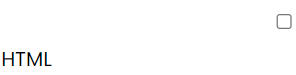

## Guía 04

[DAWM](/DAWM/) / [Proyecto01](/DAWM/proyectos/2024/proyecto01)

<link href="styles/mystyle.css" rel="stylesheet" />

### Objetivo general

<pre class="purpose">
Aplicar reglas CSS en la personalización de efectos visuales mediante el desarrollo de un currículum vitae digital para la presentación de información profesional de manera organizada y accesible en línea.
</pre>

### Actividades previas

#### Diseño

* Escoge a tu gusto una combinación de familias tipografías para título de pricipal, para los títulos de las secciones y para todo el documento, de acuerdo con la recomendación de [Fontjoy](https://fontjoy.com/). Verifica las familias tipográficas en [Google Fonts](https://fonts.google.com/).
* Seleciona a tu gusto una combinación de colores de acuerdo con la guía de [Happy Hues](https://www.happyhues.co/), [Huemint](https://huemint.com/website-2/), o [ColorMagic](https://colormagic.app/). 


### Actividades en clases

1. Clona localmente tu repositorio **curriculum**.
2. Sigue las instrucciones de [Bard](bard/guia04-bard01.pdf), y:
    - Cree la carpeta _'stylesheets'_, y dentro la hoja de estilo externa `CSS` _'style.css'_.
    - Agregue la referencia con la ruta a la hoja de estilo externa en el archivo _index.html_.

#### Servidor HTTP 

1. Siguiendo las instrucciones del [tutorial](/DAWM/tutoriales/python), levante un `servidor HTTP` con Python desde la `ruta de la aplicación`.
2. En el navegador, acceda a la URL [http:\\\\localhost:8079](http:\\localhost:8079) a la que responde el servidor HTTP.
3. (STOP 1) Actualice el navegador y compruebe los cambios.

#### Reglas CSS - I

1. Tome como referencia la [guía](gemini/guia04-gemini01.pdf) de Gemini para escribir las `reglas CSS`. 
2. Coloque las siguientes reglas CSS (`selector CSS`,`propiedad CSS` y `valor CSS`) en la hoja de estilo externa:

    <table>
      <thead>
        <tr>
          <th colspan="2" class="th-center">Selector CSS</th>
          <th>Propiedad y Valor CSS</th>
          <th>MDN</th>
        </tr>
      </thead>
      <tbody>
        <tr>
          <td rowspan="2">Universal</td>
          <td rowspan="2">*</td>
          <td> 
            <b>font-family: 'Segoe UI', Tahoma, Geneva, Verdana, sans-serif;</b>
          </td>
          <td> <a href="https://developer.mozilla.org/en-US/docs/Web/CSS/font-family">Ir</a> </td>
        </tr>
        <tr>
          <td> 
            <b>font-weight: 200;</b>
          </td>
          <td> <a href="https://developer.mozilla.org/en-US/docs/Web/CSS/font-weight">Ir</a> </td>
        </tr>
        <tr>
          <td rowspan="3">Por elemento</td>
          <td rowspan="2">h1</td>
          <td> 
            <b>text-align: center;</b>
          </td>
          <td> <a href="https://developer.mozilla.org/en-US/docs/Web/CSS/text-align">Ir</a> </td>
        </tr>
        <tr>
          <td> 
            <b>font-weight: bold;</b>
          </td>
          <td> <a href="https://developer.mozilla.org/en-US/docs/Web/CSS/font-weight">Ir</a> </td>
        </tr>
      </tbody>
    </table>

    <details>
      <summary><div>Haga click aquí para ver la solución</div></summary>
      <pre lang="css"><code>

        * {

          /* Familia de fuentes */
          font-family: 'Segoe UI', Tahoma, Geneva, Verdana, sans-serif;

          /* Grosor de la fuente 200 */
          font-weight: 200; 
        }

        h1 {

          /* Alineación del texto */
          text-align: center;

          /* Grosor de la fuente negrita */ 
          font-weight: bold; 
        }

      </code></pre>
    </details>


3. (STOP 2) Actualice el navegador y compruebe los cambios.
4. Versiona local y remotamente el repositorio **curriculum**.

#### Reglas CSS - II

1. Edite el archivo _index.html_:

    - Modifique la etiqueta &lt;img&gt; con el atributo _id_ y el valor _photo_.

    ```html
    
    ```

    - Modifique todas las etiquetas &lt;h2&gt; con el atributo _class_ y el valor _subtitle_.

    ```html
    ...
    <h2 class="subtitle">Educación</h2>
    ...
    <h2 class="subtitle">Experiencia Laboral</h2>
    ...
    ```

2. Coloque las siguientes reglas CSS en la hoja de estilo externa:

    <table>
      <thead>
        <tr>
          <th colspan="2" class="th-center">Selector CSS</th>
          <th>Efecto CSS</th>
          <th>MDN</th>
        </tr>
      </thead>
      <tbody>
        <tr>
          <td rowspan="2">Por identificador</td>
          <td rowspan="2">#foto</td>
          <td> Ancho del elemento <span class="explanation">200px</span> </td>
          <td> <a href="https://developer.mozilla.org/en-US/docs/Web/CSS/width">Ir</a> </td>
        </tr>
        <tr>
          <td> Alto del elemento <span class="explanation">automático</span> </td>
          <td> <a href="https://developer.mozilla.org/en-US/docs/Web/CSS/height">Ir</a> </td>
        </tr>
        <tr>
          <td rowspan="2">Por clase</td>
          <td rowspan="2">.subtitle</td>
          <td> Color del texto <span class="explanation">color: rgb(107 114 128 / 0.89)</span> </td>
          <td> <a href="https://developer.mozilla.org/es/docs/Web/CSS/color">Ir</a> </td>
        </tr>
        <tr>
          <td> Transformación del texto a <span class="explanation">mayúsculas</span> </td>
          <td> <a href="https://developer.mozilla.org/en-US/docs/Web/CSS/text-transform">Ir</a> </td>
        </tr>
      </tbody>
    </table>

    <details>
      <summary><div>Haga click aquí para ver la solución</div></summary>
      <pre lang="css"><code>

        #photo {

          /* Ancho del elemento */
          width: 200px; 

          /* Alto del elemento */
          height: auto; 
        }

        .subtitle {

          /* Color del texto en rgba */
          color: rgb(107 114 128 / 0.89);

          /* Transformación del texto a mayúsculas */ 
          text-transform: uppercase; 
        }

      </code></pre>
    </details>

3. (STOP 3) Actualice el navegador y compruebe los cambios.
4. Versiona local y remotamente el repositorio **curriculum**.


#### Modelo de caja

<!-- Tome como referencia la [sugerencia](bard/guia04-bard05.pdf) de Bard para las siguientes actividades: -->

1. Utilice el selector por elemento para acceder a las etiquetas &lt;section&gt; y aplique las reglas CSS para el `modelo de caja`: _margin_, _border_ y _padding_, por ejemplo:

    ```css
    section {

      /* margen (espacio externo) superior, derecho, abajo e izquierda */
      margin: 4px 2px 8px 2px; 

      /* borde de grosor 0.2 en puntos, estilo sólido y color hexadecimal #cedddd  */
      border: 0.2pt solid #cedddd; 

      /* relleno (espacio interno) de 
      1.5% en la parte superior e inferior y 
      0.8% a los lados derecho e izquierdo. */

      padding: 1.5% 0.8%; 

      /* reemplazan el 0.8% inicial en el relleno izquierdo y derecho, 
      dándoles un valor específico de 1.2% para esos lados. */

      padding-left: 1.2%; 
      padding-right: 1.2%; 
    }
    ```

2. (STOP 4) Actualice el navegador y compruebe los cambios.
3. Versiona local y remotamente el repositorio **curriculum**.

#### Efectos CSS

1. Utilice el servicio de [Border Radius](https://border-radius.com/) para generar los valores de la propiedad **border-radius**, p.e.:

    ```css
    section {
      ...


      /* borde redondeado con un radio de 5 píxeles */

      /* en navegadores basados en WebKit, 
      como versiones antiguas de Safari y Chrome. */
      -webkit-border-radius: 5px; 

      /* en navegadores antiguos de Mozilla, 
      como Firefox.  */
      -moz-border-radius: 5px;    

      /* en navegadores modernos. */
      border-radius: 5px;         
    }
    ```

2. Utilice el servicio de [CSSmatic](https://www.cssmatic.com/es/box-shadow) para generar los valores de la propiedad **box-shadow**, p.e.:
   
    ```css
    section {
      ...
      

      /* sombra a un elemento */

      -webkit-box-shadow: 3px 3px 1px 0px rgba(235, 234, 234, 0.60);
      -moz-box-shadow: 3px 3px 1px 0px rgba(235, 234, 234, 0.60);
      box-shadow: 3px 3px 1px 0px rgba(235, 234, 234, 0.60);
    }
    ```

3. (STOP 5) Actualice el navegador y compruebe los cambios.
4. Versiona local y remotamente el repositorio **curriculum**.

#### Etiquetas contenedoras

1. En el navegador, identifique los elementos desalineados:

    

2. Edite el archivo _index.html_ con las etiqueta contenedoras:

    - &lt;div&gt; para agrupar varios elementos (como etiquetas y el texto relacionado), y 
    - &lt;span&gt; para contener solo texto. 

    <table>
      <caption>Etiquetas contenedoras</caption>
      <thead>
        <tr>
          <th>Antes</th>
          <th>Después</th>
        </tr>
      </thead>
      <tbody>
        <tr>
          <td>
  &lt;input type="checkbox" 
    name="habilidades" value="HTML"&gt; HTML
          </td>
          <td>
  <b>&lt;div&gt;</b>
      &lt;input type="checkbox" 
        name="habilidades" value="HTML"&gt;
      <b>&lt;span&gt;</b>HTML<b>&lt;/span&gt;</b>
  <b>&lt;/div&gt;</b>
          </td>
        </tr>
      </tbody>
    </table>

3. (STOP 6) Actualice el navegador y compruebe los cambios.
4. Versiona local y remotamente el repositorio **curriculum**.

#### CSS Avanzado

1. Utilice [ChatGPT](https://chatgpt.com/) o [Gemini](https://gemini.google.com/app) para generar las siguientes reglas CSS:

    <pre class="prompt">Como desarrollador de aplicaciones web, genera la regla CSS para <ins>[Efecto CSS]</ins> a <ins>[Selector de etiqueta(s)]</ins>.
    </pre>

    <table>
      <thead>
        <tr>
          <th>[Efecto CSS]</th>
          <th>[Selector de etiqueta(s)]</th>
        </tr>
      </thead>
      <tbody>
        <tr>
          <td>aplicar la familia de fuentes <a href="https://fonts.google.com/specimen/Poppins">https://fonts.google.com/specimen/Poppins</a> </td>
          <td>todas las etiquetas</td>
        </tr>
        <tr>
          <td>eliminar el subrayado</td>
          <td>todas las etiquetas &lt;a&gt;</td>
        </tr>
        <tr>
          <td>al pasar el mouse por encima subrayar</td>
          <td>todos los elementos &lt;a&gt; dentro del elemento &lt;nav&gt;</td>
        </tr>
        <tr>
          <td>eliminar las viñetas</td>
          <td>todas las etiquetas &lt;li&gt;</td>
        </tr>
        <tr>
          <td>centrar</td>
          <td>la etiqueta &lt;ul&gt; que se encuentra dentro &lt;footer&gt;</td>
        </tr>
      </tbody>
    </table>

2. (STOP 7) Actualice el navegador y compruebe los cambios.
3. Versiona local y remotamente el repositorio **curriculum**.

### Documentación

* CSS en la documentación de [MDN](https://developer.mozilla.org/es/docs/Web/CSS).
* En [W3Schools CSS Selector Reference](https://www.w3schools.com/cssref/css_selectors.php) revise los `selectores CSS` para acceder a uno o varios elementos del documento HTML y [W3Schools CSS Reference](https://www.w3schools.com/cssref/index.php) para aplicar las `propiedades y valores CSS`.

### Fundamental

* Generadores de CSS en [X](https://twitter.com/Div_pradeep/status/1710898245570892182) 

<blockquote class="twitter-tweet"><p lang="en" dir="ltr">10 CSS Generators to save you hours of work:<br><br>1. Blob maker<a href="https://t.co/ExD4VVBZhS">https://t.co/ExD4VVBZhS</a><br><br>2. Getwaves<a href="https://t.co/gGDI7pqFda">https://t.co/gGDI7pqFda</a><br><br>3. Neumorphism<a href="https://t.co/NSaOALMj7j">https://t.co/NSaOALMj7j</a><br><br>4. Glassmorphism<a href="https://t.co/iWTpASvFAQ">https://t.co/iWTpASvFAQ</a><br><br>5. CSS Glow Generator<a href="https://t.co/8Moqd2n9nr">https://t.co/8Moqd2n9nr</a><br><br>6. Cubic-bezier… <a href="https://t.co/aDuLPUJkCD">pic.twitter.com/aDuLPUJkCD</a></p>&mdash; Pradeep Pandey (@Div_pradeep) <a href="https://twitter.com/Div_pradeep/status/1710898245570892182?ref_src=twsrc%5Etfw">October 8, 2023</a></blockquote> <script async src="https://platform.twitter.com/widgets.js" charset="utf-8"></script>

* Animaciones CSS en [X](https://twitter.com/carmenansio/status/1710351098211389450)

<blockquote class="twitter-tweet"><p lang="es" dir="ltr">🚀 Más de 500 animaciones de carga creadas con un único elemento en CSS<a href="https://t.co/kVvt9DHzFy">https://t.co/kVvt9DHzFy</a> <a href="https://t.co/VEaBgXpgyR">pic.twitter.com/VEaBgXpgyR</a></p>&mdash; Cosmic Red 🔥 (@carmenansio) <a href="https://twitter.com/carmenansio/status/1710351098211389450?ref_src=twsrc%5Etfw">October 6, 2023</a></blockquote> <script async src="https://platform.twitter.com/widgets.js" charset="utf-8"></script>

### Términos

servidor HTTP, ruta de la aplicación, CSS, reglas CSS, selectores CSS, propiedades CSS, valores CSS, modelo de caja

### Referencias

* CSS  MDN. (2023). Retrieved 22 May 2023, from https://developer.mozilla.org/es/docs/Web/CSS
* CSS Selectors Reference. (2023). Retrieved 22 May 2023, from https://www.w3schools.com/cssref/css_selectors.php
* ColorMagic  AI Color Palette Generator. (2023). Retrieved 22 May 2023, from https://colormagic.app/
* Happy Hues - Curated colors in context. (2023). Retrieved 22 May 2023, from https://www.happyhues.co/
* CSS Nivel avanzado Archives. (2023). Retrieved from https://www.eniun.com/secciones/css-sass/css-nivel-avanzado/
* Fontjoy - Generate font pairings in one click. (2023). Retrieved 22 May 2023, from https://fontjoy.com/
* The W3C Markup Validation Service. (2022). Retrieved 24 May 2022, from https://validator.w3.org/
* CSS: centering things. (2023). Retrieved 23 May 2023, from https://www.w3.org/Style/Examples/007/center.en.html
* CSS Box Model. (2023). Retrieved 23 May 2023, from https://www.w3schools.com/css/css_boxmodel.asp
* Beautiful CSS box-shadow examples - CSS Scan. (n.d.). Retrieved from https://getcssscan.com/css-box-shadow-examples
* Editor Sombras. (n.d.). Retrieved from https://www.cssmatic.com/es/box-shadow
* (N.d.). Retrieved from https://border-radius.com/