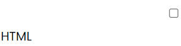

## Guía 05

[DAWM](/DAWM/) / [Proyecto01](/DAWM/proyectos/2024/proyecto01)

<link href="styles/mystyle.css" rel="stylesheet" />
<link href="styles/tabs.css" rel="stylesheet" />
<script src="javascripts/tabs.js" type="text/javascript"></script>

### Objetivo general

<pre class="objective">
Utlizar reglas CSS en la presentación y la accesibilidad del contenido mediante el desarrollo de un currículum vitae digital para la presentación de información profesional de manera organizada y accesible en línea.
</pre>

### Actividades en clases

1. Clona localmente tu repositorio **curriculum**.
2. Edite la hoja de estilo externa _'stylesheets/style.css'_.

#### Flex

1. Agregue la regla CSS al final de la hoja de estilos.

	```css
	nav ul {
		display: flex;
		justify-content: space-evenly;
	}
	```

2. (STOP 1) Actualice el navegador y compruebe los cambios.
3. Versiona local y remotamente el repositorio **curriculum**.

#### Grid

1. Agregue la regla CSS al final de la hoja de estilos.

	```css
	section form {
		display: grid;
		row-gap: 0.5rem;
	}
	```

2. (STOP 2) Actualice el navegador y compruebe los cambios.
3. Versiona local y remotamente el repositorio **curriculum**.

#### Etiquetas contenedoras

1. En el archivo _index.html_, reorganice los elementos desalineados:

	

	Utilice:

	- La etiqueta &lt;div&gt; para agrupar varios elementos (como etiquetas y su texto), y 
	- La etiqueta &lt;span&gt; para contener solo texto. 

	<table>
		<caption>Etiquetas contenedoras</caption>
		<thead>
			<tr>
				<th>Antes</th>
				<th>Después</th>
			</tr>
		</thead>
		<tbody>
			<tr>
				<td>
&lt;input type="checkbox" 
	name="habilidades" value="HTML"&gt; HTML
				</td>
				<td>
<b>&lt;div&gt;</b>
		&lt;input type="checkbox" 
			name="habilidades" value="HTML"&gt;
		<b>&lt;span&gt;</b>HTML<b>&lt;/span&gt;</b>
<b>&lt;/div&gt;</b>
				</td>
			</tr>
		</tbody>
	</table>

2. (STOP 3) Actualice el navegador y compruebe los cambios.
3. Versiona local y remotamente el repositorio **curriculum**.

#### Diseño

1. En el archivo _index.html_, utilice:   

	<div class="tabs">
	  <h3 id="tablist-1">Opciones</h3>
	  <div role="tablist" aria-labelledby="tablist-1" class="manual">
	    <button id="tab-1" type="button" role="tab" aria-selected="true" aria-controls="tabpanel-1">
	      <span class="focus">Maria Ahlefeldt</span>
	    </button>
	    <button id="tab-2" type="button" role="tab" aria-selected="false" aria-controls="tabpanel-2" tabindex="-1">
	      <span class="focus">Carl Andersen</span>
	    </button>
	    <button id="tab-3" type="button" role="tab" aria-selected="false" aria-controls="tabpanel-3" tabindex="-1">
	      <span class="focus">Ida da Fonseca</span>
	    </button>
	    <button id="tab-4" type="button" role="tab" aria-selected="false" aria-controls="tabpanel-4" tabindex="-1">
	      <span class="focus">Peter Müller</span>
	    </button>
	  </div>

	  <div id="tabpanel-1" role="tabpanel" aria-labelledby="tab-1">
	    <p>
	      <a href="https://en.wikipedia.org/wiki/Maria_Theresia_Ahlefeldt">Maria Theresia Ahlefeldt</a>
	      (16 January 1755 – 20 December 1810) was a Danish, (originally German), composer.
	      She is known as the first female composer in Denmark.
	      Maria Theresia composed music for several ballets, operas, and plays of the royal theatre.
	      She was given good critic as a composer and described as a “<span lang="da">virkelig Tonekunstnerinde</span>” ('a True Artist of Music').
	    </p>
	  </div>
	  <div id="tabpanel-2" role="tabpanel" aria-labelledby="tab-2" class="is-hidden">
	    <p>
	      <a href="https://en.wikipedia.org/wiki/Joachim_Andersen_(composer)">Carl Joachim Andersen</a>
	      (29 April 1847 – 7 May 1909) was a Danish flutist, conductor and composer born in Copenhagen, son of the flutist Christian Joachim Andersen.
	      Both as a virtuoso and as composer of flute music, he is considered one of the best of his time.
	      He was considered to be a tough leader and teacher and demanded as such a lot from his orchestras but through that style he reached a high level.
	    </p>
	  </div>
	  <div id="tabpanel-3" role="tabpanel" aria-labelledby="tab-3" class="is-hidden">
	    <p>
	      <a href="https://en.wikipedia.org/wiki/Ida_Henriette_da_Fonseca">Ida Henriette da Fonseca</a>
	      (July 27, 1802 – July 6, 1858) was a Danish opera singer and composer.
	      Ida Henriette da Fonseca was the daughter of Abraham da Fonseca (1776–1849) and Marie Sofie Kiærskou (1784–1863).
	      She and her sister Emilie da Fonseca were students of Giuseppe Siboni, choir master of the Opera in Copenhagen.
	      She was given a place at the royal Opera alongside her sister the same year she debuted in 1827.
	    </p>
	  </div>
	  <div id="tabpanel-4" role="tabpanel" aria-labelledby="tab-4" class="is-hidden">
	    <p>
	      <a href="https://en.wikipedia.org/wiki/Peter_Lange-M%C3%BCller">Peter Erasmus Lange-Müller</a>
	      (1 December 1850 – 26 February 1926) was a Danish composer and pianist.
	      His compositional style was influenced by Danish folk music and by the work of Robert Schumann; Johannes Brahms; and his Danish countrymen, including J.P.E. Hartmann.
	    </p>
	  </div>
	</div>

2. (STOP 3) Actualice el navegador y compruebe los cambios.
3. Versiona local y remotamente el repositorio **curriculum**.

### Documentación

* En [A Complete Guide to Grid](https://css-tricks.com/snippets/css/complete-guide-grid/) existe una explicación extensa del uso de Grid.
  - Otras opciones: [Layoutit Grid: Learning CSS Grid Visually With a Generator](https://css-tricks.com/layoutit-grid-learning-css-grid-visually-with-a-generator/) y [grid.layoutit](https://grid.layoutit.com/).
* En [A Complete Guide to Flexbox](https://css-tricks.com/snippets/css/a-guide-to-flexbox/) existe una explicación extensa del uso de Flexbox.
  - Otras opciones: [Don’t Overthink It (Flexbox) Grids](https://css-tricks.com/dont-overthink-flexbox-grids/) y [An Interactive Guide to Flexbox](https://www.joshwcomeau.com/css/interactive-guide-to-flexbox/).

### Fundamental

* Colocando elementos con Grid Garden y Flexbox Froggy via [X](https://twitter.com/cristiank170319/status/1710508125567000742)

<blockquote class="twitter-tweet"><p lang="es" dir="ltr">Descubre <a href="https://twitter.com/hashtag/CSSGrid?src=hash&amp;ref_src=twsrc%5Etfw">#CSSGrid</a> y <a href="https://twitter.com/hashtag/Flexbox?src=hash&amp;ref_src=twsrc%5Etfw">#Flexbox</a> de manera divertida con Grid Garden y Flexbox Froggy. 🎮🌐 Aprende jugando . 💻🚀 <br>Jardín Grid: <a href="https://t.co/SLubvps9gb">https://t.co/SLubvps9gb</a><br>Flexbox Froggy: <a href="https://t.co/e17lQydbXT">https://t.co/e17lQydbXT</a><br>¡CSS nunca fue tan divertido! 🌈✨<a href="https://twitter.com/hashtag/WebDev?src=hash&amp;ref_src=twsrc%5Etfw">#WebDev</a> <a href="https://twitter.com/hashtag/CodingFun?src=hash&amp;ref_src=twsrc%5Etfw">#CodingFun</a> <a href="https://t.co/OPd5eAouGd">pic.twitter.com/OPd5eAouGd</a></p>&mdash; Cristian Omar Guzman (@cristiank170319) <a href="https://twitter.com/cristiank170319/status/1710508125567000742?ref_src=twsrc%5Etfw">October 7, 2023</a></blockquote> <script async src="https://platform.twitter.com/widgets.js" charset="utf-8"></script>

### Términos

Colocación de elementos, flexbox, grid

### Referencias

* Pseudoclases y pseudoelementos - Aprende sobre desarrollo web MDN. (2021). Retrieved 31 May 2022, from https://developer.mozilla.org/es/docs/Learn/CSS/Building__blocks/Selectors/Pseudo-classes__and__pseudo-elements
* Pseudo-classes - CSS MDN. (2022). Retrieved 31 May 2022, from https://developer.mozilla.org/es/docs/Web/CSS/Pseudo-classes
* Pseudoelementos - CSS MDN. (2022). Retrieved 31 May 2022, from https://developer.mozilla.org/es/docs/Web/CSS/Pseudo-elements
* 3.4. Pseudo-clases (CSS avanzado). (2022). Retrieved 31 May 2022, from https://uniwebsidad.com/libros/css-avanzado/capitulo-3/pseudo-clases
* 3.5. Pseudo-elementos (CSS avanzado). (2022). Retrieved 31 May 2022, from https://uniwebsidad.com/libros/css-avanzado/capitulo-3/pseudo-elementos
* Relación de Grid Layout con otros métodos de diseño y posicionamiento - CSS - CSS MDN. (2021). Retrieved 31 May 2022, from https://developer.mozilla.org/es/docs/Web/CSS/CSS__Grid__Layout/Relationship__of__Grid__Layout
* Don't Overthink It (Flexbox) Grids  CSS-Tricks. (2016). Retrieved 31 May 2022, from https://css-tricks.com/dont-overthink-flexbox-grids/
* flexbox-playground. (2022). Retrieved 31 May 2022, from https://flexbox.netlify.app/
* A Complete Guide to Flexbox  CSS-Tricks. (2013). Retrieved 31 May 2022, from https://css-tricks.com/snippets/css/a-guide-to-flexbox/
* A Complete Guide to Grid CSS-Tricks. (2021). Retrieved 31 May 2022, from https://css-tricks.com/snippets/css/complete-guide-grid/
* Layoutit Grid: Learning CSS Grid Visually With a Generator CSS-Tricks. (2020). Retrieved 1 June 2022, from https://css-tricks.com/layoutit-grid-learning-css-grid-visually-with-a-generator/
* Simple HTTP server in Python - Anurag Kumar. (2022). Retrieved 1 June 2022, from https://www.hackerearth.com/practice/notes/simple-http-server-in-python/