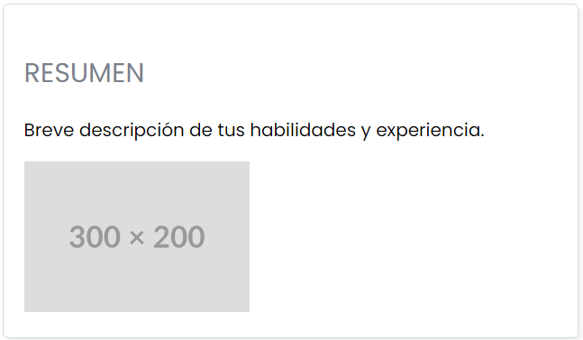
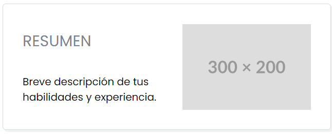

## Guía 05

[DAWM](/DAWM/) / [Proyecto01](/DAWM/proyectos/2024/proyecto01)

<link href="styles/mystyle.css" rel="stylesheet" />
<script src="javascripts/tabs.js" type="text/javascript"></script>

### Objetivo general

<pre class="purpose">
Utlizar reglas CSS en la presentación y la accesibilidad del contenido mediante el desarrollo de un currículum vitae digital para la presentación de información profesional de manera organizada y accesible en línea.
</pre>

### Actividades en clases

1. Clona localmente tu repositorio **curriculum**.
2. Levanta el servidor HTTP con Python, desde la ruta de la aplicación.

#### Flex

1. Edite la hoja de estilo externa _'stylesheets/style.css'_.
2. Agregue la regla CSS al final de la hoja de estilos.

	```css
	nav ul {
		display: flex;
		justify-content: space-around;
	}
	```

3. Actualice el navegador y compruebe los cambios.
4. Versiona local y remotamente el repositorio **curriculum**.

#### Grid

1. Edite la hoja de estilo externa _'stylesheets/style.css'_.
2. Agregue la regla CSS al final de la hoja de estilos.

	```css
	section form {
		display: grid;
		row-gap: 0.5rem;
	}
	```

3. (STOP 1) Actualice el navegador y compruebe los cambios.
4. Versiona local y remotamente el repositorio **curriculum**.

#### Diseño: Flex vs Grid

1. Identifique los elementos en el archivo _index.html_ y su vista previa en el navegador:

	```html
	<section id="resumen">
		<h2 class="subtitle">Resumen</h2>
		<p>Breve descripción de tus habilidades y experiencia.</p>
		
	</section>
	```

	

2. Considere el siguiente diseño objetivo:

	

3. Coloque una a una las siguientes reglas CSS en la hoja de estilo externa y verifique el resultado en el navegador.

	  <div class="tabs">

		  <h3 id="tablist-1">Opciones</h3>

		  <div role="tablist" aria-labelledby="tablist-1" class="manual">

		    <button id="tab-1" type="button" role="tab" aria-selected="true" aria-controls="tabpanel-1">
		      <span class="focus">Flex - columnas</span>
		    </button>

		    <button id="tab-2" type="button" role="tab" aria-selected="false" aria-controls="tabpanel-2" tabindex="-1">
		      <span class="focus">Grid - areas</span>
		    </button>

		  </div>

		  <div id="tabpanel-1" role="tabpanel" aria-labelledby="tab-1">

		  	<table>
		  		<caption>Contenedor</caption>
					<thead>
						<tr>
							<th>Selector</th>
							<th>Efecto</th>
							<th>Propiedad y Valor</th>
							<th>MDN</th>
						</tr>
					</thead>
					<tbody>
						<tr>
							<td rowspan="6">  <b>#resumen</b> </td>
							<td>1 dirección</td>
							<td><i>display: flex;</i></td>
							<td><a href="https://developer.mozilla.org/es/docs/Web/CSS/flex">Ir</a></td>
						</tr>
						<tr>
							<td>Por columna</td>
							<td><i>flex-direction: column;</i></td>
							<td><a href="https://developer.mozilla.org/es/docs/Web/CSS/flex-direction">Ir</a></td>
						</tr>
						<tr>
							<td>Apilamiento</td>
							<td><i>flex-wrap: wrap;</i></td>
							<td><a href="https://developer.mozilla.org/es/docs/Web/CSS/flex-direction">Ir</a></td>
						</tr>
						<tr>
							<td>Altura</td>
							<td><i>height: 20vh;</i></td>
							<td><a href="https://developer.mozilla.org/es/docs/Web/CSS/height">Ir</a></td>
						</tr>
						<tr>
							<td>Ajuste eje transversal</td>
							<td><i>align-content: space-evenly;</i></td>
							<td><a href="https://developer.mozilla.org/es/docs/Web/CSS/align-content">Ir</a></td>
						</tr>
						<tr>
							<td>Ajuste eje principal</td>
							<td><i>justify-content: space-around;</i></td>
							<td><a href="https://developer.mozilla.org/es/docs/Web/CSS/justify-content">Ir</a></td>
						</tr>
					</tbody>
				</table>

				<table>
					<caption>Contenido</caption>
					<thead>
						<tr>
							<th>Selector</th>
							<th>Propiedad y Valor</th>
						</tr>
					</thead>
					<tbody>
						<tr>
							<td>  <b>#resumen h2</b> </td>
							<td> <i>width: 50%;</i> </td>
						</tr>
						<tr>
							<td>  <b>#resumen p</b> </td>
							<td> <i>width: 50%;</i> </td>
						</tr>
						<tr>
							<td> <b>#resumen img</b> </td>
							<td> <i>max-width: 50%;</i> </td>
						</tr>
					</tbody>
				</table>

				<details>
					<summary><div>Haga click aquí para ver la solución</div></summary>
					<pre lang="css"><code>

						#resumen {
						  display: flex;
						  flex-direction: column;
						  flex-wrap: wrap; 

						  height: 20vh;

						  align-content: space-evenly;
						  justify-content: space-around;

						}

						#resumen h2, #resumen p {
						  width: 50%;
						}

						#resumen img {
							max-width: 50%;
						}

					</code></pre>
				</details>
		  </div>

		  <div id="tabpanel-2" role="tabpanel" aria-labelledby="tab-2" class="is-hidden">

		  	<table>
					<thead>
						<tr>
							<th>Elemento</th>
							<th>Selector</th>
							<th>Propiedad y Valor</th>
						</tr>
					</thead>
					<tbody>
						<tr>
							<td>contenedor</td>
							<td>  <b>#resumen</b> </td>
							<td>
								<i>
									display: grid; <br>
								  grid-template-areas: "A D" <br>
								                       "B D";<br>

								  align-items: center; <br>
								  justify-content: space-around;
								</i> 
						  </td>
						</tr>
						<tr>
							<td rowspan="3">contenido</td>
							<td>  <b>#resumen h2</b> </td>
							<td> <i>grid-area: A;</i> </td>
						</tr>
						<tr>
							<td> <b>#resumen p</b> </td>
							<td> <i>grid-area: B;</i> </td>
						</tr>
						<tr>
							<td> <b>#resumen img</b> </td>
							<td> <i>grid-area: D;</i> </td>
						</tr>
					</tbody>
				</table>

				<details>
					<summary><div>Haga click aquí para ver la solución</div></summary>
					<pre lang="css"><code>

						#resumen {
						  display: grid;
						  grid-template-areas: "A D"
						                       "B D";

						  align-items: center;
						  justify-content: space-around;
						}

						#resumen h2 {
						  grid-area: A;
						}

						#resumen p {
						  grid-area: B;
						}

						#resumen img {
						  grid-area: D;
						}

					</code></pre>
				</details>
		  </div>

		</div>

4. (STOP 3) Actualice el navegador y compruebe los cambios.
5. Versiona local y remotamente el repositorio **curriculum**.

### Documentación

* En [A Complete Guide to Grid](https://css-tricks.com/snippets/css/complete-guide-grid/) existe una explicación extensa del uso de Grid. Otras opciones: [Layoutit Grid: Learning CSS Grid Visually With a Generator](https://css-tricks.com/layoutit-grid-learning-css-grid-visually-with-a-generator/) y [grid.layoutit](https://grid.layoutit.com/).
* En [A Complete Guide to Flexbox](https://css-tricks.com/snippets/css/a-guide-to-flexbox/) existe una explicación extensa del uso de Flexbox. Otras opciones: [Don’t Overthink It (Flexbox) Grids](https://css-tricks.com/dont-overthink-flexbox-grids/) y [An Interactive Guide to Flexbox](https://www.joshwcomeau.com/css/interactive-guide-to-flexbox/).

### Fundamental

* Colocando elementos con Grid Garden y Flexbox Froggy via [X](https://twitter.com/cristiank170319/status/1710508125567000742)

<blockquote class="twitter-tweet"><p lang="es" dir="ltr">Descubre <a href="https://twitter.com/hashtag/CSSGrid?src=hash&amp;ref_src=twsrc%5Etfw">#CSSGrid</a> y <a href="https://twitter.com/hashtag/Flexbox?src=hash&amp;ref_src=twsrc%5Etfw">#Flexbox</a> de manera divertida con Grid Garden y Flexbox Froggy. 🎮🌐 Aprende jugando . 💻🚀 <br>Jardín Grid: <a href="https://t.co/SLubvps9gb">https://t.co/SLubvps9gb</a><br>Flexbox Froggy: <a href="https://t.co/e17lQydbXT">https://t.co/e17lQydbXT</a><br>¡CSS nunca fue tan divertido! 🌈✨<a href="https://twitter.com/hashtag/WebDev?src=hash&amp;ref_src=twsrc%5Etfw">#WebDev</a> <a href="https://twitter.com/hashtag/CodingFun?src=hash&amp;ref_src=twsrc%5Etfw">#CodingFun</a> <a href="https://t.co/OPd5eAouGd">pic.twitter.com/OPd5eAouGd</a></p>&mdash; Cristian Omar Guzman (@cristiank170319) <a href="https://twitter.com/cristiank170319/status/1710508125567000742?ref_src=twsrc%5Etfw">October 7, 2023</a></blockquote> <script async src="https://platform.twitter.com/widgets.js" charset="utf-8"></script>

### Términos

Colocación de elementos, flexbox, grid

### Referencias

* Pseudoclases y pseudoelementos - Aprende sobre desarrollo web MDN. (2021). Retrieved 31 May 2022, from https://developer.mozilla.org/es/docs/Learn/CSS/Building__blocks/Selectors/Pseudo-classes__and__pseudo-elements
* Pseudo-classes - CSS MDN. (2022). Retrieved 31 May 2022, from https://developer.mozilla.org/es/docs/Web/CSS/Pseudo-classes
* Pseudoelementos - CSS MDN. (2022). Retrieved 31 May 2022, from https://developer.mozilla.org/es/docs/Web/CSS/Pseudo-elements
* 3.4. Pseudo-clases (CSS avanzado). (2022). Retrieved 31 May 2022, from https://uniwebsidad.com/libros/css-avanzado/capitulo-3/pseudo-clases
* 3.5. Pseudo-elementos (CSS avanzado). (2022). Retrieved 31 May 2022, from https://uniwebsidad.com/libros/css-avanzado/capitulo-3/pseudo-elementos
* Relación de Grid Layout con otros métodos de diseño y posicionamiento - CSS - CSS MDN. (2021). Retrieved 31 May 2022, from https://developer.mozilla.org/es/docs/Web/CSS/CSS__Grid__Layout/Relationship__of__Grid__Layout
* Don't Overthink It (Flexbox) Grids  CSS-Tricks. (2016). Retrieved 31 May 2022, from https://css-tricks.com/dont-overthink-flexbox-grids/
* flexbox-playground. (2022). Retrieved 31 May 2022, from https://flexbox.netlify.app/
* A Complete Guide to Flexbox  CSS-Tricks. (2013). Retrieved 31 May 2022, from https://css-tricks.com/snippets/css/a-guide-to-flexbox/
* A Complete Guide to Grid CSS-Tricks. (2021). Retrieved 31 May 2022, from https://css-tricks.com/snippets/css/complete-guide-grid/
* Layoutit Grid: Learning CSS Grid Visually With a Generator CSS-Tricks. (2020). Retrieved 1 June 2022, from https://css-tricks.com/layoutit-grid-learning-css-grid-visually-with-a-generator/
* Simple HTTP server in Python - Anurag Kumar. (2022). Retrieved 1 June 2022, from https://www.hackerearth.com/practice/notes/simple-http-server-in-python/
* (WAI), W. W. A. I. (n.d.). Example of Tabs with Manual Activation. Retrieved from https://www.w3.org/WAI/ARIA/apg/patterns/tabs/examples/tabs-manual/
* Olo, oloolo 5, Ethan VuEthan Vu 2, symlinksymlink 12.2k77 gold badges3030 silver badges5454 bronze badges, Dean WilsonDean Wilson 6155 bronze badges, & lucidlipslucidlips 4622 bronze badges. (1964). CSS flex-wrap how to make the height do not stretch. Retrieved from https://stackoverflow.com/questions/56999956/css-flex-wrap-how-to-make-the-height-do-not-stretch