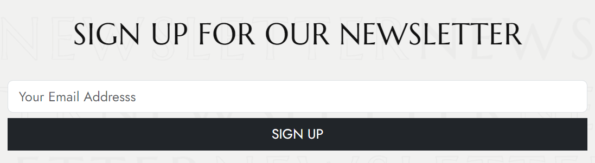

## Guía 07

[DAWM](/DAWM/) / [Proyecto02](/DAWM/proyectos/2024/proyecto02)

<link href="styles/mystyle.css" rel="stylesheet" />
<script src="javascripts/tabs.js" type="text/javascript"></script>

### Objetivo general

<pre class="purpose">
Proponer código de scripting para el manejo de datos desde el cliente mediante el desarrollo de una <i>landing page</i> funcional y atractiva utilizando una plantilla de Bootstrap para la adecuación a los requerimientos específicos.
</pre>

### Actividades en clases

1. Clone localmente tu repositorio **landing**.
2. Siga las instrucciones de [Gemini](gemini/guia07-gemini01.pdf), y:
    - Cree la carpeta con _js_ y agregue el archivo de código externo _'main.js'_.
    - Agregue la referencia con la ruta al archivo de código externo en el archivo _index.html_.
3. Abra su proyecto con VSCode y utilice el Live Server para identificar los cambios. 
4. (STOP 1) Compruebe el resultado en el navegador.

#### Ciclo de vida de una página HTML 

1. Edite el archivo de código externo _js/main.js_
2. Defina las `funciones flecha` _ready_ y _loaded_, con: 

    ```js
    let ready = () => {
        console.log('DOM está listo')
        debugger
    }

    let loaded = () => {
        debugger
        console.log('Iframes e Images cargadas')
    }
    ```

3. Agregue:
    - El objeto `window` con el método **addEventListener**, del `API`, para relacionar el `evento` **DOMContentLoaded** con la función _ready_.
    - El objeto window con el método **addEventListener** para relacionar el evento **load** con la función _loaded_.

    ```javascript
    let ready = () => { ... }
    let loaded = () => { ... }

    window.addEventListener("DOMContentLoaded", ready);
    window.addEventListener("load", loaded)
    ```

4. (STOP 2) Compruebe el resultado en el navegador. Habilite el inspector y recargue la página.

#### Document API

1. Elimine los puntos de interrupción **debugger**.
2. Identifique el elemento &lt;form&gt; con id **form** en el documento _index.html_.

    ```html
    <form id="form" class="d-flex flex-wrap gap-2">
      <input type="text" name="email" 
             placeholder="Your Email Addresss" 
             class="form-control form-control-lg">
      <button class="btn btn-dark btn-lg text-uppercase w-100">Sign Up</button>
    </form>
    ```

    

3. Escriba o genere el código:
    
    <pre class="prompt">
    Asigne a la variable <i>myform</i> la referencia al elemento HTML a partir del objeto document con el método <b>getElementById</b>. El formulario tiene id <i>'form'</i>.<br>
    Agregue un punto de interrupción.
    </pre> 

    ```typescript
    let loaded = () => {

      //Coloque aquí el código

    }
    ```

    <details>
      <summary><div>Haga click aquí para ver la solución</div></summary>
      <pre lang="javascript"><code>
        let loaded = () => {

          let myform = document.getElementById('form');
          debugger;

        }
      </code></pre>
    </details>

4. (STOP 3) Compruebe el resultado en el navegador. Habilite el inspector y recargue la página.

#### Evento submit

1. Elimine los puntos de interrupción **debugger**.
2. Escriba o genere el código:

    <pre class="prompt">
    Use la variable <i>myform</i> mediante con el método <b>addEventListener</b> para relacionar el evento <b>submit</b> con un callback (incluya el parámetro <i>eventSubmit</i>).<br>
    Dentro del callback, use el parámetro <i>eventSubmit</i> para evitar el comportamiento por defecto del formulario.<br>
    Agregue un punto de interrupción.
    </pre>

    ```typescript
    let loaded = () => {

      let myform = document.getElementById('form');

      //Coloque aquí el código

    }
    ```

    <details>
      <summary><div>Haga click aquí para ver la solución</div></summary>
      <pre lang="javascript"><code>
        let loaded = ( eventLoaded ) => {

          let myform = document.getElementById('form');
          
          myform.addEventListener('submit', (eventSubmit) => {
              eventSubmit.preventDefault(); 
              debugger;
          })

        }
      </code></pre>
    </details> 

3. (STOP 4) Compruebe el resultado en el navegador. Habilite el inspector y recargue la página.

#### Validación de campos

1. Elimine los puntos de interrupción **debugger**.
2. Escriba o genere el código:

    <pre class="prompt">
    Asigne a la variable <i>emailElement</i> la referencia al elemento HTML a partir del objeto document con el método <b>querySelector</b>. El elemento tiene la clase <i>'form-control-lg'</i>.<br>
    Asigne a la variable <i>emailText</i> a partir del objeto <i>emailElement</i> con la propiedad <b>value</b>.<br>
    Use la variable <i>emailText</i> mediante la propiedad <b>length</b> para verificar la longitud. En caso que la longitud sea igual que 0, use la variable <i>emailElement</i> mediante con el método <b>focus</b> para llevar el enfoque al elemento.
    </pre>

    ```typescript
    let loaded = () => {

      let myform = document.getElementById('form');
      
      myform.addEventListener('submit', (eventSubmit) => {
          eventSubmit.preventDefault(); 
          
          //Coloque aquí el código

      })

    }
    ```

    <details>
      <summary><div>Haga click aquí para ver la solución</div></summary>
      <pre lang="javascript"><code>
        let loaded = ( eventLoaded ) => {

          let myform = document.getElementById('form');
          
          myform.addEventListener('submit', (eventSubmit) => {
              eventSubmit.preventDefault(); 
              
              const emailElement = document.querySelector('.form-control-lg');
              const emailText = emailElement.value;

              if (emailText.length === 0) {
                emailElement.focus()
              }
          })

        }
      </code></pre>
    </details> 

3. (STOP 5) Compruebe el resultado en el navegador.

#### Animate API

1. Revise la documentación de [Web Animations API Concepts](https://developer.mozilla.org/en-US/docs/Web/API/Web_Animations_API/Web_Animations_API_Concepts) y [Web Animation API](https://blog.carbonteq.com/web-animation-api/)
2. Escriba o genere el código:

    <pre class="prompt">
    Además de llevar el enfoque al elemento <i>emailElement</i>: Use el <i>Animate API</i> para que elemento <i>emailElement</i> se mueva de 0 a 50px y de -50px a 0, con una duración de 400 milisegundos. 
    </pre>

    <details>
      <summary><div>Haga click aquí para ver la solución</div></summary>
      <pre lang="javascript"><code>
        emailElement.animate(
            [
                { transform: "translateX(0)" },
                { transform: "translateX(50px)" },
                { transform: "translateX(-50px)" },
                { transform: "translateX(0)" }
            ],
            {
                duration: 400,
                easing: "linear",
            }
        )
      </code></pre>
    </details> 

3. (STOP 6) Compruebe el resultado en el navegador. 

### Documentación

* [JavaScript](https://developer.mozilla.org/es/docs/Web/JavaScript)  es un lenguaje de programación ligero, interpretado, o compilado justo-a-tiempo (just-in-time) con funciones de primera clase: [Básico](https://developer.mozilla.org/es/docs/Learn/Getting_started_with_the_web/JavaScript_basics), [EcmaScript6](http://es6-features.org/#) y la [compatibilidad con los diferentes navegadores](http://kangax.github.io/compat-table/es6/), [Arreglos](https://developer.mozilla.org/es/docs/Web/JavaScript/Referencia/Objetos_globales/Array), [Objetos](https://developer.mozilla.org/es/docs/Web/JavaScript/Guide/Trabajando_con_objectos), y [Elementos del navegador](https://javascript.info/browser-environment).
    - [DOM](https://javascript.info/dom-nodes). El DOM y su uso a través de ejemplos de etiquetas, anidamientos, autocorrección e inspección por la consola del navegador con sus [propiedades y métodos](https://developer.mozilla.org/es/docs/Web/API/Document).
    - [Objeto: Document](https://javascript.info/dom-navigation). Este objeto te permite manipular el DOM de cualquier página web.
    - [Eventos](https://javascript.info/events). Cada elemento dentro del navegador responde a un conjunto de señales disparadas en el DOM.
* [Web API](https://developer.mozilla.org/es/docs/Web/API) En esta sección puedes encontrar las referencias al Web API que se utiliza cuando programas con Javascript.

### Fundamental

* Tiempo de descarga y ejecución del código Javascript via [X](https://twitter.com/kamrify/status/1436392322451841026)

<blockquote class="twitter-tweet"><p lang="en" dir="ltr">Avoid render blocking JavaScript using async and defer scripts. <a href="https://t.co/JPDOlshMpk">pic.twitter.com/JPDOlshMpk</a></p>&mdash; Kamran Ahmed (@kamrify) <a href="https://twitter.com/kamrify/status/1436392322451841026?ref_src=twsrc%5Etfw">September 10, 2021</a></blockquote> <script async src="https://platform.twitter.com/widgets.js" charset="utf-8"></script>

* Preguntas básicas relacionadas con el DOM via [X](https://x.com/emiko_dev/status/1719339017051738188)

<blockquote class="twitter-tweet"><p lang="en" dir="ltr">You&#39;re in a web developer internship interview. 💼<br><br>The interviewer asked:<br><br>&quot;What&#39;s a DOM (Document Object Model) in web development?&quot;<br><br>Here&#39;s how to answer:</p>&mdash; Emiko.dev ☀️ (@emiko_dev) <a href="https://twitter.com/emiko_dev/status/1719339017051738188?ref_src=twsrc%5Etfw">October 31, 2023</a></blockquote> <script async src="https://platform.twitter.com/widgets.js" charset="utf-8"></script>

### Términos

Javascript, función flecha, API, console, debugger, window, evento, document, propiedad, función.

### Referencias

* JavaScript Guide - JavaScript MDN. (2022). Retrieved 9 June 2022, from https://developer.mozilla.org/en-US/docs/Web/JavaScript/Guide
* Tutorial, T. (2022). The Modern JavaScript Tutorial. Retrieved 9 June 2022, from https://javascript.info/ 
* JavaScript Tutorial. (2022). Retrieved 9 June 2022, from https://www.javascripttutorial.net/
* JavaScript Tutorial. (2022). Retrieved 9 June 2022, from https://www.w3schools.com/js/
* Free JavaScript Resources Java5cript.com. (2022). Retrieved 9 June 2022, from https://www.java5cript.com/
* ¿Qué diferencia async y defer en JavaScript? (2019). Retrieved from https://cybmeta.com/diferencia-async-y-defer
* Página: DOMContentLoaded, load, beforeunload, unload. (n.d.). Retrieved from https://es.javascript.info/onload-ondomcontentloaded
* Nick Schot  @nickschot on Twitter, & Schot, N. (2021). An intro to animating with the Web Animations API. Retrieved from https://mainmatter.com/blog/2021/01/29/web-animations-intro/