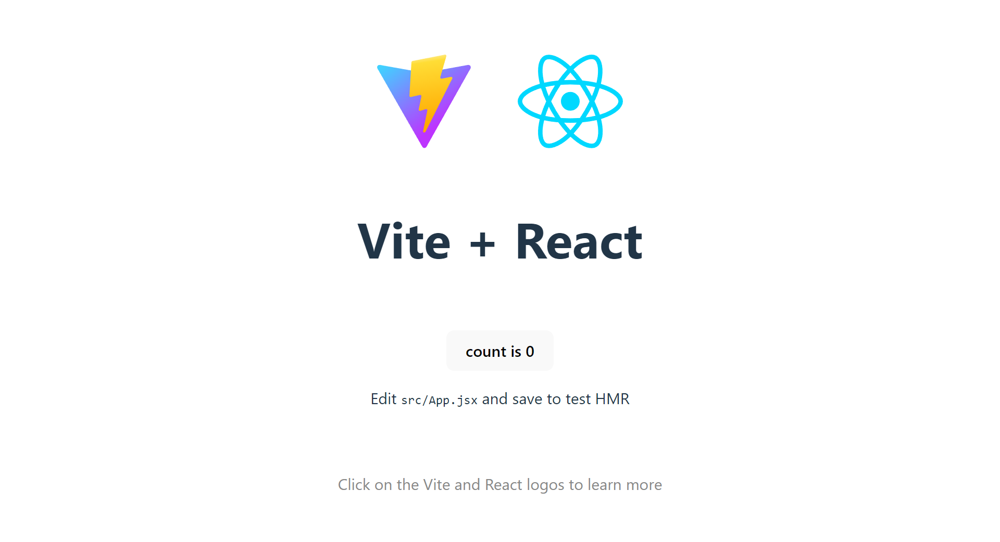

## Guía 11

[DAWM](/DAWM/) / [Proyecto03](/DAWM/proyectos/2024/proyecto03)

### Actividades previas

* Desde la línea de comandos:
	- Verifique la versión de npm, con: `npm --v`

### Actividades en clases

#### Github

* Crea un repositorio en GitHub con el nombre **dashboard**.

#### Proyecto Base

* Desde la línea de comandos, cree un nuevo sitio con Vite:

```prompt
	npm create vite@latest <NOMBRE_DEL_REPOSITORIO>
```

   - Seleccione **React** como framework: `√ Select a framework: » React`
   - Seleccione **Typescript** como variante: `√ Select a variant: » Typescript`

* Ingrese a la carpeta del repositorio:

```prompt
	cd <NOMBRE_DEL_REPOSITORIO>
```

* Instale las dependencias

```prompt
	npm install
```

* Inicie el servidor.

```prompt
	npm run dev
```

* Revise el resultado en [http://localhost:5173/](http://localhost:5173/)

<div align="center">
    
</div>

* Versiona local y remotamente el repositorio **dashboard**.

#### Estructura de archivos del proyecto en Vite - React.

* Archivos de configuración
    + **./vite.config.js** contiene la información al ejecutar el servidor de Vite.
    + **./package.json** contiene la lista de los paquetes instalados

* Código fuente
    + **./index.html** página de inicio
    + **src/index.css** estilo global de la página
    + **src/main.jsx** punto de entrada de la página
    + **src/App.jsx** función componente principal
    + **src/App.css** estilo de la función componente principal

#### Configuración para el despliegue

* Desde la línea de comandos, acceda a la ruta del proyecto.
* Instale el paquete `gh-pages`

```prompt
	npm install gh-pages --save-dev
```

* En el archivo `package.json` agregue las siguientes líneas antes de la entrada **build**:

```typescript
    ...
    "predeploy": "npm run build",
    "deploy": "gh-pages -d dist",
    ...
```

* En el archivo `vite.config.js` agregue esta línea antes de: **plugins: [react()],**:

```typescript
    base: "/<NOMBRE_DEL_REPOSITORIO>",
    ...
```

* Versiona local y remotamente el repositorio **dashboard**.

* Desde la línea de comandos:
	+ Ejecute el comando de transpilación y despliegue del sitio web, con: `npm run deploy`
	+ De ser necesario, corrija o comente las secciones de código identificadas por el transpilador.
	+ Levante un servidor HTTP en la carpeta `dist`, para comprobar el funcionamiento del sitio web transpilado.

* En GitHub:
	+ En _Settings_ > _Code and automation_ > _Pages_ > _Build and deployment_ seleccione la rama **gh-pages**
	+ Verifique que exista la rama **gh-pages** y que contenga el sitio web transpilado.
	+ Revise el URL del sitio web desplegado, que se encuentra en _Settings_ > _Code and automation_ > _Pages_ > _GitHub Pages_: `https://<NOMBRE_DE_USUARIO>.github.io/<NOMBRE_DEL_REPOSITORIO>/`. 

#### React MUI: Instalación

* Desde la línea de comandos, [instale React MUI](https://mui.com/material-ui/getting-started/installation/) con:

```prompt
npm install @mui/material @emotion/react @emotion/styled
```

#### React MUI: Componente Grid v2

* En el componente `App.tsx`, agregue la referencia al componente [Grid 2](https://mui.com/material-ui/react-grid2/).

```typescript
import { useState } from 'react'
import Grid from '@mui/material/Unstable_Grid2'; // Grid version 2
```

* En `App.tsx`, reemplace el contenido a renderizar por:

```jsx
...

function App() {
	...

	return (
	  <Grid>
	      <Grid>1</Grid>
	      <Grid>2</Grid>
	      <Grid>3</Grid>
	      <Grid>4</Grid>
	      <Grid>5</Grid>
	      <Grid>6</Grid>
	    </Grid>
    )
}

export default App
```
* Compruebe el resultado en el navegador.

#### React MUI: Propiedades (Props)

* En `App.tsx`, convierta el primer Grid en contenedor con el atributo **container** y asigne un espacio entre elementos con **spacing**.

```jsx
...
	return (
	  <Grid container spacing={5}>
		...
		</Grid>
    )
...
```
* Compruebe el resultado en el navegador.

#### React MUI: Layout

* Agregue las propiedades **xs**, **sm**, **md** y **lg** a los elementos internos.

```jsx
...
	return (
	  <Grid container spacing={5}>
	      <Grid xs={12} sm={4} md={3} lg={2}>1</Grid>
	      <Grid xs={6} sm={4} md={3} lg={2}>2</Grid>
	      <Grid xs={6} sm={4} md={3} lg={2}>3</Grid>
	      <Grid xs={12} sm={4} md={3} lg={2}>4</Grid>
	      <Grid xs={6} sm={4} md={6} lg={2}>5</Grid>
	      <Grid xs={6} sm={4} md={6} lg={2}>6</Grid>
	    </Grid>
	)
...
```

* Compruebe el resultado para los diferentes tamaños del navegador.

#### Despliegue automático

* Agregue los elementos necesarios, para cada uno de los tamaños de dispositivos, de acuerdo con el diseño de su dashboard responsivo. 
* Versiona local y remotamente el repositorio **dashboard**.
* Desde la línea de comandos, ejecute el comando de transpilación y despliegue del sitio web, con: `npm run deploy`

### Documentación

* En [react.dev](https://react.dev/) se encuentra la documentación, tutoriales, playground y referencias para crear interfaces de sitios web y aplicaciones nativas.
* En [vitejs.dev](https://vitejs.dev/) se encuentra la documentación y referencias que provee de un servidor de desarrollo local que se utiliza para crear aplicaciones web de JavaScript. Vite es conocido por su velocidad, facilidad de uso y soporte para una amplia gama de marcos y bibliotecas de JavaScript.
* En [mui.com](https://mui.com/) se encuentra la documentación de la librería de componentes visuales para React.

### Fundamental

* React.dev Blog

<blockquote class="twitter-tweet" data-media-max-width="560"><p lang="en" dir="ltr">Join us for a tour around the new site in our introductory blog post. You’ll learn what’s new, how to access the old site (in case you need it), and what’s coming next. <a href="https://t.co/h6K8uMyRXN">https://t.co/h6K8uMyRXN</a></p>&mdash; React (@reactjs) <a href="https://twitter.com/reactjs/status/1636444645981863967?ref_src=twsrc%5Etfw">March 16, 2023</a></blockquote> <script async src="https://platform.twitter.com/widgets.js" charset="utf-8"></script>

* MUI is more than just Material UI!

<blockquote class="twitter-tweet" data-media-max-width="560"><p lang="en" dir="ltr">🗣️💬 Shout it from the rooftops:<br><br>MUI is more than just Material UI! ✨<br><br>Headless components? <br>✅ Base UI<br><br>Next-gen design &amp; DX?<br>✅ Joy UI<br><br>Advanced components?<br>✅ MUI X Data Grid &amp; Date Pickers<br><br>Low-code admin builder?<br>✅ MUI Toolpad<br><br>Learn more here:<a href="https://t.co/ZulMd41oIf">https://t.co/ZulMd41oIf</a></p>&mdash; MUI org (@MUI_hq) <a href="https://twitter.com/MUI_hq/status/1651256048307585029?ref_src=twsrc%5Etfw">April 26, 2023</a></blockquote> <script async src="https://platform.twitter.com/widgets.js" charset="utf-8"></script>

### Términos

librería, ui, ui material

### Referencias

* Quick Start. (n.d.). Retrieved from https://react.dev/learn
* Vite. (n.d.). Retrieved from https://vitejs.dev/
* Cómo iniciar un proyecto React con Vite. (2022). Retrieved from https://carlosazaustre.es/react-vite
* Shamloo, R. (2023). Deploying Vite / React App to GitHub Pages. Retrieved from https://dev.to/rashidshamloo/deploying-vite-react-app-to-github-pages-35hf
* The React component library you always wanted. (n.d.). Retrieved from https://mui.com/
* Khaled, A. (2024). TypeScript vs. TypeScript SWC in Vite: Understanding the Differences. Retrieved from https://medium.com/@amirakhaled2027/typescript-vs-typescript-swc-in-vite-understanding-the-differences-7240e7309ca7