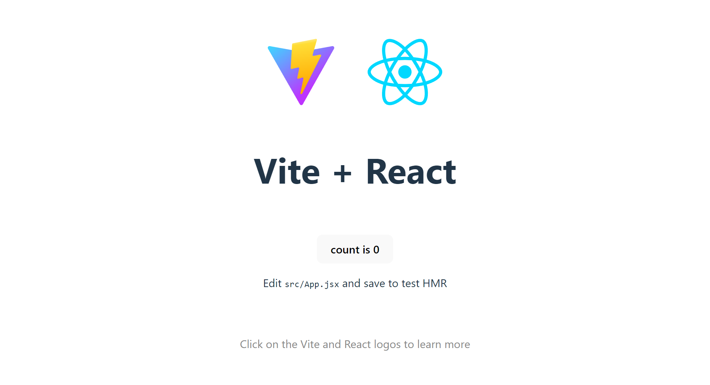

## Guía 11

[DAWM](/DAWM/) / [Proyecto03](/DAWM/proyectos/2024/proyecto03)

<link href="styles/mystyle.css" rel="stylesheet" />
<script src="javascripts/tabs.js" type="text/javascript"></script>

### Objetivo general

<pre class="purpose">
Desarrollar un dashboard interactivo y visualmente intuitivo utilizando tecnologías web modernas, como React, que permita a los usuarios monitorear en tiempo real métricas clave del clima.</pre>

### Actividades previas

* Desde la línea de comandos:
	- Verifique la versión de npm, con: `npm --v`

### Actividades en clases

#### Github

1. Crea un repositorio en GitHub con el nombre **dashboard**.
	- Incluya el archivo _README.md_.
	- Agregue _.gitignore_ con la plantilla **Node**.
2. Clone su repositorio localmente.

#### Proyecto Base

1. Desde la línea de comandos, 

	- Acceda a la carpeta de su proyecto.
	
	```prompt
	cd dashboard
	```

	- Cree un nuevo sitio con Vite:

	```prompt
	npm create vite@latest .
	```

	- En caso de ser necesario, ingrese **y** a la instalación del paquete `create-vite`: 

	```prompt
	Need to install the following packages:  
	create-vite@5.5.5
	Ok to proceed? (y) y
	```

	- En caso de ser necesario, seleccione **Ignore files and continue** a crear la estructura de archivos en un repositorio con README.md: 

	```prompt
	Current directory is not empty. 
	Please choose how to proceed: » Ignore files and continue
	```

	- Seleccione **React** como framework: 

	```
	√ Select a framework: » React
	```

	- Seleccione **Typescript** como variante: 

	```
	√ Select a variant: » Typescript
	```

2. Instale las dependencias

	```prompt
	npm install
	```

3. Inicie el servidor.

	```prompt
	npm run dev
	```

5. (STOP 1) Compruebe el resultado en el navegador.
6. Revise el resultado en [http://localhost:5173/](http://localhost:5173/)

<div align="center">
    
</div>

7. Versiona local y remotamente el repositorio.

#### Estructura de archivos del proyecto en Vite - React.

* Archivos de configuración
    + _./vite.config.js_ contiene la información al ejecutar el servidor de Vite.
    + _./package.json_ contiene la lista de los paquetes instalados

* Código fuente
    + _./index.html_ página de inicio
    + _src/index.css_ estilo global de la página
    + _src/main.tsx_ punto de entrada de la página
    + _src/App.tsx_ función componente principal
    + _src/App.css_ estilo de la función componente principal

#### React MUI: Instalación

1. Desde la línea de comandos, instale [React MUI](https://mui.com/material-ui/getting-started/installation/) con:

	```prompt
	npm install @mui/material @emotion/react @emotion/styled
	```

#### React MUI: Componente Grid version 2

1. En el componente _App.tsx_, agregue la referencia al componente [Grid 2](https://mui.com/material-ui/react-grid2/).

	```typescript
	import { ... } from 'react'

	// Grid version 2
	import Grid from '@mui/material/Grid2' 
	```

2. En _App.tsx_, reemplace el contenido a renderizar en el **return** por:

	```jsx
	...

	function App() {
		...

		return (
		  <Grid>
		      <Grid>Elemento: Indicador 1</Grid>
		      <Grid>Elemento: Indicador 2</Grid>
		      <Grid>Elemento: Indicador 3</Grid>
		      <Grid>Elemento: Indicador 4</Grid>
		      <Grid>Elemento: Tabla</Grid>
		      <Grid>Elemento: Gráfico 1</Grid>
		      <Grid>Elemento: Gráfico 2</Grid>
		  </Grid>
	    )
	}

	export default App
	```

3. Versiona local y remotamente el repositorio.
4. (STOP 2) Compruebe el resultado en el navegador.

#### React MUI: Propiedades (Props)

1. En _App.tsx_, aplique al elemento Grid contenedor: 

	- El atributo **container** para convertir una [cuadrícula fluida](https://mui.com/material-ui/react-grid2/#fluid-grids).
	- El atributo **spacing** para crear un [espaciado](https://mui.com/material-ui/react-grid2/#spacing).

	```jsx
	return (
	  <Grid container spacing={5}>

		<Grid>Elemento: Indicador 1</Grid>
      		...
		<Grid>Elemento: Gráfico 2</Grid>

	  </Grid>
    )
	```

2. Versiona local y remotamente el repositorio.
3. (STOP 3) Compruebe el resultado en el navegador.

#### React MUI: Layout

1. En _App.tsx_, aplique a todos los elementos Grid descendientes (con los textos del 1 al 6) los [puntos de interrupción](https://mui.com/material-ui/react-grid2/#multiple-breakpoints) (atributo **size**) con las [claves predeterminadas](https://mui.com/material-ui/customization/breakpoints/#default-breakpoints) y valores de acuerdo con la siguiente tabla:

	<table>
		<caption>Diseño con puntos de interrupción</caption>
		<thead>
			<tr>
				<th>Clave (Tamaño)</th>
				<th>Cantidad de columnas</th>
				<th>Elemento</th>
			</tr>
		</thead>
		<tbody>
			<tr>
				<td>xs (extra-small)</td>
				<td>12</td>
				<td>Indicadores, Tabla y Gráficos</td>
			</tr>
			<!-- <tr>
				<td>sm (small)</td>
				<td>6</td>
			</tr>
			<tr>
				<td>md (medium)</td>
				<td>4</td>
			</tr> -->
			<tr>
				<td rowspan="3">xl (extra-large)</td>
				<td>3</td>
				<td>Indicadores</td>
			</tr>
			<tr>
				<td>3</td>
				<td>Gráficos</td>
			</tr>
			<tr>
				<td>6</td>
				<td>Tabla</td>
			</tr>
		</tbody>
	</table>

	<details>
      <summary><div>Haga click aquí para ver la solución</div></summary>
      <pre lang="jsx"><code>
      	return (
		    &lt;Grid container spacing={5}&gt;
		        &lt;Grid size={{ xs: 12, xl: 3 }}&gt;Elemento: Indicador 1&lt;/Grid&gt;
		        &lt;Grid size={{ xs: 12, xl: 3 }}&gt;Elemento: Indicador 2&lt;/Grid&gt;
		        &lt;Grid size={{ xs: 12, xl: 3 }}&gt;Elemento: Indicador 3&lt;/Grid&gt;
		        &lt;Grid size={{ xs: 12, xl: 3 }}&gt;Elemento: Indicador 4&lt;/Grid&gt;
		        &lt;Grid size={{ xs: 12, xl: 6 }}&gt;Elemento: Tabla&lt;/Grid&gt;
		        &lt;Grid size={{ xs: 12, xl: 3 }}&gt;Elemento: Gráfico 1&lt;/Grid&gt;
		        &lt;Grid size={{ xs: 12, xl: 3 }}&gt;Elemento: Gráfico 1&lt;/Grid&gt;
		    &lt;/Grid&gt;
		)
      </code></pre>
    </details>

2. Versiona local y remotamente el repositorio.
3. (STOP 4) Compruebe el resultado para los diferentes tamaños del navegador.

#### Configuración para el despliegue

1. Desde la línea de comandos, acceda a la ruta del proyecto.
2. Instale el paquete `gh-pages`

	```prompt
	npm install gh-pages --save-dev
	```

3. En el archivo `package.json` 

	- Agregue la entrada **homepage** en el formato: `https://{username}.github.io/dashboard`:

	```typescript
	{
		...
		"homepage": "https://{username}.github.io/dashboard",
		"type": "...",
		"scripts": { ... }
	}
	```

	- Agregue los comandos **predeploy** y **deploy** a la entrada scripts:

	```typescript
	{
		...
		"type": "...",
		"scripts": {
		    ...
		    "predeploy": "npm run build",
		    "deploy": "gh-pages -d dist",
		    ...
		}
	}
	```

4. En el archivo `vite.config.js` agregue la ruta al repositorio remoto `/dashboard`:

	```typescript
	export default defineConfig({
	  base: "/dashboard",
	  plugins: [react()],
	})
	```

5. Versiona local y remotamente el repositorio.
6. Desde la línea de comandos, ejecute el comando de transpilación y despliegue del sitio web, con: `npm run deploy`
	+ De ser necesario, corrija o comente las secciones de código identificadas por el transpilador.
	+ Vuelva a ejecutar el comando de transpilación y despliegue.

### Documentación

* En [react.dev](https://react.dev/) se encuentra la documentación, tutoriales, playground y referencias para crear interfaces de sitios web y aplicaciones nativas.
* En [vitejs.dev](https://vitejs.dev/) se encuentra la documentación y referencias que provee de un servidor de desarrollo local que se utiliza para crear aplicaciones web de JavaScript. Vite es conocido por su velocidad, facilidad de uso y soporte para una amplia gama de marcos y bibliotecas de JavaScript.
* En [mui.com](https://mui.com/) se encuentra la documentación de la librería de componentes visuales para React.

### Fundamental

* React.dev Blog

<blockquote class="twitter-tweet" data-media-max-width="560"><p lang="en" dir="ltr">Join us for a tour around the new site in our introductory blog post. You’ll learn what’s new, how to access the old site (in case you need it), and what’s coming next. <a href="https://t.co/h6K8uMyRXN">https://t.co/h6K8uMyRXN</a></p>&mdash; React (@reactjs) <a href="https://twitter.com/reactjs/status/1636444645981863967?ref_src=twsrc%5Etfw">March 16, 2023</a></blockquote> <script async src="https://platform.twitter.com/widgets.js" charset="utf-8"></script>

* MUI is more than just Material UI!

<blockquote class="twitter-tweet" data-media-max-width="560"><p lang="en" dir="ltr">🗣️💬 Shout it from the rooftops:<br><br>MUI is more than just Material UI! ✨<br><br>Headless components? <br>✅ Base UI<br><br>Next-gen design &amp; DX?<br>✅ Joy UI<br><br>Advanced components?<br>✅ MUI X Data Grid &amp; Date Pickers<br><br>Low-code admin builder?<br>✅ MUI Toolpad<br><br>Learn more here:<a href="https://t.co/ZulMd41oIf">https://t.co/ZulMd41oIf</a></p>&mdash; MUI org (@MUI_hq) <a href="https://twitter.com/MUI_hq/status/1651256048307585029?ref_src=twsrc%5Etfw">April 26, 2023</a></blockquote> <script async src="https://platform.twitter.com/widgets.js" charset="utf-8"></script>

### Términos

librería, ui, ui material

### Referencias

* Quick Start. (n.d.). Retrieved from https://react.dev/learn
* Vite. (n.d.). Retrieved from https://vitejs.dev/
* Cómo iniciar un proyecto React con Vite. (2022). Retrieved from https://carlosazaustre.es/react-vite
* Shamloo, R. (2023). Deploying Vite / React App to GitHub Pages. Retrieved from https://dev.to/rashidshamloo/deploying-vite-react-app-to-github-pages-35hf
* The React component library you always wanted. (n.d.). Retrieved from https://mui.com/
* Khaled, A. (2024). TypeScript vs. TypeScript SWC in Vite: Understanding the Differences. Retrieved from https://medium.com/@amirakhaled2027/typescript-vs-typescript-swc-in-vite-understanding-the-differences-7240e7309ca7
* Gitname. (n.d.). gitname/react-gh-pages: Deploying a React App (created using create-react-app) to GitHub Pages. Retrieved from https://github.com/gitname/react-gh-pages