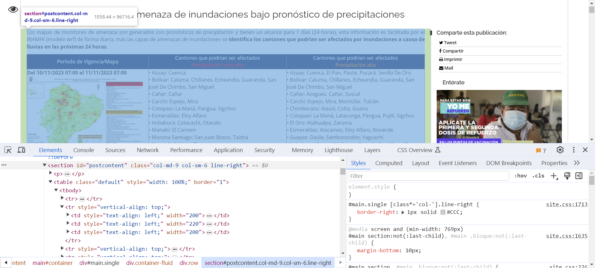
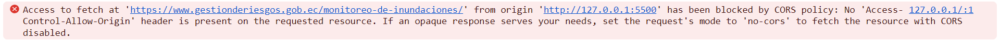
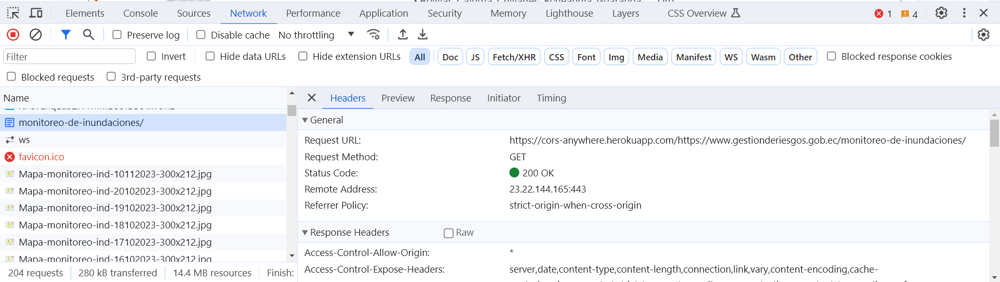

## Guía 11

[DAWM](/DAWM/) / [Proyecto02](/DAWM/proyectos/2024/proyecto02)

### Actividades previas

* Revise la tabla del [Mapa de monitoreo de amenaza de inundaciones bajo pronóstico de precipitaciones](https://www.gestionderiesgos.gob.ec/monitoreo-de-inundaciones/).

	- Use el inspector del navegador para identificar la sección del HTML a extraer. 
  	

 
### Actividades

* Clona localmente tu repositorio **dashboard**.
* Abra el proyecto en VSCode y levante el live server.

#### HTML

Edite el archivo `index.html`

* Agregue las etiquetas contenedoras para la tabla del mapa de monitoreo.

```html
...

  <!-- Tabla de mareas -->
  <section class="p-4 text-right bg-light">
      <h4 class="mb-3">
          Mapa de monitoreo de amenaza de inundaciones bajo pronóstico de precipitaciones
      </h4>
      <div class="container">
          <div class="row row-cols-1 row-cols-md-1 g-3 mt-2">
              <div class="col">
                  <div class="card">
                      <div id="monitoreo" class="card-body">
                          
                      </div>
                  </div>
              </div>
          </div>
      </div>
  </section>
  <!-- Tabla de mareas -->
...
```

#### Javascript

Edite el archivo `public/javascript/load_data.js`

* Agregue e invoque la función flecha _loadExternalTable_.

```typescript
... 
let loadExternalTable = () => {
  
 //Requerimiento asíncrono

}

loadExternalTable()
```

#### Petición asíncrona

* Dentro de la función loadExternalTable:
	
	1. Realice una petición asíncrona al _endpoint_ de `'https://www.gestionderiesgos.gob.ec/monitoreo-de-inundaciones/'`, y
	2. Obtenga a XML a partir de la respuesta de cadena de caracteres convertida en `"text/html"`. 
	3. Del objeto XML, utilice el método `querySelector` para extraer el elemento que se encuentra en la ruta `"#postcontent table"`
	4. Del objeto DOM, utilice el método `getElementById` para extraer el elemento con id `monitoreo`
	5. Asigne el contenido del elemento XML en el contenido del DOM, con:

	```typescript
	...
		elementoDOM.innerHTML = elementoXML.outerHTML
	...
	```

	6. Use el inspector del navegador (en la pestaña **Console**) para reconocer el error en el requerimiento a un dominio cruzado. 




#### CORS - Proxy

* Solicite acceso al [proxy demo](https://cors-anywhere.herokuapp.com/corsdemo)

##### JavaScript

Edite el archivo `public/javascript/load_data.js`

* Edite la función loadExternalTable:
	
	1. Agregue la variable **proxyURL**
	2. Modifique el _endpoint_ para que los requerimientos sean respondidos por el CORS - Proxy.

	```typescript
	... 
	let loadExternalTable = () => {
	  
	 //Requerimiento asíncrono

	 let proxyURL = 'https://cors-anywhere.herokuapp.com/'
	 let endpoint = proxyURL + 'https://www.gestionderiesgos.gob.ec/monitoreo-de-inundaciones/'

	 ...

	}
	...
	```

	3. Compruebe el requerimiento exitoso.



##### CSS

* Realice los cambios necesarios en el estilo.

```css
...
table.default tr:not(:nth-child(1)):not(:nth-child(2)) {
    display: none;
}
...
```

* Revise los resultados en el navegador

* Versiona local y remotamente el repositorio **dashboard**.


### Fundamental

* CORS en [X](https://twitter.com/midudev/status/1721516493995716680)

<blockquote class="twitter-tweet"><p lang="es" dir="ltr">¡Soluciona el Error de CORS de tu API de una vez!<br>Con estos diagramas entenderás por qué pasa:<a href="https://t.co/8rCqeRKSNX">https://t.co/8rCqeRKSNX</a> <a href="https://t.co/x58yEkwTvf">pic.twitter.com/x58yEkwTvf</a></p>&mdash; Miguel Ángel Durán (@midudev) <a href="https://twitter.com/midudev/status/1721516493995716680?ref_src=twsrc%5Etfw">November 6, 2023</a></blockquote> <script async src="https://platform.twitter.com/widgets.js" charset="utf-8"></script>

### Documentación

* Mecanismo de [CORS](https://developer.mozilla.org/es/docs/Web/HTTP/CORS) implementado por el navegador. El significado, uso y consideraciones de los [CORS - Proxies](https://httptoolkit.com/blog/cors-proxies/).

### Términos

XML, CORS, proxy

### Referencias

* Joubran, J., & Joubran, J. (2023). How to fetch XML in JavaScript  Code to go. Retrieved 18 June 2023, from https://codetogo.io/how-to-fetch-xml-in-javascript/
* Intercambio de recursos de origen cruzado (CORS) - HTTP MDN. (2023). Retrieved 18 June 2023, from https://developer.mozilla.org/es/docs/Web/HTTP/CORS
* What are CORS proxies, and when are they safe?. (2023). Retrieved 18 June 2023, from https://httptoolkit.com/blog/cors-proxies/