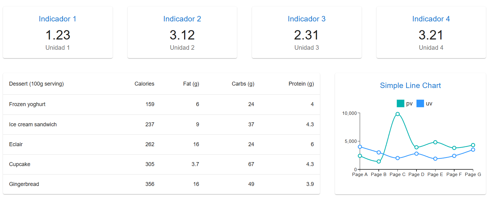

## Guía 12

[DAWM](/DAWM/) / [Proyecto03](/DAWM/proyectos/2024/proyecto03)

<link href="styles/mystyle.css" rel="stylesheet" />
<script src="javascripts/tabs.js" type="text/javascript"></script>

### Objetivo general

<pre class="purpose">
Desarrollar un dashboard interactivo y visualmente intuitivo utilizando tecnologías web modernas, como React, que permita a los usuarios monitorear en tiempo real métricas clave del clima.</pre>

### Actividades en clases

* Clona localmente tu repositorio **dashboard**.

#### Componente Indicador: Estructura básica

1. Cree el archivo _src/components/Indicator.tsx_.
2. En _src/components/Indicator.tsx_, agregue:

    - Un elemento vacío ([Fragment](https://es.react.dev/reference/react/Fragment#fragment)) con el texto `Componente Indicator`:

    ```jsx
    export default function Indicator() {
        return (
            <>
                Componente Indicator
            </> 
        )
    }
    ```

2. En _App.tsx_:
    
    - Importe el componente **Indicator**, y 
    - Coloque la referencia al componente `<Indicador />` en el Grid. 

    ```jsx
    import Indicator from './components/Indicator';

    function App() {
        return (
            <Grid container spacing={5}>

                {/* Indicadores  */}
                <Grid size={ ... }> <Indicator /> </Grid>
                <Grid size={ ... }> <Indicator /> </Grid>
                <Grid size={ ... }> <Indicator /> </Grid>
                <Grid size={ ... }> <Indicator /> </Grid>

                ...

            </Grid>
        )
    }

    export default App
    ```

3. Versiona local y remotamente el repositorio.
4. (STOP 1) Compruebe el resultado en el navegador.

#### Componente Indicador: Propiedades (Props)

1. En _src/components/Indicador.tsx_:

    - Agregue la interfaz **Config** con las claves title, subtitle y value,
    - Defina **config** del tipo Config, como [props](https://react.dev/learn/passing-props-to-a-component) del componente, y
    - Renderice las claves title, subtitle y value

    ```jsx
    ...
    interface Config {
        title?: String;
        subtitle?: String;
        value: Number;
    }

    export default function Indicator(config: Config) {
        return (
            <>
                {config.title}<br/>
                {config.value.toString()}<br/>
                {config.subtitle}
            </>
        )
    }
    ```

2. En _App.tsx_:

    - A cada componente **Indicator**, agregue las propiedades y los valores correspondientes. 

    ```jsx
    import Indicator from './components/Indicator';

    function App() {
        return (
            <Grid container spacing={5}>
                
                {/* Indicadores  */}
                <Grid size={ ... }>
                    <Indicator title={'Indicador 1'} subtitle={'Unidad 1'} value={1.23} /> 
                </Grid>

                <Grid size={ ... }>
                    <Indicator title={'Indicador 2'} subtitle={'Unidad 2'} value={3.12} />
                </Grid>
                
                <Grid size={ ... }>
                    <Indicator title={'Indicador 3'} subtitle={'Unidad 3'} value={2.31} />
                </Grid>
                
                <Grid size={ ... }>
                    <Indicator title={'Indicador 4'} subtitle={'Unidad 4'} value={3.21} />
                </Grid>
                
                ...

            </Grid>
        )
    }

    export default App
    ```

3. Versiona local y remotamente el repositorio.
4. (STOP 2) Compruebe el resultado en el navegador.

#### Componente Indicador: Componente MUI Paper y Typography

1. En _src/components/Indicator.tsx_:

    - Agregue la referencia a los componentes [Typography](https://mui.com/material-ui/react-typography/) y [Paper](https://mui.com/material-ui/react-paper/)
    - Reemplace el código existente por los componentes **Typography** y **Paper**

    ```jsx
    import Typography from '@mui/material/Typography';
    import Paper from '@mui/material/Paper';
    
    interface Config { ... }

    export default function Indicator(config: Config) {
        return (
            <Paper
                sx={{
                  p: 2,
                  display: 'flex',
                  flexDirection: 'column'
                }}
              >
                <Typography component="h2" variant="h6" 
                            color="primary" gutterBottom>
                    {config.title} 
                </Typography>
                <Typography component="p" variant="h4">
                    {config.value.toString()}
                </Typography>
                <Typography color="text.secondary" sx={{ flex: 1 }}>
                    {config.subtitle}
                </Typography>
            </Paper> 
        )
    }
    ```

2. Versiona local y remotamente el repositorio.
3. (STOP 3) Compruebe el resultado en el navegador.

#### Componente Control: Estructura básica

1. Cree el componente _src/components/Control.tsx_
2. En _src/components/Control.tsx_, copie el código: 

    ```tsx
    {/* Componentes MUI */}

    import Paper from '@mui/material/Paper';
    import Typography from '@mui/material/Typography';
    import Box from '@mui/material/Box';
    import InputLabel from '@mui/material/InputLabel';
    import MenuItem from '@mui/material/MenuItem';
    import FormControl from '@mui/material/FormControl';
    import Select from '@mui/material/Select';
    
    export default function Control() {

        {/* Arreglo de objetos */}

        let items = [
            {"name":"Precipitación", "description":"Cantidad de agua, en forma de lluvia, nieve o granizo, que cae sobre una superficie en un período específico."}, 
            {"name": "Humedad", "description":"Cantidad de vapor de agua presente en el aire, generalmente expresada como un porcentaje."}, 
            {"name":"Nubosidad", "description":"Grado de cobertura del cielo por nubes, afectando la visibilidad y la cantidad de luz solar recibida."}
        ]

        {/* Arreglo de elementos JSX */}

        let options = items.map( (item, key) => <MenuItem key={key} value={key}>{item["name"]}</MenuItem> )
        
        {/* JSX */}

        return (
            <Paper
                sx={{
                    p: 2,
                    display: 'flex',
                    flexDirection: 'column'
                }}
            >

                <Typography mb={2} component="h3" variant="h6" color="primary">
                    Variables Meteorológicas
                </Typography>

                <Box sx={{ minWidth: 120 }}>
                    
                    <FormControl fullWidth>
                        <InputLabel id="simple-select-label">Variables</InputLabel>
                        <Select
                            labelId="simple-select-label"
                            id="simple-select"
                            label="Variables"
                            defaultValue='-1'
                        >
                            <MenuItem key="-1" value="-1" disabled>Seleccione una variable</MenuItem>

                            {options}

                        </Select>
                    </FormControl>

                </Box>


            </Paper>


        )
    }
    ```

#### Componente Tabla: Componente MUI BasicTable 

1. Acceda al componente [BasicTable](https://github.com/mui/material-ui/blob/v6.1.6/docs/data/material/components/table/BasicTable.tsx) y copie el código.
2. Cree el componente _src/components/Tabla.tsx_, y:

    - Pegue el código del componente BasicTable. 
    - Elimine la referencia `import * as React from 'react';`
    - Elimine la propiedad con el estilo embebido `sx` en el elemento `<Table />`.

#### Componente Grid: Anidado

1. En _App.tsx_:

    - Importe el componente **BasicTable** y **ControlPanel**, y 
    - Coloque la referencia a los componentes `<ControlPanel/>` y `<BasicTable />` en el Grid. 

    ```jsx
    ...
    import Tabla from './components/Tabla';
    import Control from './components/Control';

    function App() {
        return (
            <Grid container spacing={5}>
                
                ...
                
                {/* Tabla */}
                <Grid size={ ... }>
                    
                    {/* Grid Anidado */}
                    <Grid container spacing={2}>
                        <Grid size={{ xs: 12, xl: 3 }}>
                            <Control/>
                        </Grid>
                        <Grid size={{ xs: 12, xl: 9 }}>
                            <Tabla/>
                        </Grid>
                    </Grid>

                </Grid>

                ...

            </Grid>
        )
    }

    export default App
    ```

2. Versiona local y remotamente el repositorio.
3. (STOP 4) Compruebe el resultado en el navegador.

#### React MUI X: Instalación

1. Desde la línea de comandos, instale [React MUI X](https://mui.com/x/react-charts/getting-started/#installation) con:

    ```prompt
    npm install @mui/x-charts
    ```

2. Copie el código del componente [SimpleLineChart](https://github.com/mui/mui-x/blob/v7.22.2/docs/data/charts/line-demo/SimpleLineChart.tsx).

3. Cree el componente _src/components/GraficoLinea.tsx_, y:

    - Pegue el código del componente SimpleLineChart. 
    - Elimine la referencia `import * as React from 'react';`
    - Aplique `width={400} height={250}`

4. En _App.tsx_:

    - Importe los componentes **GraficoLinea**, y 
    - Coloque la referencia a los componentes `<GraficoLinea />` en el Grid. 

    ```jsx
    import GraficoLinea from './components/GraficoLinea';

    function App() {
        return (
            <Grid container spacing={5}>
                
                ...
                
                {/* Gráfico */}
                <Grid size={ ... }> <GraficoLinea/> </Grid>

            </Grid>
        )
    }

    export default App
    ```

5. Versiona local y remotamente el repositorio.
6. (STOP 5) Compruebe el resultado en el navegador.

<div align="center">
    
</div>

### Documentación

* En [mui.com](https://mui.com/) se encuentra la documentación de la librería de componentes visuales para React.

### Fundamental

* Nombres de componentes en React

<blockquote class="twitter-tweet" data-media-max-width="560"><p lang="en" dir="ltr">⚛️ Do you know how to name React components with the Base + Composite + Suffix Pattern?<br><br>You can use this pattern to create clear and consistent component names in your projects. <a href="https://t.co/xxopzpmvwJ">pic.twitter.com/xxopzpmvwJ</a></p>&mdash; George Moller (@_georgemoller) <a href="https://twitter.com/_georgemoller/status/1721326634001715433?ref_src=twsrc%5Etfw">November 6, 2023</a></blockquote> <script async src="https://platform.twitter.com/widgets.js" charset="utf-8"></script>

### Términos

component, interface, props

### Referencias

* The React component library you always wanted. (n.d.). Retrieved from https://mui.com/
* Your First Component. (n.d.). Retrieved from https://react.dev/learn/your-first-component
* Rwparrish. (2020). React Basics. Retrieved from https://dev.to/rwparrish/react-basics-2je1
* Built-in React Components. (n.d.). Retrieved from https://react.dev/reference/react/components
* Codemarch. (2024). Build a Card Component: pic.twitter.com/AQ6VwHhl20. Retrieved from https://twitter.com/codemarch/status/1745649409436660118?t=kTuhWffwFZ2UJ0oW4V_SEw&s=08