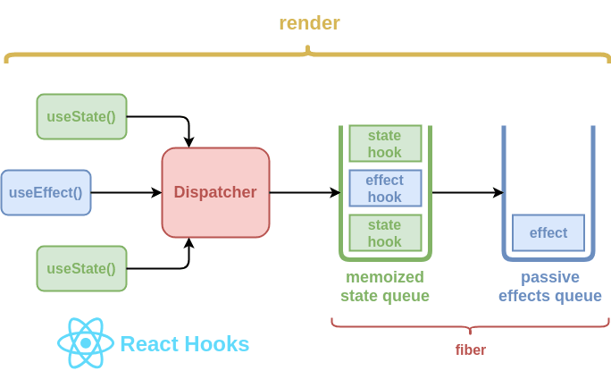

## Guía 13

[DAWM](/DAWM/) / [Proyecto03](/DAWM/proyectos/2024/proyecto03)

<link href="styles/mystyle.css" rel="stylesheet" />

### Objetivo general

<pre class="purpose">
Desarrollar un dashboard interactivo y visualmente intuitivo utilizando tecnologías web modernas, como React, que permita a los usuarios monitorear en tiempo real métricas clave del clima.</pre>

### Actividades previas

Revise la descripción del uso de Hooks en React, el sitio [Understanding React Hooks: A Comprehensive Guide](https://www.yourteaminindia.com/tech-insights/understanding-react-hooks).

<div align="center">
    
    <p>Fuente: <a href="https://www.yourteaminindia.com/tech-insights/understanding-react-hooks">Understanding React Hooks: A Comprehensive Guide</a> </p>
</div>

### Actividades en clases

1. Clona localmente tu repositorio **dashboard**.

#### Componente ControlWeather: evento onChange

1. En _src/components/ControlWeather.tsx_:

	- Importe la interfaz **SelectChangeEvent**.

	```tsx
	{/* Interfaz SelectChangeEvent */}
	import Select, { SelectChangeEvent } from '@mui/material/Select';
	```

	- Agregue la función flecha **handleChange**.
	
	```tsx
	export default function ControlWeather() {

		...

		{/* Manejador de eventos */}
		const handleChange = (event: SelectChangeEvent) => {
			
			let idx = parseInt(event.target.value)
			alert( idx );

		};

		{/* JSX */}
		...
	}
	```

	- En el componente _Select_, relacione el evento **onChange** con el manejador de eventos _handleChange_.
	
	```tsx

		{/* JSX */}
		return (

			...

			<Select
				labelId="simple-select-label"
				id="simple-select"
				label="Variables"
				defaultValue='-1'
				onChange={handleChange}
			>

			...
		)
	}
	```
2. (STOP 1) Compruebe el resultado en el navegador.

#### Componente ControlWeather: hook - useState

1. En _src/components/ControlWeather.tsx_:
	
	- Importe el hook **useState**.

	```tsx
	{/* Hooks */ }
	import { useState } from 'react';

	{/* Componentes MUI */ }
	...
	```

	- Agregue la `variable de estado` **selected** y la `función de actualización` **setSelected**. El valor predeterminado de la variable de estado es -1.
	
	```tsx
	
	export default function ControlWeather() {
		
		{/* Variable de estado y función de actualización */}
		let [selected, setSelected] = useState(-1)

		...
	}
	```

	- Use la función de actualización en el manejador **handleChange** en lugar de la función alert.
	
	```tsx
	export default function ControlWeather() {

		...

		{/* Manejador de eventos */}
		const handleChange = (event: SelectChangeEvent) => {

			let idx = parseInt(event.target.value)
			// alert( idx );
			setSelected( idx );

		};

		...
	}
	```

	- Use la variable de estado para renderizar el item elemento seleccionado.

	```tsx
	export default function ControlWeather() {

		...
	    
	    {/* JSX */}	
		return (
			<Paper>

				<Typography ... > ... </Typography>

				<Box ... > ... </Box>

				{/* Use la variable de estado para renderizar del item seleccionado */}
				<Typography mt={2} component="p" color="text.secondary">
				{
					(selected >= 0)?items[selected]["description"]:""
				}
				</Typography>
				

			</Paper>
		)

	}
	```

2. (STOP 2) Compruebe el resultado en el navegador.

#### Componente ControlWeather: hook - useRef

1. En _src/components/ControlWeather.tsx_:

	- Importe el hook **useRef**.

	```tsx
	{/* Hooks */ }
	import { useState, useRef } from 'react';
	```

	- Agregue la constante **descriptionRef** que servirá como referencia a un elemento HTML.

	```tsx
	export default function ControlWeather() {

		{/* Constante de referencia a un elemento HTML */ }
	    const descriptionRef = useRef<HTMLDivElement>(null);

	    ...
	```

	- En el manejador de eventos, use la referencia **descriptionRef** para modificar su contenido. 
	
	```tsx
	export default function ControlWeather() {

		...
		
		{/* Manejador de eventos */}
		const handleChange = (event: SelectChangeEvent) => {

			let idx = parseInt(event.target.value)
			// alert( idx );
			setSelected( idx );

			{/* Modificación de la referencia descriptionRef */}
			if (descriptionRef.current !== null) {
				descriptionRef.current.innerHTML = (idx >= 0) ? items[idx]["description"] : ""
			}

		};

		...
	}
	```

	- Reemplace el elemento Typography y use el prop ref con la referencia **descriptionRef**. 

	```tsx
	export default function ControlWeather() {

		{/* JSX */}	
		return (

			<Paper>

				...

				<Box ... > ... </Box>


				{/* Use la variable de estado para renderizar del item seleccionado */}
				{/*<Typography mt={2} component="p" color="text.secondary">
				{
					(selected >= 0)?items[selected]["description"]:""
				}
				</Typography>*/}

				<Typography ref={descriptionRef} mt={2} component="p" color="text.secondary" />
				

			</Paper>
		)

	}
	```

2. (STOP 3) Compruebe el resultado en el navegador.
3. Versiona local y remotamente el repositorio **dashboard**.
4. Despliega la aplicación **dashboard**.

### Documentación

* En [Hooks integrados en React](https://es.react.dev/reference/react/hooks) se encuentra la documentación para usar las características de los componentes de React.

### Fundamental

* Guía de `hooks` en React

<blockquote class="twitter-tweet"><p lang="en" dir="ltr">⚛️ Massive React hooks cheatsheet ↓ <br><br>1/8 <a href="https://t.co/S0BPD9OHrf">pic.twitter.com/S0BPD9OHrf</a></p>&mdash; George Moller (@_georgemoller) <a href="https://twitter.com/_georgemoller/status/1748347605606600820?ref_src=twsrc%5Etfw">January 19, 2024</a></blockquote> <script async src="https://platform.twitter.com/widgets.js" charset="utf-8"></script>


### Términos

hooks, variable de estado, función de actualización

### Referencias

* Rakannimer. (n.d.). rakannimer/react-google-charts: A thin, typed, React wrapper over Google Charts Visualization and Charts API. Retrieved from https://github.com/RakanNimer/react-google-charts?tab=readme-ov-file
* Yosami. "Creating a Weather Dashboard Using HTML, CSS, and JavaScript." Medium, 8 Jul. 2020, https://medium.com/@yosami14/creating-a-weather-dashboard-using-html-css-and-javascript-217f80229fb.
* (N.d.). Retrieved from https://www.react-google-charts.com/
* Geekster. (2024). Functional Components Vs Class Components in React JS. Retrieved from https://blog.geekster.in/functional-components-vs-class-components/#:~:text=Ans%3A%20React%20class%20components%20are,suitable%20for%20smaller%2C%20presentational%20components.