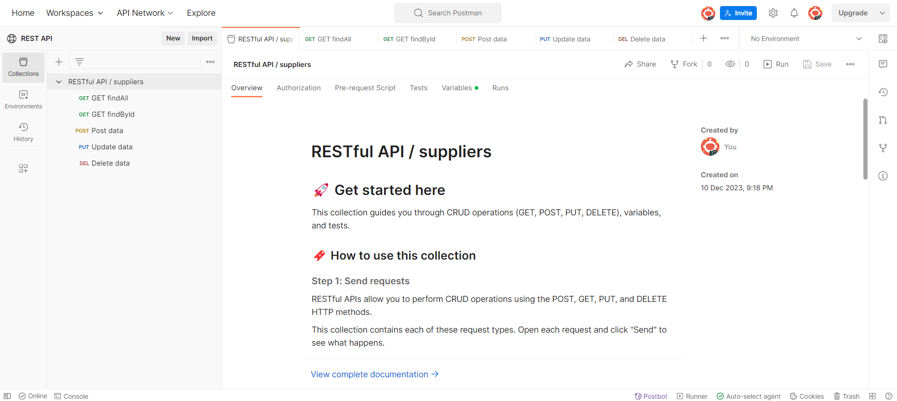

## Guía 15

[DAWM](/DAWM/) / [Proyecto04](/DAWM/proyectos/2024/proyecto04)

### Actividades previas

#### Entorno de desarrollo

1. En el terminal, verifica que tengas instalado Node.js y npm, con:

  ```command
  node -v
  npm -v
  ```

#### Firebase - Firestore

1. Ve a [Firebase Console](https://firebase.google.com/) y crea un nuevo proyecto.
2. En **Categorías de producto** > **Compilación**, seleccione _Firestore Database_.
3. De click **Crear base de datos** y seleccione las opciones predeterminadas. 

#### Firebase - Servicio de Cuenta (Service Account)

1. En la Descripción general, selecciona **Configuración del proyecto**, 
2. Selecciona **Cuentas de servicio**,
3. Da clic en **Nueva clave privada**, y 
4. Descargue el archivo JSON con **Generar clave**. 
5. Cambie el nombre al archivo por **firebaseConfig.json**.

### Actividades en clases

#### Github

1. Crea un repositorio en GitHub con el nombre **restapi**.
2. Clona y accede a la carpeta en el directorio local.

#### Express - Configuración y estructura base

1. Inicializa un nuevo proyecto de Node.js, con:

  ```command
  npm init -y
  ```

2. Instala las dependencias **Express**, **nodemon** (para reiniciar el servidor automáticamente durante el desarrollo) y **body-parser** (manejar solicitudes POST).

  ```command
  npm install express
  npm install --save-dev nodemon
  npm install body-parser
  ```

3. Instala el SDK de administración de Firebase.

  ```command
  npm install firebase-admin
  ```

4. Crea la estructura base de archivos y carpetas:

  **NOTA:** Mueva el archivo firebaseConfig.json dentro de la carpeta **config** 
  
  ```command
  restapi/
  ├── package.json
  ├── server.js
  ├── config/
  │   └── firebaseConfig.json
  ├── routes/
  │   └── api.js
  └── controllers/
      └── itemController.js
  ```

#### Express - Servidor

#### Express - Enrutador

#### Express - Controlador

#### Express - Credenciales para firebase 

#### Verificación

* Inicie el servidor, con:

  ```command
  SET DEBUG=rest_api:\* & npm start
  ```

#### Postman

* Utilice el workspace público de [Postman](https://elements.getpostman.com/redirect?entityId=1898620-df625a84-2a04-44ef-9492-d31713c26330&entityType=collection) para comprobar la respuesta para cada tipo de petición.

<p align="center">
  
</p>

* Versiona local y remotamente el repositorio **restapi**.

### Documentación

En [ExpressJS](https://expressjs.com/) se encuentra la referencia del API, guías y tutoriales.

### Fundamental

* What is REST API? en [X](https://twitter.com/Terrasoft_ltd/status/1732354546528067738)

<blockquote class="twitter-tweet" data-media-max-width="560"><p lang="en" dir="ltr"><a href="https://twitter.com/hashtag/REST?src=hash&amp;ref_src=twsrc%5Etfw">#REST</a> <a href="https://twitter.com/hashtag/API?src=hash&amp;ref_src=twsrc%5Etfw">#API</a> what is it?<br>Representational State Transfer<br>This means that when a <a href="https://twitter.com/hashtag/client?src=hash&amp;ref_src=twsrc%5Etfw">#client</a> requests a resource using a REST API, the <a href="https://twitter.com/hashtag/server?src=hash&amp;ref_src=twsrc%5Etfw">#server</a> transfers back the current state of the resource in a standardized representation <a href="https://t.co/xCFXw9cQFZ">pic.twitter.com/xCFXw9cQFZ</a></p>&mdash; Terrasoft Ltd (@Terrasoft_ltd) <a href="https://twitter.com/Terrasoft_ltd/status/1732354546528067738?ref_src=twsrc%5Etfw">December 6, 2023</a></blockquote> <script async src="https://platform.twitter.com/widgets.js" charset="utf-8"></script>

### Términos

rest api, orm, crud, verbos HTTP, estados HTTP

### Referencias

* Terminal, F. (2011). Formatting cURL Output in the Windows Terminal. Retrieved 11 August 2022, from https://superuser.com/questions/275229/formatting-curl-output-in-the-windows-terminal
* Wieruch, R. (2020). How to create a REST API with Express.js in Node.js. Retrieved 10 August 2022, from https://www.robinwieruch.de/node-express-server-rest-api/
* Node.js Rest APIs example with Express, Sequelize & MySQL - BezKoder. (2020). Retrieved 14 August 2022, from https://www.bezkoder.com/node-js-express-sequelize-mysql/
* -->QueryInterface, H. (2022). sequelize.QueryInterface.removeColumn JavaScript and Node.js code examples Tabnine. Retrieved 24 December 2022, from https://www.tabnine.com/code/javascript/functions/sequelize/QueryInterface/removeColumn
* -->QueryInterface, H. (2022). sequelize.QueryInterface.addColumn JavaScript and Node.js code examples Tabnine. Retrieved 24 December 2022, from https://www.tabnine.com/code/javascript/functions/sequelize/QueryInterface/addColumn
* orm, b., bagade, a., Panneerselvam, S., Grin, O., & OurBigBook.com, C. (2019). bulkUpdate in sequelize orm. Retrieved 24 December 2022, from https://stackoverflow.com/questions/54898994/bulkupdate-in-sequelize-orm
* S., McConnell, H., & McConnell, H. (2020). Sequelize many-to-many M:N relationship not functioning. Error: 'SequelizeEagerLoadingError:${model1} is not associated to ${model2}'. Retrieved 24 December 2022, from https://stackoverflow.com/questions/64790882/sequelize-many-to-many-mn-relationship-not-functioning-error-sequelizeeagerl
* expected, O., & Vidal, L. (2021). One To Many relationship using Sequelize creates more foreign keys than expected. Retrieved 24 December 2022, from https://stackoverflow.com/questions/66696143/one-to-many-relationship-using-sequelize-creates-more-foreign-keys-than-expected