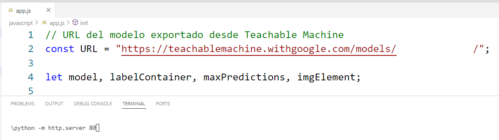
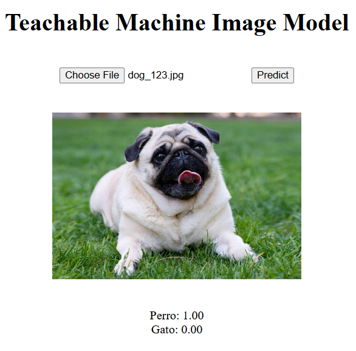

## Guía 15

[DAWM](/DAWM/) / [Proyecto04](/DAWM/proyectos/2024/proyecto04)

<link href="styles/mystyle.css" rel="stylesheet" />

### Objetivo general

<pre class="purpose">Desarrollar una aplicación híbrida utilizando tecnologías que integren modelos de aprendizaje automático previamente entrenados en un entorno funcional y accesible para resolver problemas específicos mediante el reconocimiento de patrones, objetos o sonidos fomentando habilidades prácticas en el desarrollo de aplicaciones móviles con tecnologías modernas y la implementación de inteligencia artificial.</pre>

### Actividades en clases

1. Descargue y descomprima el [dataset](recursos/dogsandcats.zip) de imágenes de [Cats and Dogs image classification](https://www.kaggle.com/datasets/samuelcortinhas/cats-and-dogs-image-classification).
2. Descargue y descomprima la [aplicación de prueba](recursos/teachablemachine-simple.zip).

### Actividades en clases

#### Teachable Machine: Modelo 

1. Acceda a un proyecto Teachable Machine [basado en imágenes](https://teachablemachine.withgoogle.com/train/image).
2. Cree las categorías _Perro_ y _Gato_ para crear el modelo.

	<div align="center">
	    
	</div>

3. Cargue las imágenes de la carpeta **train** en cada clase.

	<div align="center">
	    
	</div>

4. Prepare el modelo

	<div align="center">
	    
	</div>

5. A la derecha:

	- Seleccione **Archivo** como la opción de entrada,

	<div align="center">
	    
	</div>

	- Seleccione una imagen de la carpeta **test** para probar el funcionamiento del modelo.

	<div align="center">
	    
	</div>

6. Exporte el modelo en botón **Exportar modelo**

7. En la ventana **Exportar el modelo para usarlo en proyectos.**

	- Suba el modelo. Revise la información del FAQ [¿Quién puede usar mi modelo después de que lo haya publicado?](https://teachablemachine.withgoogle.com/faq#Saving-&-Exporting)

	<div align="center">
	    
	</div>

	- Copie la **URL del modelo**.

	<div align="center">
	    
	</div>

#### Teachable Machine: Aplicación de prueba

1. Abra la aplicación de prueba con VSCode
2. Modifique el archivo _javascript/app.js_ con la **URL del modelo**

	<div align="center">
	    
	</div>

3. Levante un servidor http, con:

	```script
	python -m http.server 80
	```

4. Abra la aplicación en su navegador y compruebe el funcionamiento con imágenes de la carpeta **test**.

	<div align="center">
	    
	</div>
	

### Documentación

- Información del proyecto [Teachable Machine](https://teachablemachine.withgoogle.com/)

### Fundamental

<blockquote class="twitter-tweet"><p lang="en" dir="ltr">Excited to launch a Teachable Machine plugin for TouchDesigner!<br>- Train lightweight Pose Detection, Image Recognition, and Audio Classification models ⁰- Embed them into TouchDesigner to run offline without an internet connection<br>⁰Link 🔗 to the tutorial:… <a href="https://t.co/qnFq0UdJfQ">pic.twitter.com/qnFq0UdJfQ</a></p>&mdash; Torin Blankensmith (@blankensmithing) <a href="https://twitter.com/blankensmithing/status/1802834407847337990?ref_src=twsrc%5Etfw">June 17, 2024</a></blockquote> <script async src="https://platform.twitter.com/widgets.js" charset="utf-8"></script>

### Términos

modelo, machine learning, teachable machine, google

### Referencias

* Techzizou. (2024). Train image classification model using Teachable Machine. Retrieved from https://medium.com/geekculture/train-image-classification-model-using-teachable-machine-8b8501e17bb4
* Webster, B. (2019). Teachable Machine Tutorial: Bananameter. Retrieved from https://medium.com/@warronbebster/teachable-machine-tutorial-bananameter-4bfffa765866
* Cortinhas, S. (2022). Cats and Dogs image classification. Retrieved from https://www.kaggle.com/datasets/samuelcortinhas/cats-and-dogs-image-classification