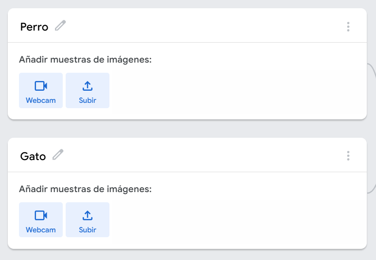
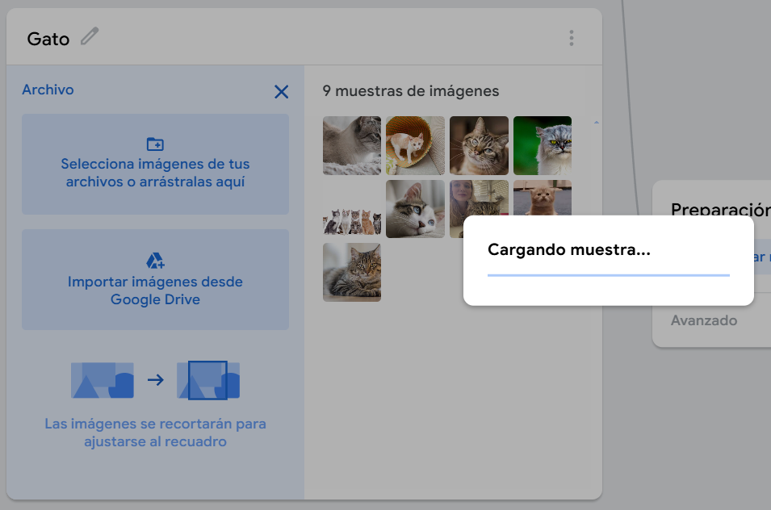
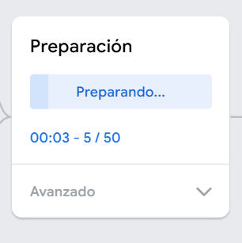
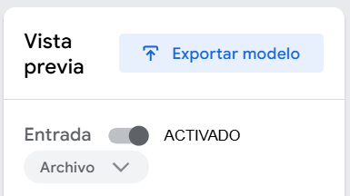
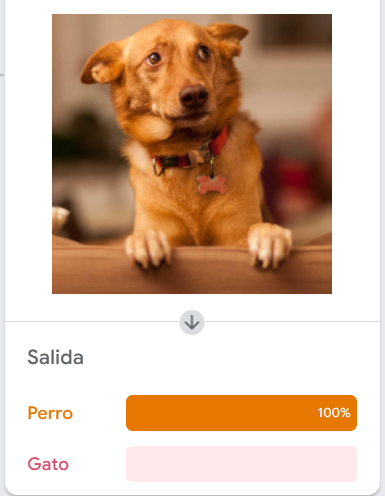
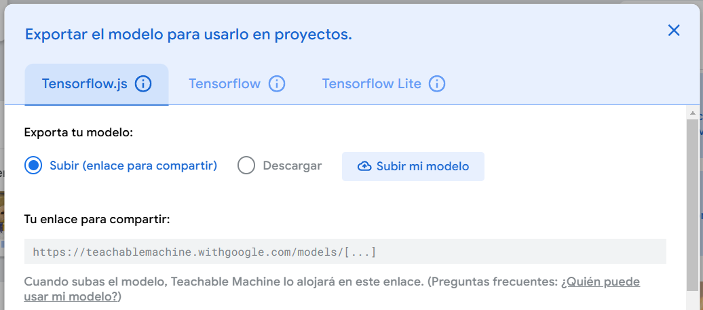
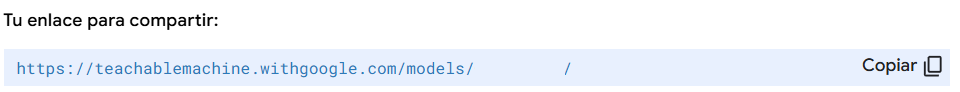

## Guía 15

[DAWM](/DAWM/) / [Proyecto04](/DAWM/proyectos/2024/proyecto04)

<link href="styles/mystyle.css" rel="stylesheet" />

### Objetivo general

<pre class="purpose">Desarrollar una aplicación híbrida utilizando tecnologías que integren modelos de aprendizaje automático previamente entrenados en un entorno funcional y accesible para resolver problemas específicos mediante el reconocimiento de patrones, objetos o sonidos fomentando habilidades prácticas en el desarrollo de aplicaciones móviles con tecnologías modernas y la implementación de inteligencia artificial.</pre>

### Actividades en clases

1. Descargue y descomprima el [dataset](recursos/dogsandcats.zip) de imágenes de [Cats and Dogs image classification](https://www.kaggle.com/datasets/samuelcortinhas/cats-and-dogs-image-classification).
2. Descargue y descomprima la [aplicación de prueba](recursos/teachablemachine-simple.zip).

### Actividades en clases

1. Acceda a un proyecto Teachable Machine [basado en imágenes](https://teachablemachine.withgoogle.com/train/image).
2. Cree diferentes categorías o clases para crear el modelo.

	

	    
	

3. Cargue las imágenes de la carpeta **train** para cada clase.

	

	    
	

4. Prepare el modelo

	

	    
	

5. A la derecha:

	- Seleccione **Archivo** como la opción de entrada,

	

	    
	

	- Seleccione una imagen de la carpeta **test** para probar el funcionamiento del modelo.

	

	    
	

6. Exporte el modelo en botón **Exportar modelo**

7. En la ventana **Exportar el modelo para usarlo en proyectos.**

	- Suba el modelo. Revise la información del FAQ [¿Quién puede usar mi modelo después de que lo haya publicado?](https://teachablemachine.withgoogle.com/faq#Saving-&-Exporting)

	

	    
	

	- Copie el URL para realizar los requerimientos al modelo.

	

	    
	

### Documentación

### Fundamental

### Términos

### Referencias

* Techzizou. (2024). Train image classification model using Teachable Machine. Retrieved from https://medium.com/geekculture/train-image-classification-model-using-teachable-machine-8b8501e17bb4
* Webster, B. (2019). Teachable Machine Tutorial: Bananameter. Retrieved from https://medium.com/@warronbebster/teachable-machine-tutorial-bananameter-4bfffa765866
* Cortinhas, S. (2022). Cats and Dogs image classification. Retrieved from https://www.kaggle.com/datasets/samuelcortinhas/cats-and-dogs-image-classification