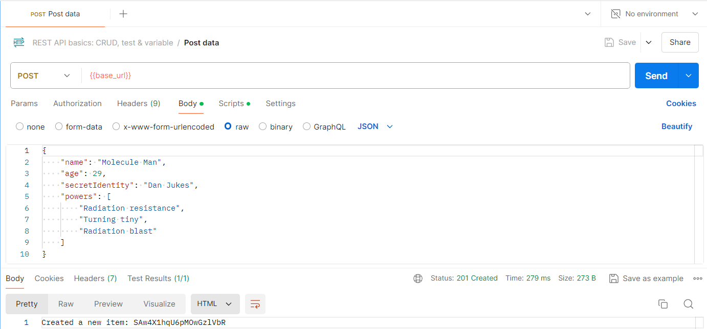

<style type="text/css" media="screen">
  details {
    margin: 5% 0%;
    padding: 2%;
    border: dashed 2px black;
    border-radius: 11px;
    box-shadow: 5px 5px 15px rgba(0, 0, 0, 0.3);
  }

  details div {
    color: lightseagreen;
    font-weight: bold;
    cursor: pointer;
    text-align: center;
  }

  img.description {
    width: 50%;
    text-align: center;
    margin: 0 25%;
  }
</style>

## Guía 16

[DAWM](/DAWM/) / [Proyecto04](/DAWM/proyectos/2024/proyecto04)

### Actividades previas

* Revise la [documentación oficial](https://swagger.io/) de Swagger.

### Actividades en clases

#### REST API

1. Clone localmente tu repositorio **restapi**.

2. Desde la línea de comandos, dentro del proyecto instale los módulos **swagger-autogen** y **swagger-ui-express**

    ```command
    npm install swagger-autogen swagger-ui-express
    ```

3. En la raíz del proyecto, cree el archivo de configuración de `./swagger.js` con el siguiente contenido: 

    ```typescript
    const swaggerAutogen = require('swagger-autogen')()

    const doc = {
      "info": {
        "title": 'REST API',
        "description": 'REST API with Express and Firestore'
      },
      "host": 'localhost:5000',
      "basePath": "/api",
    };

    const outputFile = './swagger_output.json'
    const endpointsFiles = ['./routes/*.js']

    swaggerAutogen(outputFile, endpointsFiles, doc)
    ```

4. Modifique el controlador `./controllers/itemControllers.js` con la descripción de cada función.

    ```typescript
    ...
    
    exports.getItem = async (req, res) => {

      /* 
        #swagger.tags = ['Items']
        #swagger.description = 'Get an item entry'
        #swagger.summary = 'Get an item entry'
        #swagger.parameters['id'] = {
            description: 'Item id',
            required: true,
        }
        #swagger.responses[404] = {
            description: 'Item not found',
        }
        #swagger.responses[400] = {
            description: 'Bad request',
        }
        #swagger.responses[200] = {
            description: 'Get an item by id',
        }
      */
      ...
    }

    exports.getAllItems = async (req, res) => {

      /* 
        #swagger.tags = ['Items']
        #swagger.description = 'Get all items entries'
        #swagger.summary = 'Get all items entries'
        #swagger.responses[200] = {
            description: 'Items entries successfully obtained',
        }
        #swagger.responses[400] = {
            description: 'Bad request',
        }
      */
      ...
    }

    exports.createItem = async (req, res) => {

      /* 
        #swagger.tags = ['Items']
        #swagger.description = 'Create an item'
        #swagger.summary = 'Create an item'
        #swagger.parameters['data'] = {
            in: 'body',
            description: 'Data to create an item',
            required: true,
        }
        #swagger.responses[201] = {
            description: 'Item successfully created',
        }
        #swagger.responses[400] = {
            description: 'Bad request',
        }
      */
      ...
    }

    ...
    ```

5. Modifique el archivo `package.json` y agregue la entrada _swagger_.

    ```typescript
    ...
    "scripts": {
      ...
      "swagger": "node ./swagger.js"
      ...
    },
    ...
    ```

6. Desde la línea de comandos, genere el archivo de configuración (`./swagger_output.json`) de Swagger, con el comando:

    ```command
    npm run swagger
    ```

7. Modifique el archivo con el servidor **server.js** con la referencia al módulo _swagger-ui-express_ y al archivo generado _swagger_output.json_. Además, agregue la ruta a la documentación.

    ```typescript
    const admin = require('firebase-admin');
    ...
    /* Referencia al módulo swagger-ui-express */
    const swaggerUi = require('swagger-ui-express')

    /* Referencia al archivo con la descripción */
    const swaggerFile = require('./swagger_output.json')
    ...

    const app = express();

    ...

    /* Ruta Base -> Documentación */
    app.use('/documentation', swaggerUi.serve, swaggerUi.setup(swaggerFile))

    app.use('/api', require('./routes/api'));

    ...
    ```

8. Ejecute el servidor, con:

    ```
    npm start
    ```

9. (STOP 1) Compruebe los `endpoints` de la documentación [http://localhost:5000/documentation](http://localhost:5000/documentation)


10. Versiona local y remotamente el repositorio **restapi**.

#### Postman

1. Accede [Postman](https://www.postman.com/) o abre la aplicación e ingresa a tu [cuenta](https://identity.getpostman.com/signup).
2. Accede a tu _workspace_ con el nombre **DAWM**.
3. Crea una colección desde la plantilla.

    

4. Acceda a la colección y a la opción **Variables**. 
    + Modifique la variable _base_url_ con la URL de su REST API. 
    + Guarde los cambios.

    

5. (STOP 2) Modifique el URL del requerimiento **Get data**. Realice el requerimiento.

    

### Actividad en grupo

En grupos de tres (3) personas, completen las siguientes tareas. Pueden utilizar la documentación oficial o los servicios de un LLM.

1. Complete la documentación para los métodos **updateItem** y **deleteItem**.

    <details>
      <summary><div>Haga click aquí para ver la solución</div></summary>
      <pre lang="typescript"><code>
        ...
        exports.updateItem = async (req, res) => {

          /* 
              #swagger.tags = ['Items']
              #swagger.description = ''
              #swagger.summary = ''
              #swagger.parameters['id'] = {
                  description: '',
                  required: true,
              }
              #swagger.parameters['data'] = {
                  in: 'body',
                  description: '',
                  required: true,
              }
              #swagger.responses[200] = {
                  description: '',
              }
              #swagger.responses[400] = {
                  description: '',
              }
          */

          ...
        };

        exports.deleteItem = async (req, res) => {

          /* 
            #swagger.tags = ['Items']
            #swagger.description = ''
            #swagger.summary = ''
            #swagger.parameters['id'] = {
                description: '',
                required: true,
            }

            #swagger.responses[200] = {
                description: '',
            }
            #swagger.responses[400] = {
                description: '',
            }
          */
            ...
        }

        ...
      </code></pre>
    </details>

2. Desde la línea de comandos, genere el archivo de configuración (`./swagger_output.json`) de Swagger
3. Ejecute el servidor.
4. Compruebe los `endpoints` de la documentación [http://localhost:5000/documentation](http://localhost:5000/documentation)

5. Modifique el URL de requerimientos **POST**, **PUT** y **DELETE** en Postman. En los requerimientos con datos en el cuerpo del mensaje HTTTP, acceda a la opción **Body** > **raw** y escriba el objeto JSON a enviar. 

    ```javascript
    /* POST */

    {
        "name": "Molecule Man",
        "age": 29,
        "secretIdentity": "Dan Jukes",
        "powers": [
            "Radiation resistance",
            "Turning tiny",
            "Radiation blast"
        ]
    }
    ```

    ```javascript
    /* PUT */

    {
        "name": "Ant Man",
        "age": 46,
        "secretIdentity": "Scott Lang",
        "powers": [
            "Genius-level intellect",
            "Size-shifting from nearly microscopic to ~100 feet gigantic (both at extremes)"
        ]
    }
    ```

    <details>
      <summary><div>Haga click aquí para ver la solución</div></summary>

      <p>
        <h3>POST</h3>
        
      </p>

      <p>
        <h3>PUT</h3>
        
      </p>

      <p>
        <h3>DELETE</h3>
        
      </p>

    </details>

6. Compruebe con Postman los requerimientos y su resultado.
7. (STOP 3) Versiona local y remotamente el repositorio **restapi**.

### Documentación

* Revise la documentación en [Swagger](https://swagger.io/) y [Swagger-Autogen](https://swagger-autogen.github.io/docs/).

### Fundamental

* Uso de Swagger en [X](https://twitter.com/rawas_aditya/status/1709735670040694799)

<blockquote class="twitter-tweet" data-media-max-width="560"><p lang="en" dir="ltr">🚀 Made significant progress today on our Project Management System! Integrated centralized Swagger documentation for clear API understanding. Also, added endpoints for projects and tasks. Excited to see it coming together! 💻🔨 <a href="https://twitter.com/hashtag/MERNStack?src=hash&amp;ref_src=twsrc%5Etfw">#MERNStack</a> <a href="https://twitter.com/hashtag/ProjectManagement?src=hash&amp;ref_src=twsrc%5Etfw">#ProjectManagement</a> <a href="https://twitter.com/hashtag/SwaggerUI?src=hash&amp;ref_src=twsrc%5Etfw">#SwaggerUI</a> <a href="https://t.co/ZP3iin9RMa">pic.twitter.com/ZP3iin9RMa</a></p>&mdash; Aditya Rawas (@rawas_aditya) <a href="https://twitter.com/rawas_aditya/status/1709735670040694799?ref_src=twsrc%5Etfw">October 5, 2023</a></blockquote> <script async src="https://platform.twitter.com/widgets.js" charset="utf-8"></script>

### Términos

swagger, documentación

### Referencias

* Swagger. Retrieved 21 August 2023, from https://swagger.io/
* Autogenerated documentation API with OpenAPI and Swagger for NodeJS and Express. (2022). Retrieved 21 August 2023, from https://dev.to/luizcalaca/autogenerated-documentation-api-with-openapi-and-swagger-for-nodejs-and-express-31g9
* Swagger-ui-express (no date b) npm. Available at: https://www.npmjs.com/package/swagger-ui-express (Accessed: 28 June 2024). 
* Swagger-Autogen (no date) npm. Available at: https://www.npmjs.com/package/swagger-autogen (Accessed: 28 June 2024). 
* Introduction (no date) Swagger Autogen. Available at: https://swagger-autogen.github.io/docs/ (Accessed: 28 June 2024). 
* Swagger-JSDOC (no date) npm. Available at: https://www.npmjs.com/package/swagger-jsdoc (Accessed: 28 June 2024).